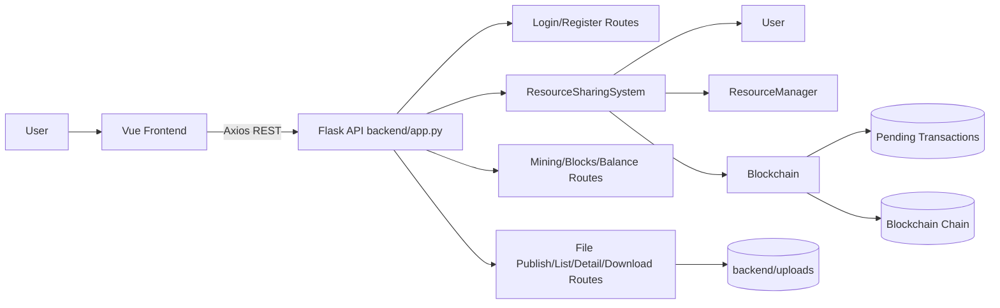
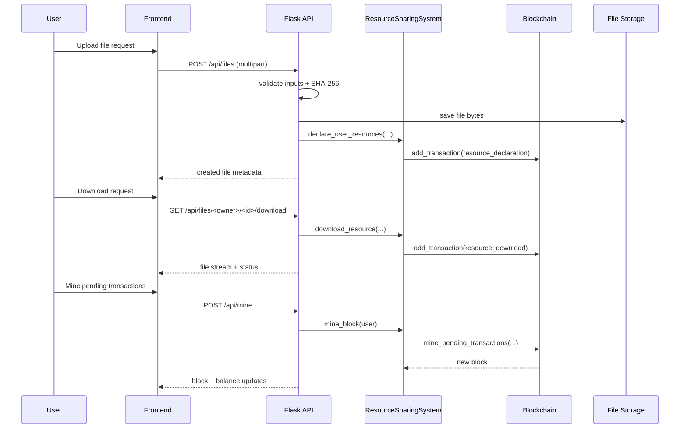
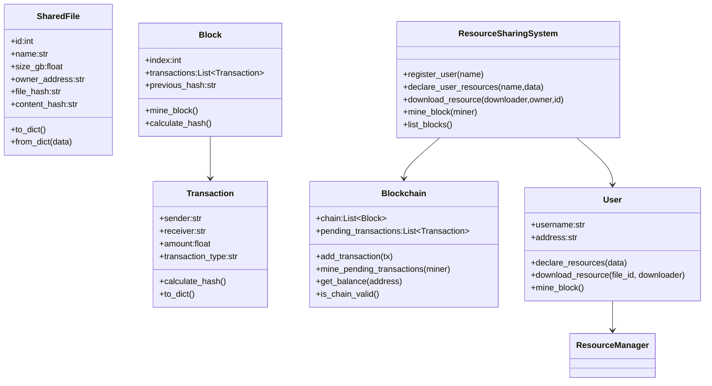
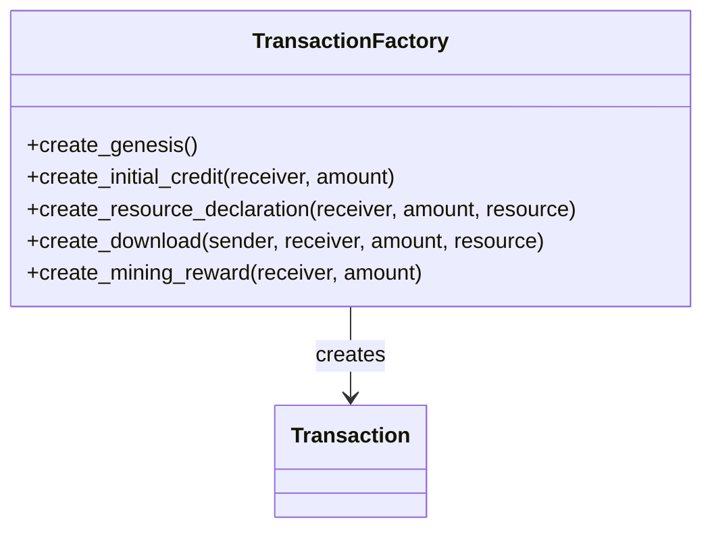
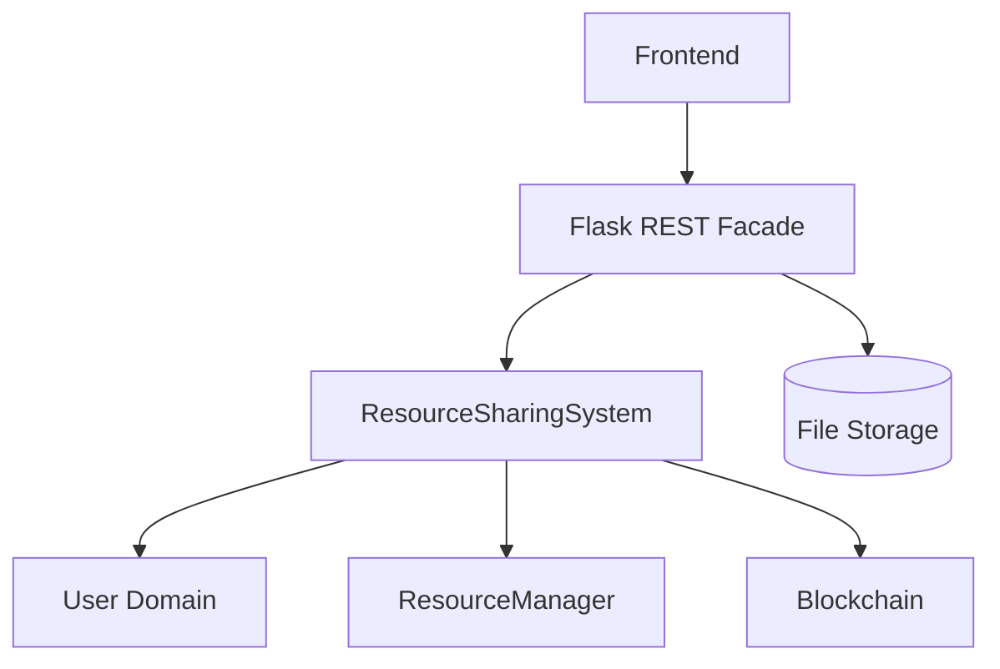
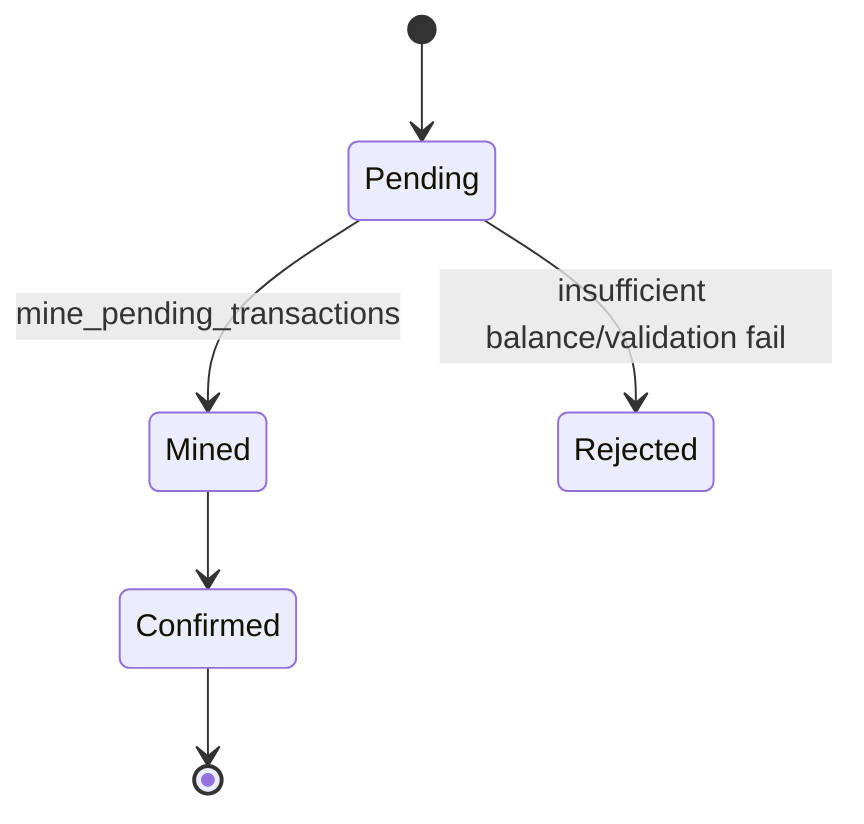

# Design Pattern Report for Blockchain-Based Resource Sharing System

## Cover Page

- **Title:** Design Pattern Report for Blockchain-Based Resource Sharing System  
- **Course/Project:** Blockchain Software Engineering Project  
- **Group Members:** _(Fill by team)_  
- **Date:** May 24, 2026  
- **Repository:** `NesusHD_BlockChain`  
- **Project Description:** This project implements a blockchain-inspired resource sharing platform with a Vue 3 frontend, Flask backend API, and a local ledger simulation module. It supports user login/registration, file publishing, upload storage, metadata search, download/payment transactions, mining reward confirmation, and ledger traceability.

---

## Table of Contents

I. Literature Review  
II. System Architecture Analysis  
III. Classic GoF Design Pattern Application  
&nbsp;&nbsp;1. Creational Patterns  
&nbsp;&nbsp;&nbsp;&nbsp;a. Factory Method  
&nbsp;&nbsp;&nbsp;&nbsp;b. Builder / Abstract Factory  
&nbsp;&nbsp;&nbsp;&nbsp;c. Prototype  
&nbsp;&nbsp;&nbsp;&nbsp;d. Singleton  
&nbsp;&nbsp;2. Structural Patterns  
&nbsp;&nbsp;&nbsp;&nbsp;a. Adapter  
&nbsp;&nbsp;&nbsp;&nbsp;b. Bridge  
&nbsp;&nbsp;&nbsp;&nbsp;c. Facade  
&nbsp;&nbsp;&nbsp;&nbsp;d. Proxy  
&nbsp;&nbsp;3. Behavioral Patterns  
&nbsp;&nbsp;&nbsp;&nbsp;a. Iterator  
&nbsp;&nbsp;&nbsp;&nbsp;b. Mediator  
&nbsp;&nbsp;&nbsp;&nbsp;c. Observer  
&nbsp;&nbsp;&nbsp;&nbsp;d. State  
&nbsp;&nbsp;&nbsp;&nbsp;e. Strategy  
&nbsp;&nbsp;&nbsp;&nbsp;f. Template Method  
IV. References

---

## I. Literature Review

### 1. GoF Design Patterns

The GoF (Gang of Four) pattern catalog provides reusable object-oriented design solutions in three families: Creational, Structural, and Behavioral patterns. These patterns help engineers avoid tightly coupled code and repeated logic by introducing canonical abstractions for object construction, subsystem composition, and runtime collaboration.

For this report, pattern analysis is not theoretical only: it is used as an engineering lens to evaluate whether this repository’s architecture is maintainable as features evolve (e.g., authentication hardening, pluggable storage, and real blockchain backend migration). Specifically, we prioritize patterns that reduce coupling between UI/API/domain concerns and patterns that make transaction and ledger workflows explicit and extensible.

### 2. Design Pattern Identification in Modern Software Engineering

Modern pattern identification research emphasizes both static and semantic cues:

- Static class/interface graphs and call relationships.
- Data transformation funnels (e.g., API DTO mapping).
- Repeated control-flow skeletons indicating latent template methods.
- Maintenance hotspots where “pattern extraction” yields complexity reduction.

In practical terms for this project, we identify patterns by inspecting concrete repository artifacts:

- Flask route functions and helper methods in `backend/app.py`.
- Domain entities and ledger operations in `hyperledger/ledger.py`.
- Reactive component interactions in `frontend/src/App.vue` and child components.

When no direct implementation exists, we explicitly label conclusions as **Potential Refactor** instead of claiming existing GoF conformance.

### 3. Blockchain System Design Perspective

Blockchain-style systems usually separate:

1. Transaction generation (user actions converted to transaction data),
2. Transaction validation (balance, ownership, policy checks),
3. Block creation and mining/confirmation,
4. Ledger storage and chain consistency checks,
5. External query/access API.

The repository follows this architecture in a simplified simulation:

- `backend/app.py` maps HTTP requests into ledger/domain actions.
- `hyperledger/ledger.py` defines `Transaction`, `Block`, `Blockchain`, and `ResourceSharingSystem`.
- Upload file bytes are persisted under `backend/uploads/` and linked to ledger metadata by hash-based identifiers.

Design patterns are valuable here because resource trading and ledger updates repeatedly invoke similar workflows (validate → build transaction → enqueue → mine → query state).

### 4. Relevance to This Project

This project’s main engineering challenge is balancing fast feature delivery with structural clarity:

- Upload/download flows require clear service boundaries (frontend action, API validation, domain commit, storage operation).
- Transaction and block operations benefit from centralized creation/validation rules.
- REST endpoints must hide internal ledger complexity from frontend pages.
- Frontend and backend should remain loosely coupled so UI and ledger evolution are independent.

The following sections therefore combine architectural decomposition with pattern-level evidence and targeted refactor recommendations.

---

## II. System Architecture Analysis

### 2.1 Project Overview

Based on repository code, the system supports:

- **User login/registration** via `/api/login` and `/api/register`.
- **File publishing** via `/api/files` (multipart and JSON modes).
- **Upload storage** under `backend/uploads/<username>/...`.
- **Hash-based verification and duplicate checks** using SHA-256 and content/name conflict detection.
- **Resource listing/search/detail/download** via `/api/files`, `/api/files/<owner>/<id>`, `/api/files/<owner>/<id>/download` and related routes.
- **Transaction generation and pending pool management** in `Blockchain.add_transaction`.
- **Mining and reward confirmation** through `/api/mine` and `mine_pending_transactions`.
- **Chain validity and block timeline access** through `/api/blocks`, `/api/blockchain`, and `is_chain_valid`.

### 2.2 Layered Architecture

#### Frontend Layer (Vue 3 + Axios)

Frontend logic is centered in `frontend/src/App.vue` with multiple focused components:

- `LoginForm.vue`: credential capture and register/login flow.
- `UploadForm.vue`: file selection, size checks, form validation, and upload request.
- `FileList.vue`: search/filter UI, computed filtering, and download triggers.
- `FileDetail.vue`: detail visualization and controlled download action.
- `MinedBlocks.vue`: block search/filter and timeline refresh.

Reactive state (`ref`, `reactive`, `computed`, `watch`) drives view updates.

#### Backend API Layer (Flask)

`backend/app.py` serves as the REST controller layer:

- Parses and validates request payloads.
- Performs policy checks (download attempt limits, ownership checks, required params).
- Converts external payload formats to domain-friendly structures.
- Invokes ledger/domain operations through a shared `ResourceSharingSystem` instance.
- Serializes domain objects back to JSON DTOs.

#### Domain / Ledger Service Layer

`hyperledger/ledger.py` includes core domain objects and orchestration:

- `SharedFile` (resource metadata/value object style).
- `ResourceManager` (resource collection and lifecycle methods).
- `Transaction` and `Block` (ledger atomic units).
- `Blockchain` (chain, pending transactions, mining, balances, validation).
- `User` (address, resource declarations, download operations).
- `ResourceSharingSystem` (cross-module coordination façade/mediator).

#### Persistence / Storage Layer

- **File storage:** local filesystem (`backend/uploads/`).
- **Ledger state:** in-memory chain and pending transactions in `Blockchain`.
- **User/resource state:** in-memory dictionaries and managers.

This storage model is suitable for demos but should be evolved for production durability and horizontal scaling.

### 2.3 Architecture Diagram

### 2.4 Core Workflow: Upload/Download/Mine

### 2.5 Domain Model View

### 2.6 Architecture Characteristics

#### Strengths

1. **Clear controller-domain separation:** routes do not embed mining algorithms.
2. **Ledger abstraction boundary exists:** frontend never invokes blockchain internals directly.
3. **Rich validation hooks:** filename/content dedup and size constraints improve correctness.
4. **Readable domain model:** classes mirror business concepts (Transaction/Block/User/Resource).

#### Limitations

1. **Module-global runtime state:** singleton-like in-memory objects complicate multi-process consistency.
2. **No persistent ledger DB:** process restart loses volatile state.
3. **Limited explicit interfaces:** local simulation and future Hyperledger backend are not abstracted behind ports.
4. **Route-level duplication:** repeated validate/ensure-user/execute/respond skeletons could be templated.

---

## III. Classic GoF Design Pattern Application

## 1. Creational Patterns

### a. Factory Method

**Intent:** Encapsulate creation of related objects behind a common creator interface.

**Repository Evidence:**

- Transaction instantiation in multiple flows (`Transaction(...)` in `User.declare_resources`, `User.download_resource`, `Blockchain.create_genesis_block`, mining reward creation).
- Block construction in `Blockchain.mine_pending_transactions`.
- File payload construction in `api_publish_file()` before domain submission.

**Why It Fits:** The system constructs multiple transaction variants (genesis, initial credit, resource declaration, download, mining reward, bonus). Centralized creation can enforce uniform metadata, validation, and audit tagging.

**Current Status:** **Partially implicit** (constructor usage exists, but no explicit factory object).

**Potential Refactor:** Introduce `TransactionFactory` and `BlockFactory` to remove creation duplication.

### b. Builder / Abstract Factory

**Intent:** Build complex objects stepwise (Builder) or create related object families (Abstract Factory).

**Repository Evidence:**

- `Block` needs index, tx list, previous hash, difficulty, nonce, and mining pass.
- No separate builder abstraction; construction is currently inline in `mine_pending_transactions`.
- No dual-implementation factory between local simulation and external ledger.

**Current Status:** **Potential Refactor**.

**Recommended Direction:**

- `BlockBuilder` for configurable block assembly and pre-mine validation hooks.
- `LedgerServiceFactory` for selecting local-simulated vs Hyperledger-backed service implementations.

### c. Prototype

**Intent:** Create objects by cloning a prototype.

**Repository Evidence:**

- `SharedFile.from_dict` supports object reconstruction from dict data.
- List copies such as `transactions_to_mine = self.pending_transactions.copy()`.

**Current Status:** **Weak/partial evidence**, no explicit Prototype interface or clone polymorphism.

**Potential Refactor:** Add cloning utilities for load testing (batch synthetic transactions) and reproducible fixture generation.

### d. Singleton

**Intent:** Ensure one globally accessible instance for shared coordination.

**Repository Evidence:**

- `app = Flask(__name__)` and module-global `system: ResourceSharingSystem = ResourceSharingSystem()` in backend.

**Why It Fits:** A single runtime ledger state simplifies demo semantics and consistent reads within one process.

**Current Status:** **Implemented in module-global singleton-like style**.

**Risk Analysis:** For Gunicorn/multi-worker deployment, each process may hold an independent chain copy unless moved to shared persistent storage.

---

## 2. Structural Patterns

### a. Adapter

**Intent:** Convert one interface format into another expected by downstream modules.

**Repository Evidence:**

- Request data adaptation: `parse_size_to_gb`, `normalize_category`, multipart/JSON branching.
- Response adaptation: `serialize_shared_file`, `normalize_block_payload`.

**Why It Fits:** HTTP payload and UI fields differ from domain entity fields; adapter-like mapping keeps domain code clean.

**Current Status:** **Implemented in functional adapter form** (not strict GoF class adapter).

**Potential Refactor:** Add explicit `LedgerPort`/`StoragePort` interfaces with concrete adapters.

### b. Bridge

**Intent:** Separate abstraction from implementation so both vary independently.

**Repository Evidence:**

- Current resource and ledger services are directly bound to concrete implementations.
- No `StorageProvider`/`LedgerProvider` abstract contract.

**Current Status:** **Potential Refactor**.

**Suggested Bridge Targets:**

- `ResourceService` abstraction + `LocalFSStorage` / `ObjectStorage` implementations.
- `LedgerService` abstraction + `SimulatedBlockchain` / `HyperledgerConnector` implementations.

### c. Facade

**Intent:** Provide a unified high-level interface to complex subsystems.

**Repository Evidence:**

- Flask routes provide concise API endpoints for frontend.
- `ResourceSharingSystem` wraps user lookup, resource operations, download logic, mining, and query interfaces.

**Why It Fits:** Frontend should use simple tasks (publish, download, mine, query) without knowing transaction internals.

**Current Status:** **Strongly implemented**.

### d. Proxy

**Intent:** Control access to a real object with pre/post checks.

**Repository Evidence:**

- Download attempt throttling (`DOWNLOAD_ATTEMPT_LIMIT`, `has_downloads_remaining`).
- Ownership checks in resource updates/deletes.
- Balance checks before transaction acceptance in `Blockchain.add_transaction` and `User.download_resource`.

**Current Status:** **Partially implemented as distributed guard logic**.

**Potential Refactor:** Consolidate into decorators or middleware-like proxy components for auth/authorization/payment policies.

---

## 3. Behavioral Patterns

### a. Iterator

**Intent:** Traverse aggregate structures without exposing internal representation details.

**Repository Evidence:**

- Chain traversal in `list_blocks`, `get_balance`, `is_chain_valid`.
- File traversal in `get_active_files`, `search_files`, `iter_existing_files`.

**Current Status:** **Implicit (native iteration loops)**.

**Potential Refactor:** Introduce paginated iterator interfaces for large ledger/resource sets.

### b. Mediator

**Intent:** Centralize module interactions to avoid pairwise coupling.

**Repository Evidence:**

- `ResourceSharingSystem` mediates between users, resources, blockchain, and address mapping.
- Route handlers orchestrate cross-cutting steps (validation + storage + ledger + serialization).

**Current Status:** **Implemented (service-level mediator/facade hybrid)**.

### c. Observer

**Intent:** Notify dependent observers when subject state changes.

**Repository Evidence:**

- Vue reactivity (`ref`, `computed`, `watch`) in `App.vue`, `FileList.vue`, `MinedBlocks.vue` automatically updates views when data changes.

**Current Status:** **Implemented in frontend reactive layer**.

**Potential Refactor:** Backend event bus + WebSocket/SSE push for mined block confirmations.

### d. State

**Intent:** Represent state-dependent behavior explicitly.

**Repository Evidence:**

- Resource activity state via `SharedFile.is_active`.
- Transaction lifecycle represented by pending pool vs mined blocks.
- Frontend operational states: loading/error/downloading/mining flags.

**Current Status:** **Partially implemented with state variables**.

**Potential Refactor:** Model `TransactionState` and `ResourceState` enums/classes for explicit transitions.

### e. Strategy

**Intent:** Encapsulate interchangeable algorithms behind a stable interface.

**Repository Evidence:**

- Reward, fee, and cost formulas are currently hardcoded:
  - `calculate_current_reward`
  - `download_cost`, `miner_fee`, bonus computation in download flow.

**Current Status:** **Potential Refactor**.

**Suggested Strategy Interfaces:**

- `RewardStrategy` (fixed, halving, dynamic congestion-based)
- `FeeStrategy` (flat, proportional, demand-based)
- `ValidationStrategy` (strict, moderate, sandbox/demo)

### f. Template Method

**Intent:** Define a stable algorithm skeleton and allow some steps to vary.

**Repository Evidence:**

Many routes repeat a similar workflow:

1. Parse request,
2. Validate input,
3. Ensure/resolve user,
4. Execute domain action,
5. Build response or error envelope.

Examples: login/register, publish, detail, download, mine, balance, report/admin review.

**Current Status:** **Potential Refactor**.

**Refactor Proposal:** Introduce shared request pipeline helper/decorator to reduce repetition and unify error handling.

---

## Pattern Evidence Matrix

| Pattern | Evidence Location | Current Assessment | Rationale |
|---|---|---|---|
| Singleton | `backend/app.py` global `system`, `app` | Implemented | One shared runtime coordinator |
| Facade | Flask routes + `ResourceSharingSystem` | Implemented | Unified external API over complex internals |
| Mediator | `ResourceSharingSystem` orchestration | Implemented | Coordinates subsystems |
| Adapter | Payload serialization/normalization helpers | Implemented (functional) | Translates HTTP/UI ↔ domain formats |
| Observer | Vue reactive primitives | Implemented (frontend) | Automatic UI update on state change |
| Iterator | loops over chain/tx/files | Implicit | Traversal pattern present without custom iterator class |
| State | flags/pools/status variables | Partial | State exists but not modeled as state objects |
| Factory Method | repeated object construction | Partial | No dedicated factory abstraction yet |
| Proxy | validation/guard checks | Partial | Access checks distributed, no explicit proxy type |
| Strategy | reward/fee formulas | Potential Refactor | Algorithms not yet pluggable |
| Template Method | repeated route skeletons | Potential Refactor | Good candidate for shared pipeline |
| Bridge | implementation coupling | Potential Refactor | Missing abstraction/implementation split |
| Builder/Abstract Factory | block and service creation | Potential Refactor | No step builder or family factory yet |
| Prototype | from_dict/copy usage | Potential Refactor | No explicit prototype interface |

---

## Engineering Refactor Roadmap (Optional for Next Iteration)

### Phase 1: Low-risk Structural Cleanup

1. Extract `TransactionFactory` and `BlockFactory`.
2. Introduce route helper for common validation/error envelope.
3. Move DTO transformation to dedicated adapter module.

### Phase 2: Extensibility Enhancements

1. Add strategy interfaces for reward/fee/validation policies.
2. Add ledger abstraction interface (`LedgerPort`) and local adapter implementation.
3. Add storage abstraction (`StorageProvider`) for future cloud/file backend switch.

### Phase 3: Runtime Scalability

1. Replace in-memory chain/users with persistent storage.
2. Add event-driven observer channel (WebSocket/SSE).
3. Add transactional consistency controls for concurrent downloads/mining.

---

## IV. References

1. Gamma, E., Helm, R., Johnson, R., & Vlissides, J. (1994). *Design Patterns: Elements of Reusable Object-Oriented Software*. Addison-Wesley.  
2. Mayvan, B. B., Rasoolzadegan, A., & Ghavidel, S. Y. (2017). Design pattern detection based on graph theory. *Knowledge-Based Systems*, 120, 164–182.  
3. Nakamoto, S. (2008). *Bitcoin: A Peer-to-Peer Electronic Cash System*.  
4. Androulaki, E., et al. (2018). Hyperledger Fabric: A Distributed Operating System for Permissioned Blockchains. In *EuroSys ’18*.  
5. Christidis, K., & Devetsikiotis, M. (2016). Blockchains and Smart Contracts for the Internet of Things. *IEEE Access*, 4, 2292–2303.

---

## Appendix A. Repository Evidence Pointers

- Backend API: `backend/app.py`  
- Ledger/domain simulation: `hyperledger/ledger.py`  
- Frontend shell and state orchestration: `frontend/src/App.vue`  
- Frontend components: `frontend/src/components/*.vue`  
- Upload file storage root: `backend/uploads/`

## Appendix B. Minimum-Content Checklist for Submission

- [x] Full report (not outline)  
- [x] English version  
- [x] Repository-based evidence  
- [x] More than 2 Mermaid diagrams  
- [x] Pattern implementation vs refactor clearly distinguished
