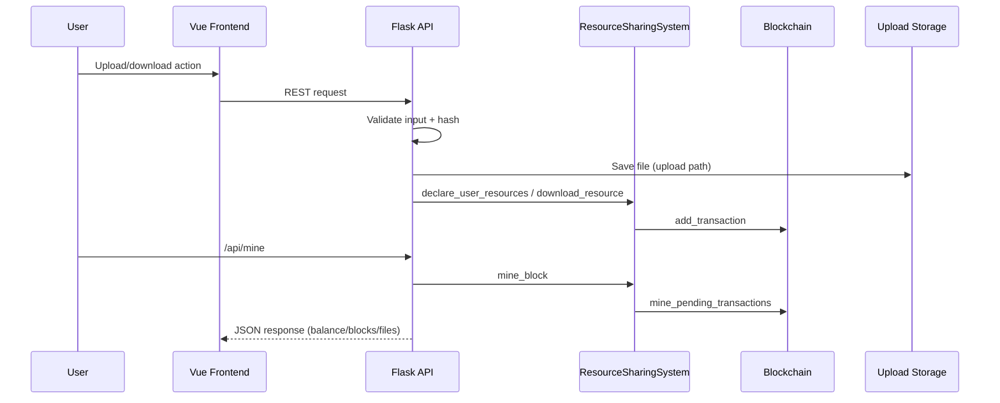

# Design Pattern Report Outline for Blockchain-Based Resource Sharing System (English)

## Cover Page
- **Title:** Design Pattern Report for Blockchain-Based Resource Sharing System
- **Course/Project:** _(to fill)_
- **Group Members:** _(to fill)_
- **Date:** _(to fill)_
- **Repository:** `NesusHD_BlockChain`
- **Project Description (to write):** A blockchain-inspired resource sharing platform with upload/download, transaction recording, mining/reward logic, and ledger traceability.

---

## Table of Contents
I. Literature Review  
II. System Architecture Analysis  
III. Classic GoF Design Pattern Application  
&nbsp;&nbsp;1. Creational Patterns  
&nbsp;&nbsp;&nbsp;&nbsp;a. Factory Method  
&nbsp;&nbsp;&nbsp;&nbsp;b. Builder / Abstract Factory  
&nbsp;&nbsp;&nbsp;&nbsp;c. Prototype  
&nbsp;&nbsp;&nbsp;&nbsp;d. Singleton  
&nbsp;&nbsp;2. Structural Patterns  
&nbsp;&nbsp;&nbsp;&nbsp;a. Adapter  
&nbsp;&nbsp;&nbsp;&nbsp;b. Bridge  
&nbsp;&nbsp;&nbsp;&nbsp;c. Facade  
&nbsp;&nbsp;&nbsp;&nbsp;d. Proxy  
&nbsp;&nbsp;3. Behavioral Patterns  
&nbsp;&nbsp;&nbsp;&nbsp;a. Iterator  
&nbsp;&nbsp;&nbsp;&nbsp;b. Mediator  
&nbsp;&nbsp;&nbsp;&nbsp;c. Observer  
&nbsp;&nbsp;&nbsp;&nbsp;d. State  
&nbsp;&nbsp;&nbsp;&nbsp;e. Strategy  
&nbsp;&nbsp;&nbsp;&nbsp;f. Template Method  
IV. References

---

## I. Literature Review
### 1. GoF Design Patterns
Write a short overview of GoF categories (Creational/Structural/Behavioral), and explain this report emphasizes modularity, extensibility, and maintainability in a blockchain-resource-sharing context.

### 2. Pattern Identification in Modern Software Engineering
Summarize research directions (pattern detection, graph-based recognition, maintainability impact), then explain this report uses repository-level evidence (classes, API routes, module interactions) instead of assumptions.

### 3. Blockchain System Design Principles
Explain common blockchain decomposition: transaction generation, validation, block construction/mining, chain storage, and query API. Link this to reusable software design flows.

### 4. Relevance to This Repository
Connect literature to observed structure:
- Flask API entry and route layer (`backend/app.py`)
- Ledger/domain model and blockchain logic (`hyperledger/ledger.py`)
- Vue UI and reactive data flow (`frontend/src/App.vue`, `frontend/src/components/*.vue`)
- File-based upload storage (`backend/uploads/`)

---

## II. System Architecture Analysis
### 2.1 Project Overview
Describe the implemented capabilities with evidence:
- Login/register routes (`/api/login`, `/api/register`) in `backend/app.py`
- File publish/list/detail/download routes (`/api/files*`) in `backend/app.py`
- SHA-256 hashing for upload integrity (`compute_file_hash`, upload hashing flow) in `backend/app.py`
- Transaction, block, mining, balance, and chain validation in `hyperledger/ledger.py`

### 2.2 Layered Architecture
Write the architecture in layers:
- **Frontend Layer (Vue):** state refs/computed/watch and API-triggered actions in `frontend/src/App.vue`, `FileList.vue`, `UploadForm.vue`, `MinedBlocks.vue`
- **Backend API Layer (Flask):** REST endpoints and request validation in `backend/app.py`
- **Domain/Ledger Layer:** `ResourceSharingSystem`, `User`, `ResourceManager`, `Blockchain`, `Block`, `Transaction` in `hyperledger/ledger.py`
- **Persistence Layer:** uploaded files under `backend/uploads/`; in-memory chain/users/resources in `hyperledger/ledger.py`

### 2.3 Architecture Diagram (Evidence-based)
```mermaid
flowchart LR
    U[User] --> FE[Vue Frontend App.vue]
    FE -->|Axios| API[Flask backend/app.py]

    API --> R1[/api/files]
    API --> R2[/api/download]
    API --> R3[/api/mine]
    API --> R4[/api/blocks]

    API --> SYS[ResourceSharingSystem]
    SYS --> RM[ResourceManager]
    SYS --> BC[Blockchain]
    BC --> TXP[(pending_transactions)]
    BC --> CHAIN[(chain)]

    R1 --> FS[(backend/uploads)]
```

### 2.4 Core Workflow Diagram (Upload/Download/Mine)


### 2.5 Architecture Characteristics
Explain strengths/risks:
- Clear FE/API/ledger separation
- REST facade protects frontend from direct chain operations
- File storage coordinated with ledger metadata
- Risk: in-memory ledger/global instances impact concurrency/scalability; discuss migration path to persistent DB/real Hyperledger adapter

---

## III. Classic GoF Design Pattern Application

### 1. Creational Patterns
#### a) Factory Method
- **Intent:** Centralize creation logic for related domain objects.
- **Repository evidence:** `Transaction(...)`, `Block(...)`, and `SharedFile.from_dict(...)` creation paths in `hyperledger/ledger.py`; route-level payload assembly in `api_publish_file()` in `backend/app.py`.
- **Assessment:** **Partially implicit**, not a dedicated Factory class.
- **Why it fits:** Upload/download/mining each create different transaction flavors with shared creation rules.
- **Recommendation:** **Potential Refactor** — add `TransactionFactory.create_upload/create_download/create_reward`.

#### b) Builder / Abstract Factory
- **Intent:** Build complex object steps (Builder) or produce families of related objects (Abstract Factory).
- **Repository evidence:** `Block` currently built in one constructor call + mining in `mine_pending_transactions` (`hyperledger/ledger.py`). No local-vs-hyperledger interchangeable factory interface found.
- **Assessment:** **Potential Refactor**.
- **Why it fits:** Future switch between simulated chain and external ledger backend.

#### c) Prototype
- **Intent:** Clone existing objects/templates.
- **Repository evidence:** `SharedFile.from_dict` and dict copy-like usage; no explicit clone/prototype hierarchy.
- **Assessment:** **Potential Refactor** (especially for test fixtures/genesis variants).

#### d) Singleton
- **Intent:** Keep a single shared instance.
- **Repository evidence:** `system: ResourceSharingSystem = ResourceSharingSystem()` global instance and `app = Flask(__name__)` in `backend/app.py`.
- **Assessment:** **Implemented (singleton-like module global)**.
- **Why it fits:** Keep one consistent runtime ledger state for all requests.
- **Risk note:** testing isolation and multi-worker process divergence.

### 2. Structural Patterns
#### a) Adapter
- **Intent:** Translate one interface to another.
- **Repository evidence:** API normalization/translation helpers in `backend/app.py` (e.g., `normalize_category`, `parse_size_to_gb`, `serialize_shared_file`) adapt HTTP payloads to domain structures.
- **Assessment:** **Implemented as functional/data adapter style** (not class-based GoF adapter).
- **Potential Refactor:** add `LedgerPort` adapter interface for future Hyperledger integration.

#### b) Bridge
- **Intent:** Decouple abstraction from implementation.
- **Repository evidence:** no explicit abstraction interface for storage or ledger implementation swapping.
- **Assessment:** **Potential Refactor**.

#### c) Facade
- **Intent:** Offer a simple unified entry to complex subsystems.
- **Repository evidence:** Flask route layer in `backend/app.py` exposes concise endpoints while coordinating user/resource/ledger/hash/storage; `ResourceSharingSystem` also wraps blockchain/user/resource operations in `hyperledger/ledger.py`.
- **Assessment:** **Strongly implemented**.
- **Why it fits:** Frontend only calls REST APIs, not internal blockchain methods.

#### d) Proxy
- **Intent:** Control access before forwarding requests.
- **Repository evidence:** validation/authorization-like checks in routes and domain methods (e.g., download attempt limits, ownership checks in `remove_file/update_file`, balance checks in `download_resource`).
- **Assessment:** **Partially implemented via guard logic**, no dedicated proxy object.
- **Potential Refactor:** extract an explicit access-control proxy/decorator layer.

### 3. Behavioral Patterns
#### a) Iterator
- **Intent:** Traverse aggregates cleanly.
- **Repository evidence:** loops across `blockchain.chain`, block transactions, file collections (`list_blocks`, `search_resources`, `get_active_files`).
- **Assessment:** **Implicit/native iteration**, not custom iterator class.

#### b) Mediator
- **Intent:** Central coordinator reduces direct coupling.
- **Repository evidence:** `ResourceSharingSystem` mediates `User`, `Blockchain`, and `ResourceManager`; route handlers coordinate validation + service calls.
- **Assessment:** **Implemented (service-level mediator style)**.

#### c) Observer
- **Intent:** Publish state changes to dependents.
- **Repository evidence:** Vue reactivity (`ref`, `computed`, `watch`) in `App.vue`, `FileList.vue`, `MinedBlocks.vue`.
- **Assessment:** **Implemented in frontend reactive layer**.
- **Potential Refactor:** backend domain event bus/websocket notifications for mined transactions.

#### d) State
- **Intent:** Behavior varies by object state.
- **Repository evidence:** state fields/flags such as `is_active` in `SharedFile`, pending vs mined transactions in `Blockchain.pending_transactions` and mined blocks appended to `chain`; UI state flags in Vue.
- **Assessment:** **Partially implemented with state variables**, not formal State classes.

#### e) Strategy
- **Intent:** Swap algorithms behind stable interfaces.
- **Repository evidence:** reward and fee calculations currently hardcoded in methods (`calculate_current_reward`, download fee logic) with conditional/inline formulas.
- **Assessment:** **Potential Refactor**.
- **Recommendation:** separate `RewardStrategy`, `FeeStrategy`, `ValidationStrategy`.

#### f) Template Method
- **Intent:** Reuse algorithm skeleton with variable steps.
- **Repository evidence:** repeated API workflows in `backend/app.py`: validate input -> ensure user -> domain call -> serialize response -> error handling.
- **Assessment:** **Potential Refactor** (extract common request pipeline helper/decorator).

---

## IV. References
Include a bibliography section in the full report, such as:
1. Gamma, E., Helm, R., Johnson, R., & Vlissides, J. *Design Patterns*.
2. Mayvan, B. B., & Rasoolzadegan, A. “Design pattern detection based on graph theory,” *Knowledge-Based Systems*, 2017.
3. Nakamoto, S. “Bitcoin: A Peer-to-Peer Electronic Cash System,” 2008.
4. Androulaki, E., et al. “Hyperledger Fabric,” *EuroSys*, 2018.
5. Christidis, K., & Devetsikiotis, M. “Blockchains and Smart Contracts for the IoT,” *IEEE Access*, 2016.

---

## Appendix (Suggested Evidence Table for Final Report Drafting)
Add a table in the full report mapping: **Pattern → File path → Function/Class → Status (Implemented / Potential Refactor) → Rationale**.
