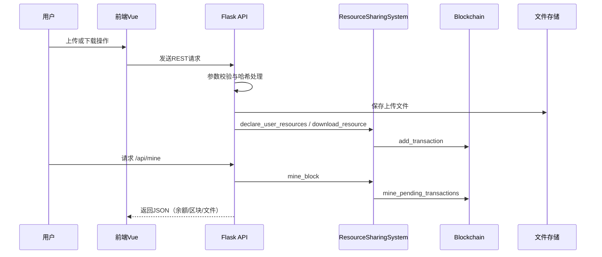

# 区块链资源共享系统设计模式报告提纲（中文版）

## 封面页
- **标题：** Design Pattern Report for Blockchain-Based Resource Sharing System
- **课程/项目：** （待补充）
- **小组成员：** （待补充）
- **日期：** （待补充）
- **仓库名称：** `NesusHD_BlockChain`
- **项目简介（应撰写）：** 一个区块链风格的资源共享平台，支持上传/下载、交易记录、挖矿奖励与账本追踪。

---

## 目录
I. 文献综述  
II. 系统架构分析  
III. GoF经典设计模式应用  
&nbsp;&nbsp;1. 创建型模式  
&nbsp;&nbsp;&nbsp;&nbsp;a. 工厂方法  
&nbsp;&nbsp;&nbsp;&nbsp;b. 建造者 / 抽象工厂  
&nbsp;&nbsp;&nbsp;&nbsp;c. 原型  
&nbsp;&nbsp;&nbsp;&nbsp;d. 单例  
&nbsp;&nbsp;2. 结构型模式  
&nbsp;&nbsp;&nbsp;&nbsp;a. 适配器  
&nbsp;&nbsp;&nbsp;&nbsp;b. 桥接  
&nbsp;&nbsp;&nbsp;&nbsp;c. 外观  
&nbsp;&nbsp;&nbsp;&nbsp;d. 代理  
&nbsp;&nbsp;3. 行为型模式  
&nbsp;&nbsp;&nbsp;&nbsp;a. 迭代器  
&nbsp;&nbsp;&nbsp;&nbsp;b. 中介者  
&nbsp;&nbsp;&nbsp;&nbsp;c. 观察者  
&nbsp;&nbsp;&nbsp;&nbsp;d. 状态  
&nbsp;&nbsp;&nbsp;&nbsp;e. 策略  
&nbsp;&nbsp;&nbsp;&nbsp;f. 模板方法  
IV. 参考文献

---

## I. 文献综述
### 1. GoF设计模式
简要说明GoF三大类模式（创建型、结构型、行为型），并强调本报告关注其在区块链资源共享系统中的可维护性、可扩展性与模块化价值。

### 2. 现代软件工程中的模式识别
概述自动化模式识别、基于图的识别、可维护性分析等研究方向；并说明本报告将以仓库中的类、模块、接口与调用关系作为识别依据。

### 3. 区块链系统设计
阐述区块链常见分层：交易生成、交易验证、区块构建/挖矿、账本存储与查询接口；说明设计模式对这些可复用流程（验证、记账、访问控制、API封装）的意义。

### 4. 与本项目的关联性
结合仓库实际结构展开：
- Flask API入口与路由层（`backend/app.py`）
- 账本与领域模型（`hyperledger/ledger.py`）
- Vue前端响应式与交互层（`frontend/src/App.vue`、`frontend/src/components/*.vue`）
- 上传文件存储目录（`backend/uploads/`）

---

## II. 系统架构分析
### 2.1 项目概览
基于代码证据说明系统能力：
- 用户登录/注册：`/api/login`、`/api/register`
- 文件发布/列表/详情/下载：`/api/files*`
- SHA-256哈希与去重相关流程：`backend/app.py` 中哈希计算与上传校验
- 交易、区块、挖矿、余额、链有效性：`hyperledger/ledger.py`

### 2.2 分层架构
建议按以下层次撰写：
- **前端层（Vue）**：`App.vue`、`FileList.vue`、`UploadForm.vue`、`MinedBlocks.vue` 中的状态与交互
- **后端API层（Flask）**：`backend/app.py` 中REST接口与请求校验
- **领域/账本层**：`ResourceSharingSystem`、`User`、`ResourceManager`、`Blockchain`、`Block`、`Transaction`
- **存储层**：`backend/uploads/` 文件存储 + `hyperledger/ledger.py` 内存账本结构

### 2.3 架构图（按仓库证据更新）
```mermaid
flowchart LR
    U[用户] --> FE[Vue 前端 App.vue]
    FE -->|Axios| API[Flask backend/app.py]

    API --> R1[/api/files]
    API --> R2[/api/download]
    API --> R3[/api/mine]
    API --> R4[/api/blocks]

    API --> SYS[ResourceSharingSystem]
    SYS --> RM[ResourceManager]
    SYS --> BC[Blockchain]
    BC --> TXP[(pending_transactions)]
    BC --> CHAIN[(chain)]

    R1 --> FS[(backend/uploads)]
```

### 2.4 核心流程图（上传/下载/挖矿）


### 2.5 架构特性
说明应写内容：
- 前端、API、领域账本逻辑分离
- 前端通过REST外观访问，避免直接耦合链内部细节
- 文件存储与链上元数据协同但不强耦合
- 可维护性关注点：全局实例/内存状态并发风险、未来接入真实Hyperledger与持久化存储

---

## III. GoF经典设计模式应用

### 1. 创建型模式
#### a) 工厂方法（Factory Method）
- **意图：** 将对象创建逻辑集中管理，避免散落在业务流程中。
- **代码证据：** `hyperledger/ledger.py` 中 `Transaction(...)`、`Block(...)`、`SharedFile.from_dict(...)`；`backend/app.py` 的 `api_publish_file()` 中组装文件/交易输入数据。
- **判断：** **部分体现（隐式）**，尚无独立工厂类。
- **适配原因：** 上传、下载、挖矿奖励本质是不同类型交易对象构建。
- **结论：** **Potential Refactor**：可引入 `TransactionFactory` 统一交易创建。

#### b) 建造者 / 抽象工厂（Builder / Abstract Factory）
- **意图：** 分步骤构建复杂对象，或统一创建同一产品族。
- **代码证据：** 当前 `Block` 直接构造后挖矿（`mine_pending_transactions`），未见本地链/Hyperledger可替换工厂接口。
- **判断：** **Potential Refactor**。

#### c) 原型（Prototype）
- **意图：** 通过复制已有对象创建新对象。
- **代码证据：** 存在 `SharedFile.from_dict` 与字典拷贝式数据流，但没有明确原型层次。
- **判断：** **Potential Refactor**（可用于测试样本、创世块模板变体）。

#### d) 单例（Singleton）
- **意图：** 保证全局共享唯一实例。
- **代码证据：** `backend/app.py` 中 `system = ResourceSharingSystem()` 与 `app = Flask(__name__)`。
- **判断：** **已实现（模块级单例风格）**。
- **适配原因：** 便于所有请求共享同一运行期账本状态。
- **风险：** 多进程部署与测试隔离复杂。

### 2. 结构型模式
#### a) 适配器（Adapter）
- **意图：** 将外部接口转换为内部可用接口。
- **代码证据：** `backend/app.py` 中 `normalize_category`、`parse_size_to_gb`、`serialize_shared_file` 等请求/响应转换函数。
- **判断：** **函数式适配已存在**（非经典类适配器）。
- **结论：** 后续可加 `LedgerPort` 接口适配真实区块链后端（**Potential Refactor**）。

#### b) 桥接（Bridge）
- **意图：** 抽象与实现解耦，使两者可独立演化。
- **代码证据：** 未见显式存储抽象接口或账本实现抽象层。
- **判断：** **Potential Refactor**。

#### c) 外观（Facade）
- **意图：** 为复杂子系统提供统一简化入口。
- **代码证据：** `backend/app.py` 路由对前端暴露简单REST；`hyperledger/ledger.py` 的 `ResourceSharingSystem` 封装用户、资源、区块链操作。
- **判断：** **强证据，已实现**。

#### d) 代理（Proxy）
- **意图：** 在访问核心对象前进行控制或增强。
- **代码证据：** 下载次数限制、所有权检查、余额检查等前置校验散布在路由与领域方法中。
- **判断：** **部分体现（守卫逻辑）**，未形成独立代理对象。
- **结论：** **Potential Refactor**：可抽离为统一访问控制代理/装饰器。

### 3. 行为型模式
#### a) 迭代器（Iterator）
- **意图：** 在不暴露内部结构的情况下遍历聚合对象。
- **代码证据：** 多处遍历 `chain`、`transactions`、`files`（如 `list_blocks`、`search_resources`、`get_active_files`）。
- **判断：** **隐式实现（语言内建迭代）**。

#### b) 中介者（Mediator）
- **意图：** 通过中介对象协调模块交互，降低耦合。
- **代码证据：** `ResourceSharingSystem` 协调 `User`、`Blockchain`、`ResourceManager`；路由层协调校验、存储与账本调用。
- **判断：** **已实现（服务中介风格）**。

#### c) 观察者（Observer）
- **意图：** 状态变化时通知依赖方。
- **代码证据：** Vue 响应式机制（`ref/computed/watch`）在 `App.vue`、`FileList.vue`、`MinedBlocks.vue`。
- **判断：** **前端层已实现**。
- **结论：** 后端事件总线/推送通知可作为 **Potential Refactor**。

#### d) 状态（State）
- **意图：** 通过状态变化驱动行为差异。
- **代码证据：** `SharedFile.is_active`，交易池 `pending_transactions` 到上链 `chain`，以及前端页面状态变量。
- **判断：** **部分体现（状态变量驱动）**，未采用状态类建模。

#### e) 策略（Strategy）
- **意图：** 封装可替换算法并统一接口。
- **代码证据：** 奖励/手续费计算逻辑目前写死在方法中（如 `calculate_current_reward`、下载成本计算）。
- **判断：** **Potential Refactor**。
- **建议：** 抽离 `RewardStrategy/FeeStrategy/ValidationStrategy`。

#### f) 模板方法（Template Method）
- **意图：** 固定流程骨架，将可变步骤下放。
- **代码证据：** `backend/app.py` 多个API流程重复“校验→调用领域→序列化→返回/异常处理”。
- **判断：** **Potential Refactor**（抽取通用流程模板）。

---

## IV. 参考文献
在正式报告中补充规范参考文献，建议包含：
1. Gamma等，《Design Patterns》
2. Mayvan & Rasoolzadegan, 2017
3. Nakamoto, 2008
4. Androulaki等, 2018
5. Christidis & Devetsikiotis, 2016

---

## 附录（建议）
建议在正式报告增加“证据矩阵表”：**模式 → 文件路径 → 函数/类 → 结论（已实现/可重构）→ 理由**。
