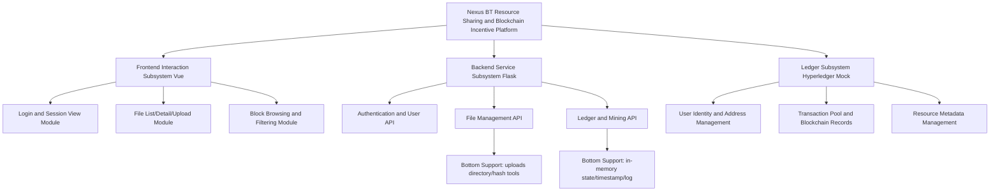
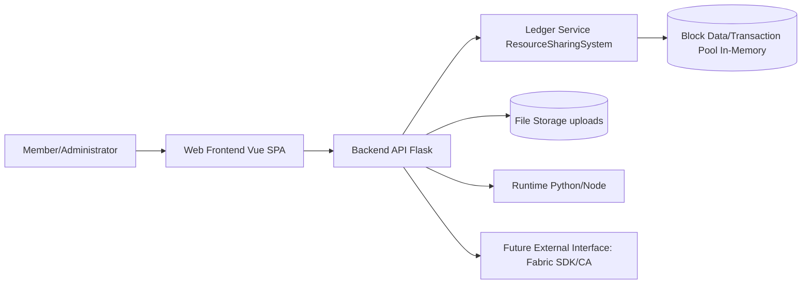
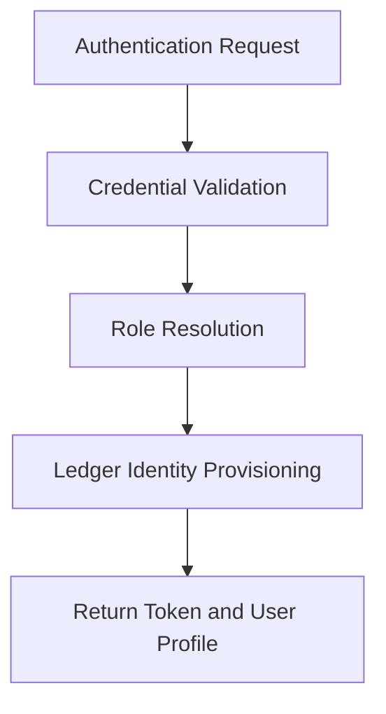
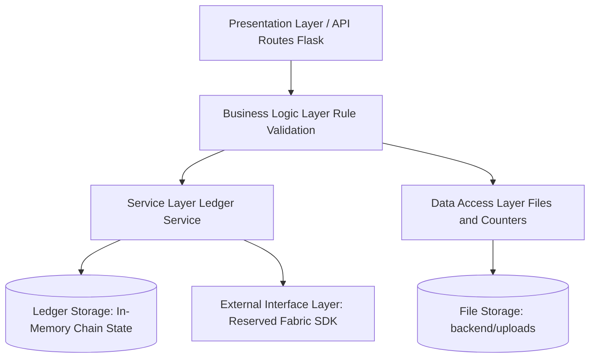
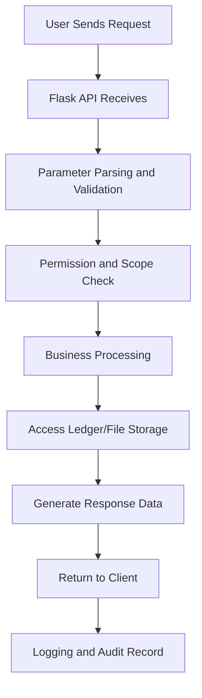
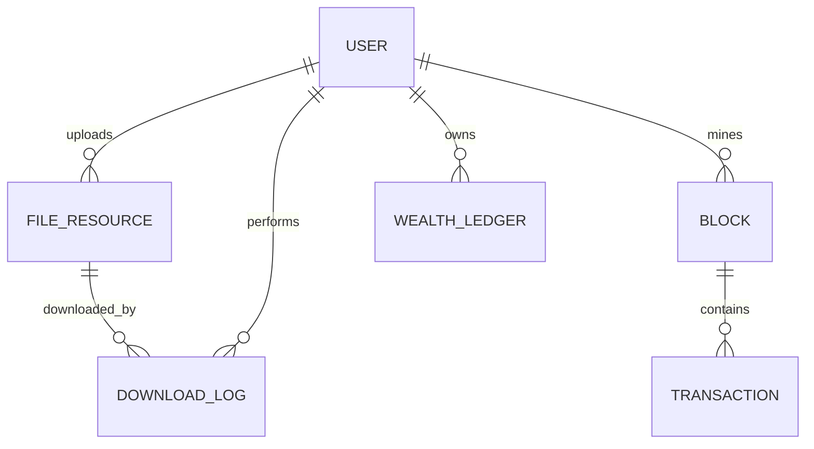
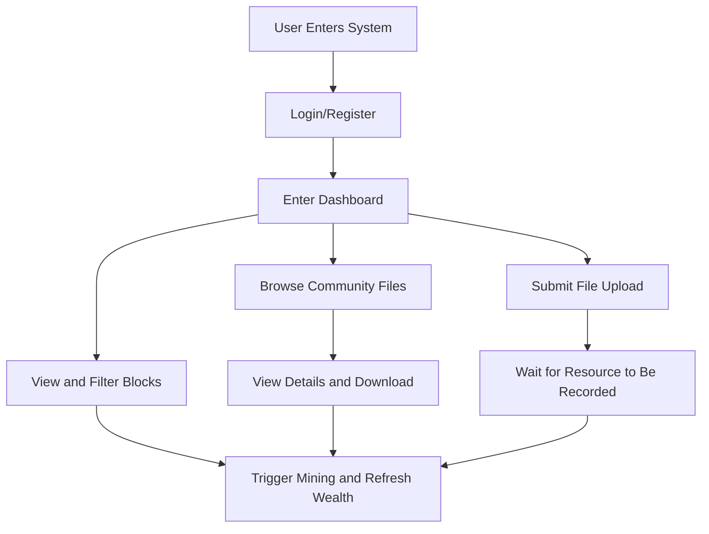

# Overall Design Report

Project Name: Nexus BT Resource Sharing and Blockchain Incentive Platform (Planned Version)

## 1 Architecture Design

### 1.1 Purpose
This overall design will guide the subsequent engineering development of the “Nexus BT Resource Sharing and Blockchain Incentive Platform.” The project will center on “resource sharing + blockchain incentives + traceable records,” and is planned to establish a scalable, maintainable, and evolvable architecture. The architecture design will provide a baseline for module partitioning, interface contracts, data model standardization, and maintainability planning in later stages.

Specifically, this design will:
- define clear boundaries among frontend, backend, and ledger subsystems to reduce coupling;
- provide a unified baseline for REST APIs, file-processing interfaces, and mining/ledger workflows;
- reserve a replacement layer for future migration from a mocked ledger to real Hyperledger Fabric;
- provide structural support for authorization, logging traceability, and operational observability.

### 1.2 Architectural Style
The system will adopt a combined style: layered architecture + frontend/backend separation + RESTful architecture + ledger-centered data architecture.

1. Layered architecture: the backend will be split into API interface layer, business logic layer, ledger service layer, and data/file access layer, improving maintainability and testability.  
2. Frontend/backend separation: the Vue client will call Flask services via HTTP, enabling independent deployment and iteration.  
3. RESTful architecture: interfaces will be modeled around users, files, blocks, and rewards for consistency.  
4. Ledger-centered data architecture: resource declaration, download rewards, and block records will be organized around a unified ledger state to support traceability and auditing.

This combination is suitable for the project’s characteristics of interactive UI, business orchestration, and ledger simulation, and it is expected to support continuous evolution toward real blockchain integration.

### 1.3 Hierarchical Structure
The planned hierarchy is as follows:
- Top layer: the Nexus platform as a whole;
- Sub-top layer: frontend interaction subsystem, backend service subsystem, and ledger subsystem;
- Middle layer: authentication/user management, file resource management, block mining and rewards, categorization/search, download control and audit;
- Bottom layer: local file storage, in-memory ledger structures, Flask/Vue runtime environments, and third-party dependencies (axios, flask-cors, etc.).

### 1.4 Architectural Context Diagram and Prototype
The system is planned to operate in a “user — web client — backend service — ledger/storage” context. External actors include members and administrators. Internally, the platform will coordinate frontend presentation, backend APIs, and ledger services. The bottom environment will rely on Python and Node runtimes, filesystem storage, and a future external blockchain connector.

#### 1.4.1 Top Layer - Overall System Design
- Responsibilities: the overall platform will provide integrated capabilities for resource sharing, credit incentives, and block traceability.  
- Primary inputs: login credentials, resource files, search filters, mining requests.  
- Primary outputs: authentication results, file catalogs, download streams, wealth status, and block records.  
- Dependencies: frontend interaction, backend API orchestration, and ledger-state consistency.  
- Follow-up implementation plan: the mock ledger will be progressively replaced by real Fabric integration.

#### 1.4.2 Sub-top Layer - Frontend Interaction Subsystem Design
- Responsibilities: login, dashboard, file browsing, upload interactions, and block filtering views.  
- Primary inputs: user events and API JSON responses.  
- Primary outputs: page state, visualized lists, and interaction feedback.  
- Dependencies: `/api/login`, `/api/files`, `/api/blocks`, and related endpoints.  
- Follow-up implementation plan: state management consistency, validation refinement, and multi-role visualization are planned.

#### 1.4.3 Sub-top Layer - Backend Service Subsystem Design
- Responsibilities: request intake, parameter validation, business-rule execution, file I/O, and ledger invocation.  
- Primary inputs: HTTP requests (JSON/multipart).  
- Primary outputs: standardized JSON responses and file-stream responses.  
- Dependencies: ledger service object, hash utilities, download-attempt counters, and local storage paths.  
- Follow-up implementation plan: token hardening, exception layering, and observability logging will be introduced.

#### 1.4.4 Middle Layer - Authentication and User Module Design
- Responsibilities: login, registration, role identification, and ledger identity mapping.  
- Primary inputs: username, password, and session context.  
- Primary outputs: token, role, and ledger identity.  
- Dependencies: credential store and ledger user-registration interface.  
- Follow-up implementation plan: persistent user storage, password hashing, and token expiry mechanisms are expected to be implemented.

#### 1.4.5 Middle Layer - File Resource Management Module Design
- Responsibilities: category handling, upload, deduplication, detail retrieval, and download control.  
- Primary inputs: file streams, metadata, filters, and download requests.  
- Primary outputs: catalog data, detail objects, binary streams, and validation errors.  
- Dependencies: hash computation, upload directory, and ledger resource managers.  
- Follow-up implementation plan: object-storage adapters, asynchronous scanning, and finer-grained throttling are planned.

#### 1.4.6 Middle Layer - Block Mining and Reward Module Design
- Responsibilities: pending transaction processing, mining rewards, block querying, and export support.  
- Primary inputs: mining requests, block filters, and reward-trigger events from downloads.  
- Primary outputs: block metadata, wealth updates, and pending-transaction statistics.  
- Dependencies: chain structures, timestamp formatting, and admin authorization checks.  
- Follow-up implementation plan: real chaincode invocation and on-chain event subscriptions are planned.

## 2 Server-Side Design

### 2.1 Server Architecture
The server side will adopt a layered architecture including:
- Presentation/API layer: REST endpoints for login, files, blocks, and rewards;
- Business logic layer: authorization checks, deduplication rules, download limits, reward allocation;
- Service layer: ledger operations (user provisioning, transaction recording, block querying);
- Data access layer: upload directory access, hash reads/writes, in-memory state access;
- Storage layer: local filesystem + in-memory ledger state (replaceable with Fabric);
- External interface layer: future Fabric SDK, CA service, and chaincode APIs.

### 2.2 Server Processing Workflow
The system will follow a unified request-processing workflow:
1. The user/client submits an HTTP request;
2. The API layer receives and routes the request;
3. Parameters are validated and normalized;
4. Permission and scope checks are executed (e.g., administrator visibility scope);
5. Business logic is applied (deduplication, download limit checks, reward computation);
6. Ledger services and file storage are invoked;
7. Results are generated in a standardized response model;
8. Responses are returned to the frontend to drive UI updates;
9. Logs and audit-relevant records are produced.

### 2.3 Database Design / Data Storage Design
Given the current project profile, a hybrid design of relational data models plus file storage is planned. Even though the prototype may use in-memory state, the design phase will define canonical entities to support later migration to MySQL/PostgreSQL or ledger-backed persistence.

The following core tables (or equivalent models) are planned:

| Table/Model | Field | Type | Description | PK | Required |
|---|---|---|---|---|---|
| user_account | id | BIGINT | Unique user identifier | Yes | Yes |
| user_account | username | VARCHAR(64) | Login name used for identity | No | Yes |
| user_account | password_hash | VARCHAR(255) | Password digest used for authentication | No | Yes |
| user_account | role | VARCHAR(32) | Role (administrator/member) | No | Yes |
| user_account | ledger_address | VARCHAR(128) | Ledger address mapping | No | No |
| file_resource | id | BIGINT | Resource ID | Yes | Yes |
| file_resource | owner_id | BIGINT | Owner user ID | No | Yes |
| file_resource | file_name | VARCHAR(255) | File name | No | Yes |
| file_resource | file_hash | CHAR(64) | File hash for deduplication | No | Yes |
| file_resource | category | VARCHAR(32) | Category label | No | Yes |
| file_resource | size_bytes | BIGINT | File size in bytes | No | Yes |
| file_resource | storage_path | VARCHAR(512) | Storage path | No | Yes |
| download_log | id | BIGINT | Download log ID | Yes | Yes |
| download_log | file_id | BIGINT | Downloaded resource ID | No | Yes |
| download_log | downloader_id | BIGINT | Downloader user ID | No | Yes |
| download_log | attempt_no | INT | Per-user attempt count for a resource | No | Yes |
| download_log | downloaded_at | DATETIME | Download timestamp | No | Yes |
| block_record | id | BIGINT | Block record ID | Yes | Yes |
| block_record | block_index | INT | Block height/index | No | Yes |
| block_record | block_hash | CHAR(64) | Block hash | No | Yes |
| block_record | previous_hash | CHAR(64) | Previous block hash | No | No |
| block_record | miner_user_id | BIGINT | Miner user ID | No | No |
| block_record | tx_count | INT | Number of transactions | No | Yes |
| wealth_ledger | id | BIGINT | Wealth ledger ID | Yes | Yes |
| wealth_ledger | user_id | BIGINT | User ID | No | Yes |
| wealth_ledger | wealth_value | DECIMAL(18,2) | Current credit/wealth value | No | Yes |
| wealth_ledger | pending_tx | INT | Pending transaction count | No | Yes |
| wealth_ledger | updated_at | DATETIME | Update timestamp | No | Yes |

## 3 UI Design

### 3.1 Design Principles
The UI/interaction design (including Web UI and API interactions) will follow these principles:
- simplicity and clarity;
- consistency in actions, labels, and error messaging;
- usability for core workflows (login, upload, download, mining);
- maintainability through componentized structure;
- security through input validation, permission cues, and sensitive-info masking;
- clear feedback for loading/success/failure/limitations;
- explicit workflow segmentation across Files, Upload, and Blocks.

### 3.2 UI Prototype / Interaction Prototype
A web-based prototype will be planned, together with an API interaction prototype.

**Page/Interaction Prototype Plan**

1. Login and Registration Page  
   - Function: user access and basic account creation.  
   - Inputs: username, password.  
   - Outputs: login token, role, ledger identity.  
   - User flow: fill credentials → submit validation → enter dashboard.

2. Dashboard Overview  
   - Function: show personal wealth, pending transactions, role, identity visibility toggle.  
   - Inputs: refresh actions, mining trigger actions.  
   - Outputs: wealth updates and mining status feedback.  
   - User flow: inspect status → execute mining → receive feedback.

3. Community Files Page (List + Detail)  
   - Function: search/filter resources, view details, download.  
   - Inputs: category filters, detail actions, download actions.  
   - Outputs: file list, detail data, download results.  
   - User flow: filter list → open details → start download.

4. Upload Page  
   - Function: submit local file + metadata for ledger recording.  
   - Inputs: file object, category, description metadata.  
   - Outputs: upload success/failure feedback and validation messages.  
   - User flow: select file → fill metadata → submit and wait.

5. Block Explorer Page  
   - Function: display block records and provide search/filter (full for admins, own for members).  
   - Inputs: keyword, block index, miner filter.  
   - Outputs: block list, metadata, exportable results (future).  
   - User flow: set filters → query blocks → inspect/export.

6. API Interaction Prototype (Supporting)  
   - Interaction scope: the frontend will use `/api/login`, `/api/files`, `/api/files/{owner}/{id}`, `/api/files/{owner}/{id}/download`, `/api/ledger/reward`, `/api/blocks`, etc.  
   - I/O model: JSON request/response + file-stream downloads.  
   - Flow: client request → server validation/processing → structured response → UI state update.
