# Overall Design Report (Extract)

Project Name: Nexus BT Resource Sharing and Blockchain Incentive Platform (Planned Version)

## 1.4.4 Middle Layer - Authentication and User Module Design
The Authentication and User Module will be positioned in the middle layer and will serve as the orchestration hub between frontend identity interactions and backend authorization execution, while also connecting downward to ledger identity mapping capabilities. Within the overall architecture, this module is planned to standardize login, registration, role recognition, and ledger identity binding into a unified authentication chain, ensuring consistency between UI-level identity state and ledger-level identity identifiers. In future multi-role and multi-terminal access scenarios, this module will continue to act as the unified identity gateway for access boundary control and session governance.

This module will handle user registration, user login, credential verification, role resolution, session/token generation, and ledger identity mapping. To improve maintainability, the system is planned to adopt a segmented processing model of “authentication handling → authorization resolution → identity mapping”: credentials will be validated first, role scope will be resolved next, and chain/ledger identity binding will be completed afterward. With this design, downstream business modules will be able to reuse standardized authentication results and will not need to duplicate identity checks.

On the input side, this module will accept username, password, login session context, role request parameters, and registration data. On the output side, it will return token payloads, role information, user profile data, ledger identity identifiers, and authentication failure messages. The follow-up plan will include unified error semantics and error-code conventions (e.g., invalid credentials, insufficient role privileges, identity mapping exceptions), so the frontend can provide precise guidance and rollback handling.

In terms of dependencies, this module will rely on credential storage structures, password-encryption components, token management strategy, role configuration rules, and ledger user-registration interfaces. The implementation roadmap is planned to include persistent user storage, encrypted password persistence, token expiry/refresh mechanisms, RBAC-based access control, and safer ledger identity-binding strategies, followed by session revocation and abnormal-login protection.

Authentication and User Module Context Diagram:
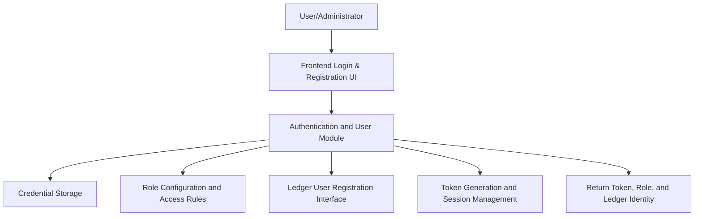

Authentication and User Module Processing Flow:
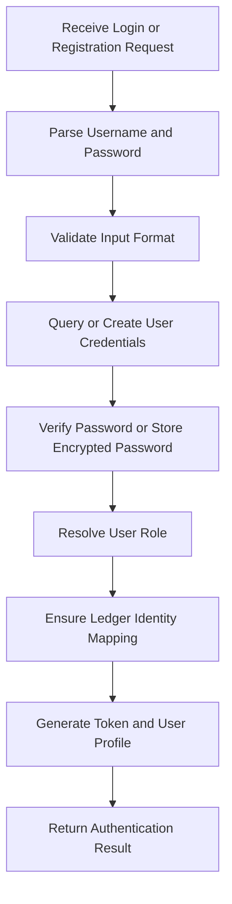

Authentication and User Module Prototype Relationship Diagram:
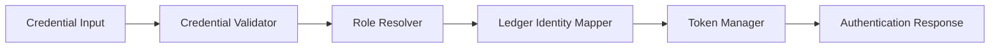

## 1.4.5 Middle Layer - Resource File Management Module Design
The Resource File Management Module will be located in the middle-layer resource-governance position and will connect frontend resource interactions, backend service orchestration, underlying storage, and ledger resource managers. This module is planned to act as the unified entry point for the resource lifecycle, covering submission, validation, registration, query, download, and audit-trigger operations. Through this single-entry architecture, the system will maintain consistency, traceability, and governance control for shared resources.

This module will process file upload intake, metadata extraction, category management, hash-based duplicate checking, detail query, download permission checks, and download response generation. The system is planned to adopt a “split upload/download processing path”: the upload path will emphasize integrity, uniqueness, and registrability, while the download path will emphasize authorization legality, file existence, and behavior traceability. This approach will provide stable event sources for the reward subsystem and reduce cross-module coupling.

Inputs will include uploaded file streams, file names, file types, business metadata, query filters, and download requests. Outputs will include resource catalog lists, detail objects, deduplication results, binary download streams, and validation error information. For future scalability, the system is planned to support filtering by pagination/category/publisher/time and include auditable context in download responses.

Dependency-wise, this module will rely on hash-computation components, upload directories/object storage, file metadata models, ledger resource managers, authentication/authorization modules, and storage adapters. The follow-up implementation plan will extend object-storage support, asynchronous scanning, access auditing, rate limiting, and finer-grained file-type validation, along with configurable policy controls for high-concurrency and large-scale file scenarios.

Resource File Management Module Context Diagram:
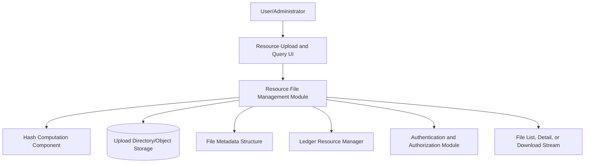

Upload and Deduplication Flow:
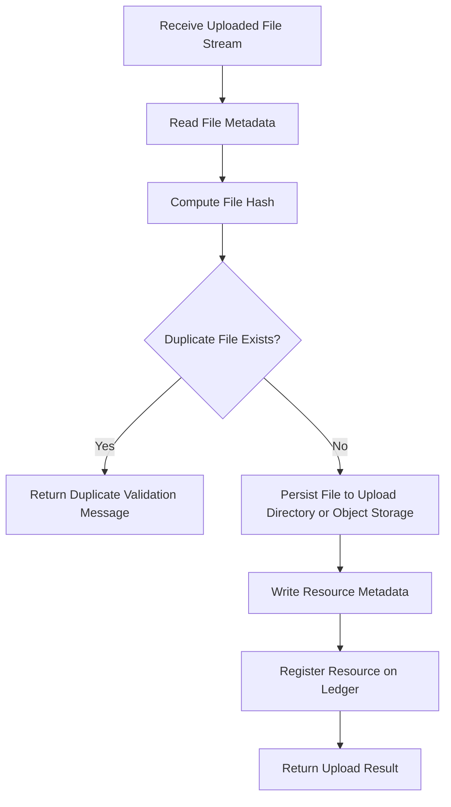

Query and Download Flow:
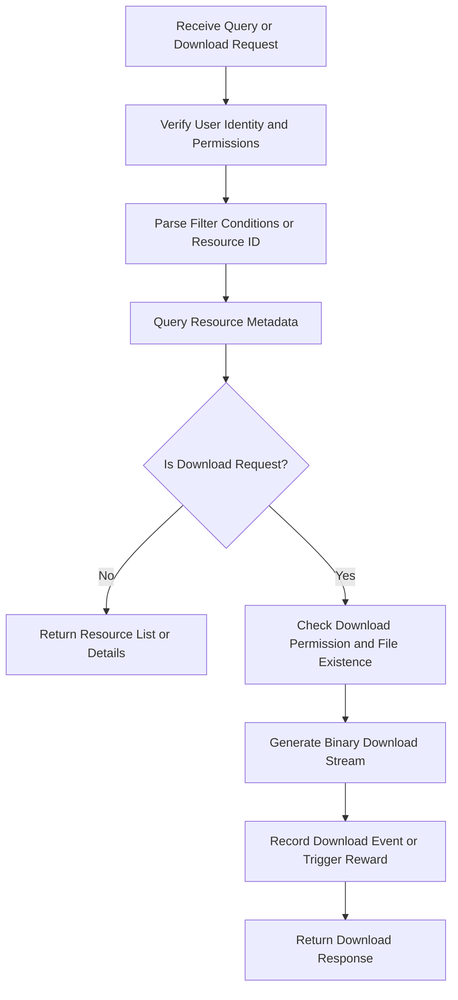

Resource File Management Module Prototype Relationship Diagram:
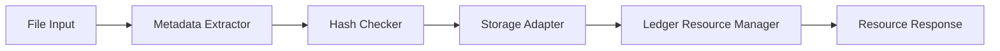

## 1.4.6 Middle Layer - Block Mining and Reward Module Design
The Block Mining and Reward Module will be positioned as the settlement core in the middle layer, connecting resource-download events, pending transaction pools, administrator mining operations, and ledger chain structures. This module will transform business actions into confirmable transactions and then produce block metadata and reward outcomes through mining confirmation workflows. As the platform evolves, this module is expected to remain a key carrier for on-chain governance and incentive-policy iteration.

This module will process pending-transaction aggregation, mining-trigger execution, reward calculation, block retrieval, block export, and wealth updates. The system is planned to adopt a two-stage model: “event intake to pending pool” and “mining confirmation for block settlement.” In this model, business-triggered events (such as download rewards) are first queued, and then administrators trigger mining to finalize block generation and reward settlement.

Inputs will include mining requests, pending transaction lists, block query filters, download reward events, and administrator operation context. Outputs will include block metadata, mining results, reward results, wealth-change outcomes, and pending-transaction statistics. A unified query interface is planned to support retrieval by block number, miner identifier, hash fragment, and time window, while standardized result payloads will support export/report workflows.

Dependencies will include ledger chain structures, pending transaction pools, timestamp formatting capabilities, administrator permission control, resource-download events, and future chaincode interfaces. The follow-up roadmap will connect real chaincode invocation, add on-chain event subscriptions, optimize reward rules, strengthen block-export capabilities, and improve audit traceability for cross-node collaboration and policy evolution.

Block Mining and Reward Module Context Diagram:
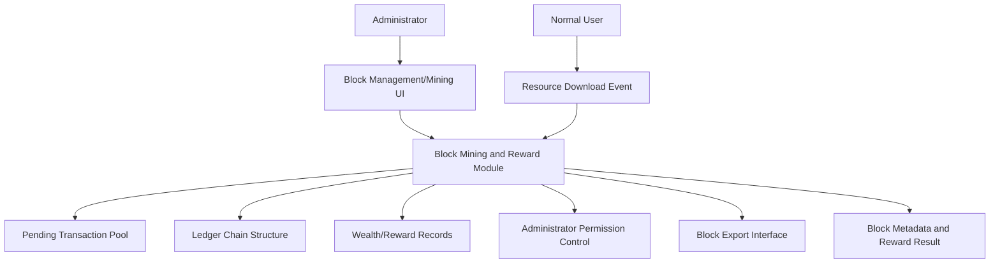

Mining Processing Flow:
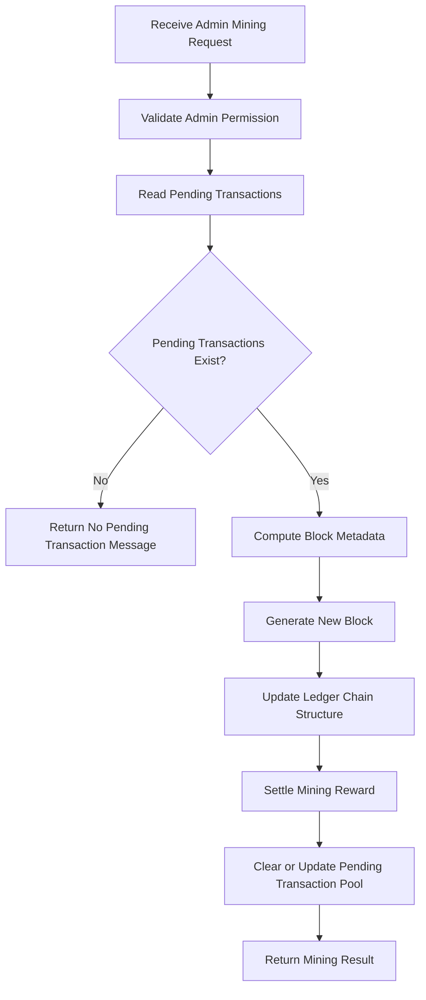

Download-Reward Trigger Flow:
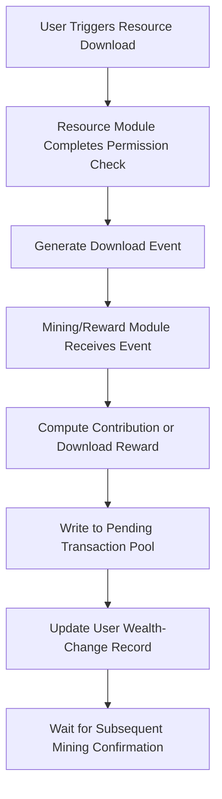

Block Mining and Reward Module Prototype Relationship Diagram:
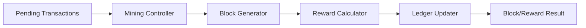
