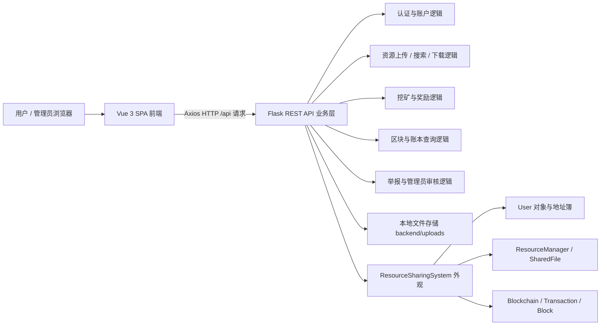
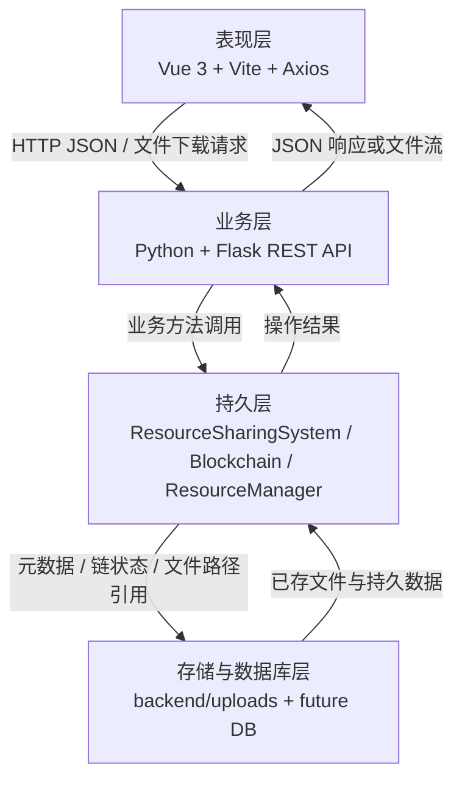
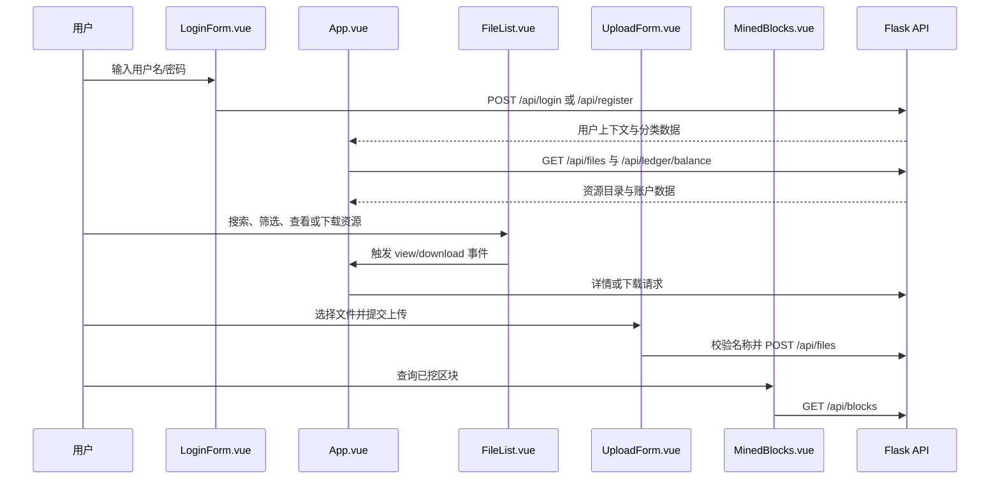
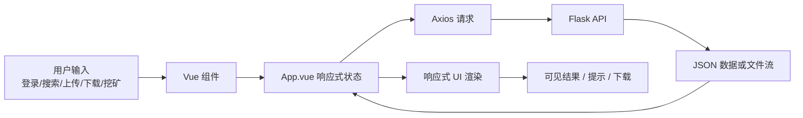
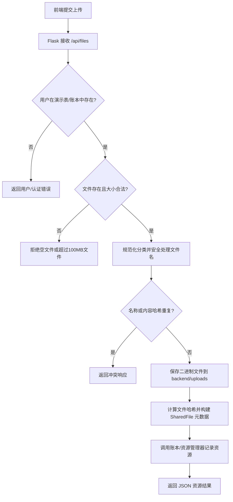
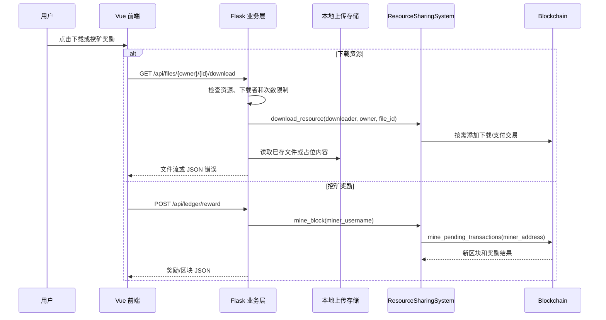

# 《基于区块链的资源共享系统（Nexus）》总体报告 v1.0 — 第2章至2.2.2整体设计

## 2 整体设计

本节说明 Nexus 基于区块链的资源共享系统从系统体系结构到分层结构前两层（表现层、业务层）的总体设计。本文档覆盖总体报告 v1.0 中 **第 2 章至 2.2.2 节** 的内容，可直接放置在后续持久层、数据库层、数据处理流程、设计模式和测试章节之前。

本节内容基于当前仓库实际实现整理：

- `frontend/`：Vue 3 + Vite 单页前端应用。
- `frontend/src/App.vue`：主仪表盘控制组件与页面状态协调组件。
- `frontend/src/components/LoginForm.vue`：登录与注册入口。
- `frontend/src/components/FileList.vue`：资源目录、搜索和筛选组件。
- `frontend/src/components/FileDetail.vue`：资源详情与下载组件。
- `frontend/src/components/UploadForm.vue`：文件上传表单与上传前校验组件。
- `frontend/src/components/MinedBlocks.vue`：已挖区块 / 账本浏览组件。
- `backend/app.py`：Flask REST API 与业务规则协调层。
- `hyperledger/ledger.py`：模拟区块链账本、资源管理器、用户、交易和区块模块。
- `backend/uploads/`：本地上传文件存储目录。

### 2.1 体系结构设计

软件结构风格是描述某一特定应用领域中系统组织方式的惯用模式。Nexus 资源共享系统采用**分层体系结构**，同时结合**前后端分离架构**、**RESTful 服务交互架构**以及**数据中心型（账本中心）架构**。这种组合结构体现了软件工程中“高内聚、低耦合”的设计思想。

在分层体系结构中，每一层都承担明确角色。表现层负责用户界面和交互逻辑；业务层负责执行用户操作相关的业务规则与请求处理；持久层和存储层负责封装账本状态、文件元数据、上传文件以及未来数据库替换等问题。每一层都是完成业务请求所需职责的一种抽象。

因此，本系统被设计为一个基于浏览器的资源共享平台，所有资源行为围绕统一账本进行记录。上传、下载、挖矿奖励、区块查询和管理员审核等操作由 Flask 服务统一协调，并最终反映到模拟区块链/资源管理模块中。

#### 2.1.1 组合架构风格

| 架构风格 | 在 Nexus 中的应用 | 设计价值 |
| :--- | :--- | :--- |
| 分层体系结构 | 系统划分为表现层、业务层、持久层和存储/数据库层。 | 降低耦合，明确模块职责，便于独立测试。 |
| 前后端分离 | Vue 3 前端通过 HTTP API 与 Flask 后端通信。 | 支持前后端独立开发、部署和后续移动端/桌面端扩展。 |
| RESTful 架构 | 业务功能通过 `/api/...` 接口暴露，例如 `/api/login`、`/api/files`、`/api/ledger/reward`、`/api/blocks`。 | 接口语义清晰，使前端不依赖后端内部实现。 |
| 账本中心架构 | 资源上传、下载、余额、奖励和区块记录由 `ResourceSharingSystem` 与 `Blockchain` 协调。 | 使资源行为具备可追溯性，并为后续替换真实区块链网络提供基础。 |
| 本地存储辅助架构 | 上传文件二进制内容保存在 `backend/uploads/`，元数据由后端和账本模块处理。 | 避免大文件进入 JSON 响应，并在原型中支持真实文件分享行为。 |

#### 2.1.2 系统高层架构



上图表明，浏览器只通过 API 接口与后端通信。前端不会直接读取磁盘上的上传文件，不会直接从区块计算余额，也不会直接修改链上交易。前端负责展示 Flask 返回的数据，并通过明确的 API 调用触发业务行为。

#### 2.1.3 模块组成

```mermaid
flowchart TB
    Nexus[Nexus 资源共享系统]
    Nexus --> Frontend[前端交互子系统]
    Nexus --> Backend[后端业务服务子系统]
    Nexus --> Ledger[模拟区块链账本子系统]
    Nexus --> FileStorage[本地文件存储子系统]

    Frontend --> Login[LoginForm.vue]
    Frontend --> Dashboard[App.vue]
    Frontend --> List[FileList.vue]
    Frontend --> Detail[FileDetail.vue]
    Frontend --> Upload[UploadForm.vue]
    Frontend --> Blocks[MinedBlocks.vue]

    Backend --> Routes[Flask API 路由]
    Backend --> Validation[校验 / 序列化辅助函数]
    Backend --> DownloadLimit[下载次数控制]
    Backend --> AdminReview[举报 / 管理员审核]

    Ledger --> RSS[ResourceSharingSystem]
    Ledger --> RM[ResourceManager]
    Ledger --> BC[Blockchain]
    Ledger --> TX[Transaction]
    Ledger --> BK[Block]
    Ledger --> SF[SharedFile]

    FileStorage --> Uploads[backend/uploads]
```



系统可理解为四个协作子系统：

1. **前端交互子系统**：展示页面、表单、资源卡片和账本数据。
2. **后端业务服务子系统**：接收前端命令，校验规则，并协调账本/存储操作。
3. **模拟区块链账本子系统**：以内存方式维护用户、文件元数据、交易、待处理交易、已挖区块和余额。
4. **本地文件存储子系统**：保存上传的二进制文件，并在下载时提供内容流。

#### 2.1.4 组合架构优势

- **分层体系结构**：减少 UI、API、账本和存储模块之间的直接依赖，提高可维护性，也便于后续替换模块。
- **前后端分离**：Vue 前端和 Flask 后端可以独立开发与测试。只要遵循相同 API 契约，前端可以重构或替换。
- **RESTful 架构**：为系统提供清晰的接口边界。接口可以使用浏览器、Postman 类工具、单元测试或自动化脚本进行验证。
- **账本中心设计**：上传奖励、下载记录、挖矿奖励和区块历史等重要资源行为均围绕账本外观对象组织，支持行为追溯。
- **原型到生产的可扩展性**：当前模拟账本和本地存储后续可被数据库和真实区块链集成替换，而不需要完全重写 UI。

### 2.2 分层结构

根据软件的逻辑结构以及功能，系统分为四个层次：**表现层**、**业务层**、**持久层**和**数据库/存储层**。本文档重点展开前两层。后续持久层和数据库/存储层可在总体报告后续章节继续补充。

层级结构用于隔离职责。某一层的变化不应直接破坏其他无关层。例如，如果账本持久化机制从内存切换为数据库，只要 Flask API 响应契约保持稳定，Vue 组件理论上不需要修改。



各层说明如下：

| 层次 | 当前仓库映射 | 主要职责 |
| :--- | :--- | :--- |
| 表现层 | `frontend/src/App.vue`、`frontend/src/components/*.vue`、`frontend/src/style.css` | 用户交互、页面展示、表单、筛选器、上传 UI、下载操作、挖矿按钮、区块浏览。 |
| 业务层 | `backend/app.py` | API 路由、请求解析、校验、重复检测、上传/下载协调、奖励挖矿调用、区块过滤、管理员审核。 |
| 持久层 | `hyperledger/ledger.py` 中的 `ResourceSharingSystem`、`Blockchain`、`ResourceManager`、`User`、`Transaction`、`Block`、`SharedFile` 等类 | 内存账本与资源元数据管理。 |
| 存储/数据库层 | `backend/uploads/`、内存字典、未来数据库设计 | 上传二进制存储、演示账号状态、下载次数计数，以及未来持久化存储。 |

#### 2.2.1 表现层

表现层位于分层架构的最上层，与用户直接接触。该层负责接收用户输入、展示系统数据、触发业务动作并显示操作反馈。当前实现中，该层为使用 Vite 构建、Axios 发送请求的 Vue 3 单页应用。

##### 2.2.1.1 技术栈

| 项目 | 实现 | 说明 |
| :--- | :--- | :--- |
| 框架 | Vue 3 | 实现组件化前端 UI 和响应式数据更新。 |
| 构建工具 | Vite | 提供本地开发服务器和生产构建输出。 |
| HTTP 客户端 | Axios | 向 Flask 接口发送请求，例如 `/api/login`、`/api/files`、`/api/blocks`。 |
| 样式 | `frontend/src/style.css` | 定义深色主题、卡片、表单、布局和视觉一致性。 |
| 运行环境 | 现代浏览器 | 加载生成的静态资源并执行 SPA。 |

##### 2.2.1.2 核心组件

| 组件 | 文件路径 | 主要作用 |
| :--- | :--- | :--- |
| 登录/注册入口 | `frontend/src/components/LoginForm.vue` | 提供登录与注册模式切换、用户名/密码输入，并调用 `/api/login` 和 `/api/register`。 |
| 主仪表盘控制器 | `frontend/src/App.vue` | 维护登录用户状态、标签页导航、文件数据、余额、挖矿状态和区块查询状态。 |
| 资源列表 | `frontend/src/components/FileList.vue` | 展示社区文件和用户文件，支持关键词搜索、筛选、详情查看和下载触发。 |
| 资源详情 | `frontend/src/components/FileDetail.vue` | 展示文件元数据，并提供下载和返回操作。 |
| 上传表单 | `frontend/src/components/UploadForm.vue` | 支持文件选择/拖拽、分类选择、大小显示、重复名称校验和上传提交。 |
| 区块浏览器 | `frontend/src/components/MinedBlocks.vue` | 展示已挖区块信息，并提供管理员/成员筛选操作。 |

##### 2.2.1.3 表现层工作流程



该流程表明，前端组件采用事件驱动方式协作。子组件收集用户意图并向 `App.vue` 发出事件，`App.vue` 负责协调 API 调用和共享状态刷新。

##### 2.2.1.4 交互设计原则

- **设计简洁明了，考虑用户习惯**：系统主要面向 Web 用户，页面操作应直接、易理解。用户可以通过清晰区域完成登录、浏览文件、上传资源、下载文件、挖矿奖励和查询区块。
- **视觉一致性**：项目采用深色科技风格，通过深色背景和高亮强调色体现区块链与资源共享主题。
- **反馈明确**：登录错误、上传校验错误、重复名称检查、挖矿加载状态和下载次数限制等反馈应及时展示。
- **组件复用**：文件卡片、筛选控件、上传控件和区块筛选被拆分为组件，便于独立维护。
- **前后端隔离**：前端不直接操作账本对象，只消费 API 返回的 JSON 数据和文件响应。

##### 2.2.1.5 表现层数据流



表现层将用户操作转换为 API 调用，并将 API 结果转换为用户可见的界面变化。这样可以使 UI 层专注于交互和渲染，而业务决策保留在后端。

#### 2.2.2 业务层

业务层的关注点主要集中在业务规则的制定、业务流程的实现等与业务需求有关的系统设计。其位置处于持久层与表现层中间，起到了数据交换中承上启下的作用。

在当前仓库中，业务层由 `backend/app.py` 实现。Flask 应用接收来自 Vue 前端的请求，校验请求数据，协调模拟区块链/资源模块，管理本地上传下载行为，并返回 JSON 响应或文件流。

##### 2.2.2.1 技术栈

| 项目 | 实现 | 说明 |
| :--- | :--- | :--- |
| 语言 | Python 3.x | 用于 Flask 路由逻辑和业务辅助函数。 |
| Web 框架 | Flask | 在 `/api/...` 下提供 REST 接口。 |
| 跨域支持 | Flask-CORS | 支持开发阶段前后端分离调用。 |
| 文件工具 | Werkzeug `secure_filename`、Flask `send_file` | 保护文件名并返回已存文件或占位文件。 |
| 账本外观 | `ResourceSharingSystem` | 提供注册、资源声明、下载、挖矿、余额和区块链查询方法。 |

##### 2.2.2.2 核心职责

- 接收前端请求，调用底层区块链与资源管理模块执行业务逻辑。
- 使用演示用户表进行用户认证与注册，同时确保账本用户/地址存在。
- 处理文件上传：大小校验、安全命名、哈希计算、名称/内容冲突检测、分类规范化和资源发布。
- 处理文件下载：资源定位、下载次数控制、账本下载记录和文件流响应。
- 协调挖矿：调用账本挖矿/奖励逻辑，打包待处理交易，并返回区块/奖励元数据。
- 提供区块链查询：余额计算、区块列表、基于角色的区块可见性和链有效性状态。
- 支持举报/管理员审核流程，通过改变资源活跃状态为未来治理/回滚扩展做准备。
- 向前端返回 API 响应。设计目标是统一 JSON 结构 `{success, data, message, error}`；当前实现中仍存在多种响应形态，因此响应标准化是后续改进方向。

##### 2.2.2.3 业务层服务映射

```mermaid
flowchart TB
    API[backend/app.py Flask API]

    API --> Auth[认证\n/api/login /api/register]
    API --> Balance[余额快照\n/api/ledger/balance /api/balance/{username}]
    API --> FileSvc[文件资源服务\n/api/files /api/resources]
    API --> Download[下载服务\n/api/files/{owner}/{id}/download /api/download]
    API --> Mining[挖矿与奖励\n/api/ledger/reward /api/mine]
    API --> Chain[区块链浏览\n/api/blocks /api/blockchain]
    API --> Admin[举报与审核\n/api/report /api/admin/review]

    Auth --> RSS[ResourceSharingSystem]
    Balance --> RSS
    FileSvc --> RSS
    Download --> RSS
    Mining --> RSS
    Chain --> RSS
    Admin --> RSS

    FileSvc --> Uploads[backend/uploads]
    Download --> Uploads
    RSS --> Ledger[Blockchain / User / ResourceManager]
```

##### 2.2.2.4 主要 API 接口

| 业务功能 | 接口 | 方法 | 说明 |
| :--- | :--- | :--- | :--- |
| 登录 | `/api/login` | POST | 校验演示账号并返回用户上下文。 |
| 注册 | `/api/register` | POST | 创建演示账号并初始化账本用户。 |
| 账本余额 | `/api/ledger/balance` | GET | 返回用户余额和账户/账本摘要。 |
| 挖矿奖励 | `/api/ledger/reward` | POST | 触发模拟挖矿/奖励流程。 |
| 区块查询 | `/api/blocks` | GET | 按角色过滤后返回已挖区块元数据。 |
| 文件列表 | `/api/files` | GET | 返回前端可用的资源目录条目。 |
| 文件分类 | `/api/files/categories` | GET | 返回标准资源分类。 |
| 文件名校验 | `/api/files/validate-name` | GET | 检查重复或冲突资源名称。 |
| 发布/上传文件 | `/api/files` | POST | 接收 JSON 或 multipart 上传并创建资源元数据。 |
| 文件详情 | `/api/files/{owner}/{file_id}` | GET | 返回单个资源元数据。 |
| 文件下载 | `/api/files/{owner}/{file_id}/download` | GET | 返回文件流并记录下载相关影响。 |
| 区块链摘要 | `/api/blockchain` | GET | 返回链长度、待处理交易数、难度、奖励和有效性。 |
| 资源搜索 | `/api/resources` | GET | 通过后端/账本筛选条件搜索资源。 |
| 用户文件管理 | `/api/user/{username}/files`、`/api/user/{username}/file/{file_id}` | GET/PUT/DELETE | 列出、更新或删除用户拥有的资源。 |
| 举报/管理员审核 | `/api/report`、`/api/admin/review` | POST | 将举报资源标记为非活跃或执行审核操作。 |

##### 2.2.2.5 上传业务流程



##### 2.2.2.6 下载与奖励业务流程



##### 2.2.2.7 业务规则与校验

| 规则类别 | 规则 | 实现位置 |
| :--- | :--- | :--- |
| 用户规则 | Web 账号应关联账本用户/地址。 | `ensure_ledger_user()`、`ResourceSharingSystem.register_user()`。 |
| 上传大小规则 | 文件必须非空且不超过 100 MB。 | `clamp_upload_size()`。 |
| 分类规则 | 未知分类规范化为 `other`。 | `normalize_category()`、`category_label()`。 |
| 重复名称规则 | 已存在的活跃资源名称应被拒绝。 | `/api/files/validate-name`、`find_name_conflict()`。 |
| 重复内容规则 | 相同文件内容不应被重复上传。 | `compute_file_hash()`、`find_content_conflict()`。 |
| 下载次数规则 | 原型限制同一用户对同一非自有文件的重复下载。 | `DOWNLOAD_ATTEMPT_LIMIT`、`DOWNLOAD_ATTEMPTS`。 |
| 账本规则 | 上传、下载、挖矿和奖励行为应反映到账本/资源状态中。 | `ResourceSharingSystem`、`Blockchain`、`ResourceManager`。 |
| 管理员规则 | 举报资源可以被标记为非活跃并进入审核流程。 | `/api/report`、`/api/admin/review`。 |

##### 2.2.2.8 当前设计说明

业务层已经支持主要资源共享闭环：登录/注册、目录加载、上传校验、资源发布、资源详情查询、下载、挖矿奖励、余额刷新、区块查询和管理员审核。但由于项目仍处于原型阶段，仍存在若干后续改进方向：

1. 将演示型明文凭据替换为密码哈希和 JWT/Session 中间件。
2. 将用户、余额、资源元数据、下载日志和链快照持久化到数据库。
3. 将所有 JSON API 响应标准化为目标 `{success, data, message, error}` 格式。
4. 当项目规模扩大时，将 `backend/app.py` 拆分为更小的服务模块。
5. 增加更严格的文件类型/MIME 校验和安全扫描。
6. 使用真实区块链网络或多节点模拟替换/扩展当前模拟账本。
7. 为举报审核和回滚/补偿实现可审计的治理交易。

### 第2章至2.2.2小结

从第 2 章到 2.2.2 节，Nexus 系统被设计为一个分层、前后端分离、RESTful、账本中心的资源共享平台。表现层通过 Vue 组件负责用户交互，业务层负责请求校验、资源流程执行、挖矿奖励协调和面向账本的服务编排。该设计为当前课程原型提供了清晰架构，同时也为后续数据库持久化、安全增强和真实区块链集成保留了扩展空间。

