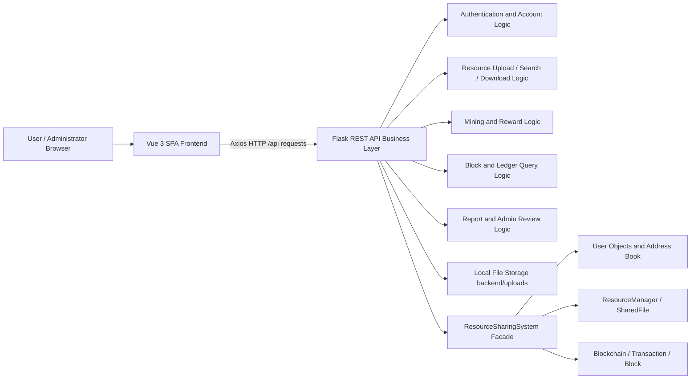
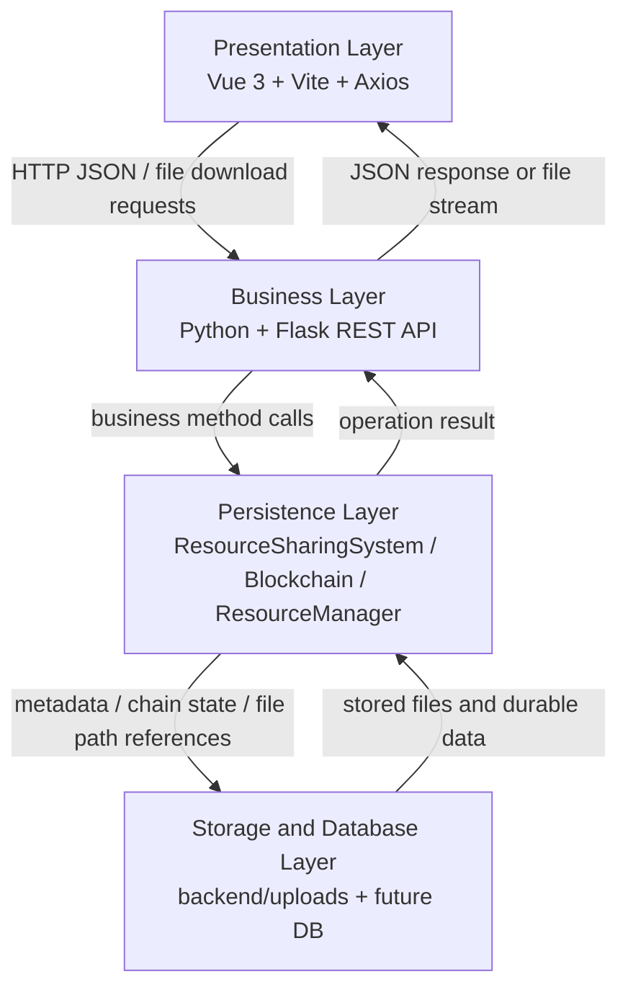
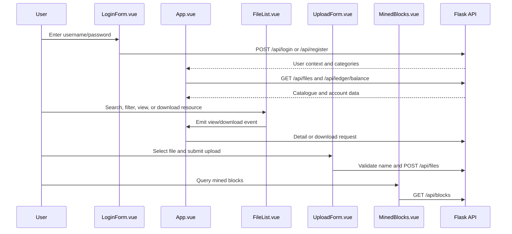
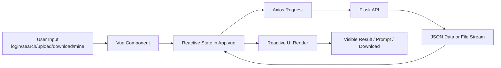
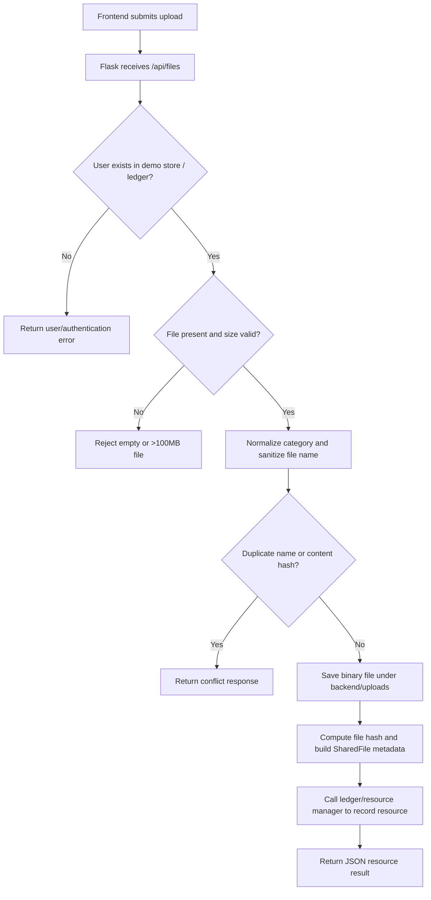
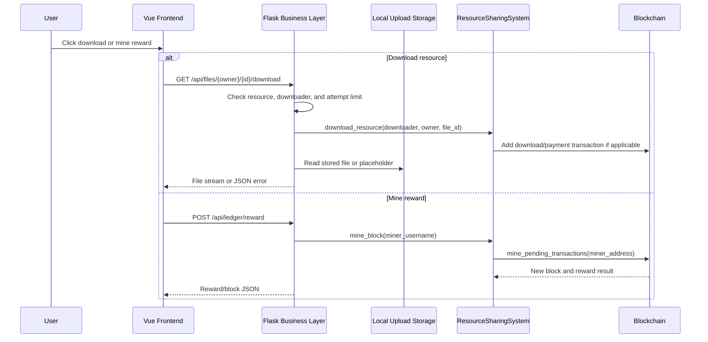

# Nexus Overall Report v1.0 — Section 2 to 2.2.2 Overall Design

## 2 Overall Design

This section describes the overall design of the Nexus blockchain-based resource sharing system from the system architecture level down to the first two layers of the layered structure: the presentation layer and the business layer. The scope of this document is **Section 2 through Section 2.2.2** of the Overall Report v1.0. It is intended to be inserted before the later persistence-layer, database-layer, data-flow, design-pattern, and testing sections.

The description is based on the current repository implementation:

- `frontend/`: Vue 3 + Vite single-page application.
- `frontend/src/App.vue`: main dashboard controller and page-state coordinator.
- `frontend/src/components/LoginForm.vue`: login and registration entry.
- `frontend/src/components/FileList.vue`: resource catalogue, search, and filters.
- `frontend/src/components/FileDetail.vue`: resource details and download action.
- `frontend/src/components/UploadForm.vue`: file upload form and pre-upload validation.
- `frontend/src/components/MinedBlocks.vue`: mined-block / ledger browser.
- `backend/app.py`: Flask REST API and business-rule coordination layer.
- `hyperledger/ledger.py`: mocked blockchain ledger, resource manager, users, transactions, and blocks.
- `backend/uploads/`: local upload storage directory.

### 2.1 Architecture Design

Software architecture style describes a reusable organization pattern for a specific type of application. For the Nexus resource sharing system, the design adopts a **layered architecture** and combines it with **frontend/backend separation**, **RESTful service interaction**, and a **ledger-centered data management style**. This combination reflects the software engineering principle of high cohesion and low coupling.

In the layered architecture, each layer has a clear role. The presentation layer handles user interfaces and interaction logic. The business layer executes business rules and request processing closely related to user operations. The persistence and storage layers encapsulate ledger state, file metadata, uploaded files, and future database replacement concerns. Each layer abstracts a specific group of responsibilities required to complete a business request.

The system is therefore designed as a browser-based resource sharing platform whose resource behavior is recorded around a unified ledger. Uploading, downloading, mining rewards, block query, and administrative review are coordinated through the Flask service and then reflected in the mocked blockchain/resource-management modules.

#### 2.1.1 Combined Architecture Style

| Architecture Style | Application in Nexus | Design Value |
| :--- | :--- | :--- |
| Layered architecture | The system is divided into presentation, business, persistence, and storage/database layers. | Reduces coupling, clarifies module responsibility, and supports independent testing. |
| Frontend/backend separation | Vue 3 frontend communicates with Flask backend through HTTP APIs. | Enables separate development, easier deployment, and potential mobile/desktop client extension. |
| RESTful architecture | Business functions are exposed through `/api/...` endpoints such as `/api/login`, `/api/files`, `/api/ledger/reward`, and `/api/blocks`. | Provides clear API semantics and allows the frontend to remain independent from backend implementation details. |
| Ledger-centered architecture | Resource upload, download, balance, reward, and block records are coordinated through `ResourceSharingSystem` and `Blockchain`. | Makes resource behavior traceable and provides a basis for later replacement with a real blockchain network. |
| Local-storage-assisted architecture | Uploaded file binaries are stored under `backend/uploads/`, while metadata is handled by the backend and ledger modules. | Keeps large binary data outside JSON responses and supports realistic file sharing behavior in the prototype. |

#### 2.1.2 High-Level System Architecture



The diagram shows that the browser only communicates with the backend through API endpoints. The frontend does not directly read uploaded files from disk, calculate balances from blocks, or manipulate chain transactions. Instead, it displays data returned by Flask and triggers actions through well-defined API calls.

#### 2.1.3 Module Composition

```mermaid
flowchart TB
    Nexus[Nexus Resource Sharing System]
    Nexus --> Frontend[Frontend Interaction Subsystem]
    Nexus --> Backend[Backend Business Service Subsystem]
    Nexus --> Ledger[Mock Blockchain Ledger Subsystem]
    Nexus --> FileStorage[Local File Storage Subsystem]

    Frontend --> Login[LoginForm.vue]
    Frontend --> Dashboard[App.vue]
    Frontend --> List[FileList.vue]
    Frontend --> Detail[FileDetail.vue]
    Frontend --> Upload[UploadForm.vue]
    Frontend --> Blocks[MinedBlocks.vue]

    Backend --> Routes[Flask API Routes]
    Backend --> Validation[Validation / Serialization Helpers]
    Backend --> DownloadLimit[Download Attempt Control]
    Backend --> AdminReview[Report / Admin Review]

    Ledger --> RSS[ResourceSharingSystem]
    Ledger --> RM[ResourceManager]
    Ledger --> BC[Blockchain]
    Ledger --> TX[Transaction]
    Ledger --> BK[Block]
    Ledger --> SF[SharedFile]

    FileStorage --> Uploads[backend/uploads]
```



The system can be understood as four cooperating subsystems:

1. **Frontend interaction subsystem**: displays pages, forms, resource cards, and ledger data.
2. **Backend business service subsystem**: receives frontend commands, checks rules, and coordinates ledger/storage operations.
3. **Mock blockchain ledger subsystem**: stores users, file metadata, transactions, pending transactions, mined blocks, and balances in memory.
4. **Local file storage subsystem**: stores uploaded binary files and provides content streams during download.

#### 2.1.4 Advantages of the Combined Architecture

- **Layered architecture**: reduces direct dependency between UI, API, ledger, and storage modules. This improves maintainability and makes later module replacement easier.
- **Frontend/backend separation**: allows the Vue frontend and Flask backend to be developed and tested independently. The frontend can be rebuilt or replaced as long as it follows the same API contracts.
- **RESTful architecture**: gives the system a clear interface boundary. API endpoints are easy to test with browsers, Postman-like tools, unit tests, or automated scripts.
- **Ledger-centered design**: all important resource behaviors, including upload rewards, download records, mining rewards, and block history, are centered on the ledger facade, which supports traceability.
- **Prototype-to-production extensibility**: the current mocked ledger and local storage can be replaced later by a database and real blockchain integration without redesigning the entire UI.

### 2.2 Layered Structure

According to the logical structure and functions of the software, the system can be divided into four layers: **presentation layer**, **business layer**, **persistence layer**, and **database/storage layer**. This document covers the first two layers in detail. The later persistence and storage/database layers can be expanded in subsequent sections of the overall report.

The layered structure isolates responsibilities. Changes in one layer should not directly break unrelated layers. For example, if the ledger persistence mechanism changes from memory to a database, the Vue components should not need to change as long as the Flask API response contract remains stable.



Layer descriptions:

| Layer | Current Repository Mapping | Main Responsibility |
| :--- | :--- | :--- |
| Presentation layer | `frontend/src/App.vue`, `frontend/src/components/*.vue`, `frontend/src/style.css` | User interaction, page display, forms, filters, upload UI, download action, mining button, block browser. |
| Business layer | `backend/app.py` | API routing, request parsing, validation, duplicate checking, upload/download coordination, reward mining calls, block filtering, admin review. |
| Persistence layer | `hyperledger/ledger.py` classes such as `ResourceSharingSystem`, `Blockchain`, `ResourceManager`, `User`, `Transaction`, `Block`, `SharedFile` | In-memory ledger and resource metadata management. |
| Storage/database layer | `backend/uploads/`, in-memory dictionaries, future database design | Uploaded binary storage, demo account state, download attempt counters, and future persistent storage. |

#### 2.2.1 Presentation Layer

The presentation layer is the top layer of the architecture and directly interacts with users. It receives user input, displays system data, triggers business actions, and presents operation feedback. In the current implementation, this layer is a Vue 3 single-page application built with Vite and using Axios for HTTP requests.

##### 2.2.1.1 Technology Stack

| Item | Implementation | Description |
| :--- | :--- | :--- |
| Framework | Vue 3 | Implements component-based frontend UI and reactive data updates. |
| Build tool | Vite | Provides local development server and production build output. |
| HTTP client | Axios | Sends requests to Flask endpoints such as `/api/login`, `/api/files`, and `/api/blocks`. |
| Styling | `frontend/src/style.css` | Defines dark theme, cards, forms, layout, and visual consistency. |
| Runtime | Modern browser | Loads the generated static assets and executes the SPA. |

##### 2.2.1.2 Core Components

| Component | File Path | Main Role |
| :--- | :--- | :--- |
| Login/register entry | `frontend/src/components/LoginForm.vue` | Provides login and registration mode switching, username/password input, and calls `/api/login` and `/api/register`. |
| Main dashboard controller | `frontend/src/App.vue` | Maintains logged-in user state, tab navigation, file data, balances, mining status, and block query state. |
| Resource list | `frontend/src/components/FileList.vue` | Displays community files and user files, supports keyword search, filters, detail view, and download triggers. |
| Resource detail | `frontend/src/components/FileDetail.vue` | Shows file metadata and exposes download/back actions. |
| Upload form | `frontend/src/components/UploadForm.vue` | Supports file selection/drag-and-drop, category selection, size display, duplicate name validation, and upload submission. |
| Block browser | `frontend/src/components/MinedBlocks.vue` | Displays mined block information and provides administrator/member filtering actions. |

##### 2.2.1.3 Presentation-Layer Workflow



The workflow shows that frontend components are event-driven. Child components collect user intent and emit events to `App.vue`, while `App.vue` coordinates API calls and shared state refreshes.

##### 2.2.1.4 Interaction Design Principles

- **Simplicity and user habit orientation**: the system targets web users, so page operations are designed to be direct and easy to understand. Users can log in, browse files, upload resources, download files, mine rewards, and query blocks through visible sections.
- **Visual consistency**: the project uses a dark technology-oriented style. It combines deep background colors with bright accent colors to match the blockchain/resource-sharing theme.
- **Clear feedback**: login errors, upload validation errors, duplicate-name checks, mining loading states, and download-limit messages should be presented promptly.
- **Component reuse**: file cards, filter controls, upload controls, and block filters are separated into components so they can be maintained independently.
- **Frontend/backend isolation**: the frontend never directly manipulates ledger objects. It only consumes JSON data and file responses from the API.

##### 2.2.1.5 Presentation-Layer Data Flow



The presentation layer transforms user operations into API calls and transforms API results into user-visible changes. This keeps the UI layer focused on interaction and rendering, while business decisions remain in the backend.

#### 2.2.2 Business Layer

The business layer focuses on business-rule definition and business-process implementation. It is positioned between the presentation layer and the persistence layer, serving as a bridge for data exchange and business execution.

In the current repository, this layer is implemented by `backend/app.py`. The Flask application receives requests from the Vue frontend, validates request data, coordinates the mocked blockchain/resource modules, manages local upload/download behavior, and returns JSON responses or file streams.

##### 2.2.2.1 Technology Stack

| Item | Implementation | Description |
| :--- | :--- | :--- |
| Language | Python 3.x | Used for Flask route logic and business helper functions. |
| Web framework | Flask | Provides REST endpoints under `/api/...`. |
| Cross-origin support | Flask-CORS | Supports local frontend/backend separation during development. |
| File utilities | Werkzeug `secure_filename`, Flask `send_file` | Protects file names and returns stored files or placeholders. |
| Ledger facade | `ResourceSharingSystem` | Provides registration, resource declaration, download, mining, balance, and blockchain query methods. |

##### 2.2.2.2 Core Responsibilities

- Receive frontend requests and call the underlying blockchain/resource-management modules.
- Perform user authentication and registration using the demo user store, while ensuring the ledger user/address exists.
- Handle file upload: size validation, safe naming, hash calculation, name/content conflict detection, category normalization, and resource publication.
- Handle file download: resource lookup, download-attempt control, ledger download recording, and file-stream response.
- Coordinate mining: call the ledger mining/reward logic, package pending transactions, and return block/reward metadata.
- Provide blockchain query functions: balance calculation, block list, role-based block visibility, and chain-validity status.
- Support report/admin review workflows by changing resource active status and preparing future governance/rollback extensions.
- Return API responses to the frontend. The design target is a unified JSON structure `{success, data, message, error}`; the current implementation has several response shapes, so response standardization is a recommended improvement.

##### 2.2.2.3 Business-Layer Service Map

```mermaid
flowchart TB
    API[backend/app.py Flask API]

    API --> Auth[Authentication\n/api/login /api/register]
    API --> Balance[Balance Snapshot\n/api/ledger/balance /api/balance/{username}]
    API --> FileSvc[File Resource Service\n/api/files /api/resources]
    API --> Download[Download Service\n/api/files/{owner}/{id}/download /api/download]
    API --> Mining[Mining and Reward\n/api/ledger/reward /api/mine]
    API --> Chain[Blockchain Browser\n/api/blocks /api/blockchain]
    API --> Admin[Report and Review\n/api/report /api/admin/review]

    Auth --> RSS[ResourceSharingSystem]
    Balance --> RSS
    FileSvc --> RSS
    Download --> RSS
    Mining --> RSS
    Chain --> RSS
    Admin --> RSS

    FileSvc --> Uploads[backend/uploads]
    Download --> Uploads
    RSS --> Ledger[Blockchain / User / ResourceManager]
```

##### 2.2.2.4 Main API Endpoints

| Business Function | Endpoint | Method | Description |
| :--- | :--- | :--- | :--- |
| Login | `/api/login` | POST | Validates demo credentials and returns user context. |
| Registration | `/api/register` | POST | Creates a demo account and initializes the ledger user. |
| Ledger balance | `/api/ledger/balance` | GET | Returns user balance and account/ledger summary. |
| Mining reward | `/api/ledger/reward` | POST | Triggers simulated mining/reward flow. |
| Block query | `/api/blocks` | GET | Returns mined block metadata with role-based filtering. |
| File list | `/api/files` | GET | Returns resource catalogue entries for the frontend. |
| File categories | `/api/files/categories` | GET | Returns canonical resource categories. |
| Validate file name | `/api/files/validate-name` | GET | Checks duplicate or conflicting resource names. |
| Publish/upload file | `/api/files` | POST | Accepts JSON or multipart upload and creates resource metadata. |
| File detail | `/api/files/{owner}/{file_id}` | GET | Returns metadata for one resource. |
| File download | `/api/files/{owner}/{file_id}/download` | GET | Streams a file and records download-related effects. |
| Blockchain summary | `/api/blockchain` | GET | Returns chain length, pending transaction count, difficulty, reward, and validity. |
| Resource search | `/api/resources` | GET | Searches resources through backend/ledger filters. |
| User file management | `/api/user/{username}/files`, `/api/user/{username}/file/{file_id}` | GET/PUT/DELETE | Lists, updates, or removes user-owned resources. |
| Report/admin review | `/api/report`, `/api/admin/review` | POST | Marks reported resources inactive or applies review actions. |

##### 2.2.2.5 Upload Business Process



##### 2.2.2.6 Download and Reward Business Process



##### 2.2.2.7 Business Rules and Validation

| Rule Category | Rule | Implementation Area |
| :--- | :--- | :--- |
| User rule | A web account should be associated with a ledger user/address. | `ensure_ledger_user()`, `ResourceSharingSystem.register_user()`. |
| Upload size rule | Files must be non-empty and no larger than 100 MB. | `clamp_upload_size()`. |
| Category rule | Unknown categories are normalized to `other`. | `normalize_category()`, `category_label()`. |
| Duplicate name rule | Existing active resource names should be rejected. | `/api/files/validate-name`, `find_name_conflict()`. |
| Duplicate content rule | Same file content should not be uploaded repeatedly. | `compute_file_hash()`, `find_content_conflict()`. |
| Download attempt rule | The prototype limits repeated non-owner downloads for the same file. | `DOWNLOAD_ATTEMPT_LIMIT`, `DOWNLOAD_ATTEMPTS`. |
| Ledger rule | Upload, download, mining, and reward behavior should be reflected in ledger/resource state. | `ResourceSharingSystem`, `Blockchain`, `ResourceManager`. |
| Admin rule | Reported resources can be marked inactive and reviewed. | `/api/report`, `/api/admin/review`. |

##### 2.2.2.8 Current Design Notes

The business layer already supports the main resource-sharing loop: login/registration, catalogue loading, upload validation, resource publication, resource detail query, download, mining reward, balance refresh, block query, and administrator review. However, because the project is still a prototype, several design improvements remain:

1. Replace demo plaintext credentials with password hashing and JWT/session middleware.
2. Persist users, balances, resource metadata, download logs, and chain snapshots in a database.
3. Standardize all JSON API responses to the target `{success, data, message, error}` format.
4. Split `backend/app.py` into smaller service modules when the project grows.
5. Add stricter file-type/MIME validation and security scanning.
6. Replace or extend the mocked ledger with a real blockchain network or multi-node simulation.
7. Implement auditable governance transactions for report review and rollback/compensation.

### Section 2 to 2.2.2 Summary

From Section 2 through Section 2.2.2, the Nexus system is designed as a layered, frontend/backend-separated, RESTful, ledger-centered resource sharing platform. The presentation layer focuses on user interaction through Vue components, while the business layer focuses on request validation, resource workflow execution, mining/reward coordination, and ledger-facing service orchestration. This design provides a clear architecture for the current course prototype and leaves room for future database persistence, stronger security, and real blockchain integration.

