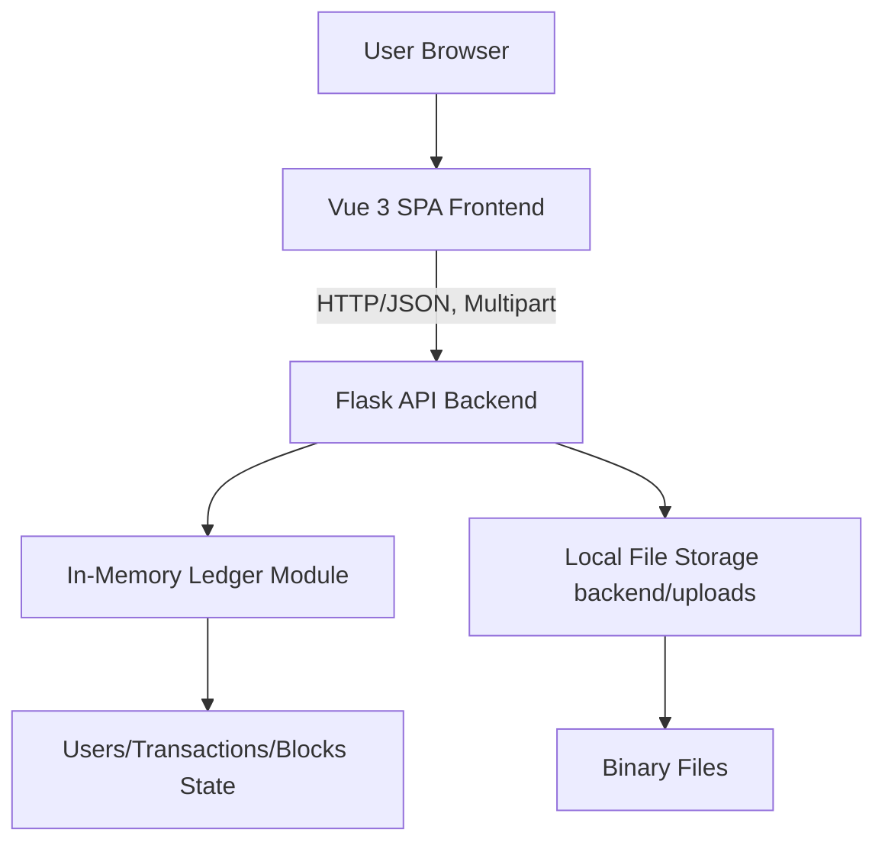
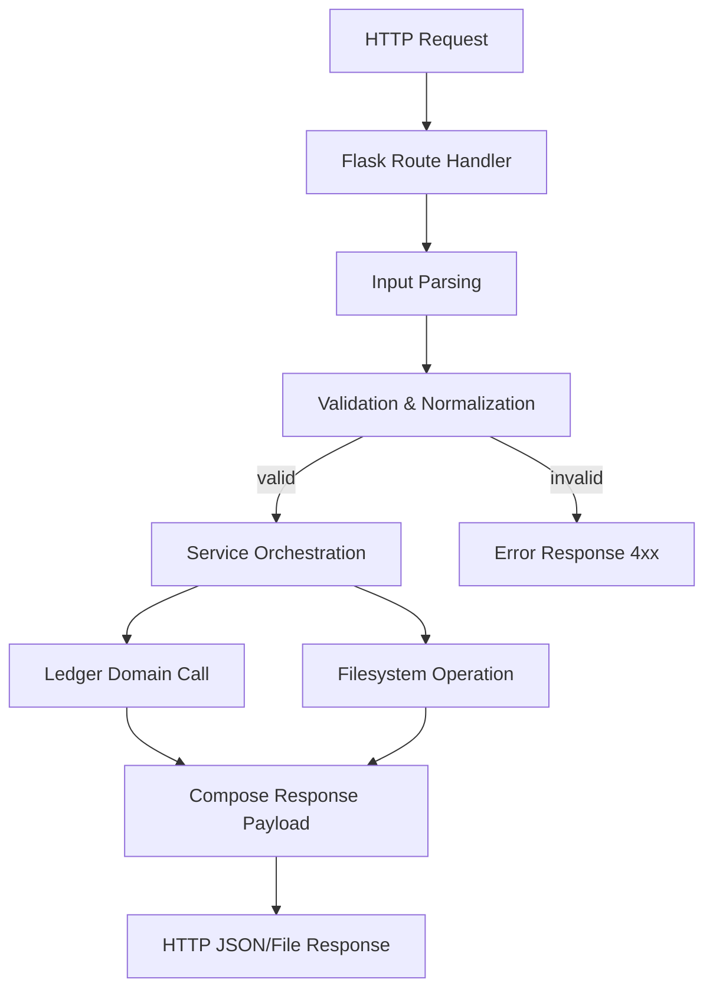
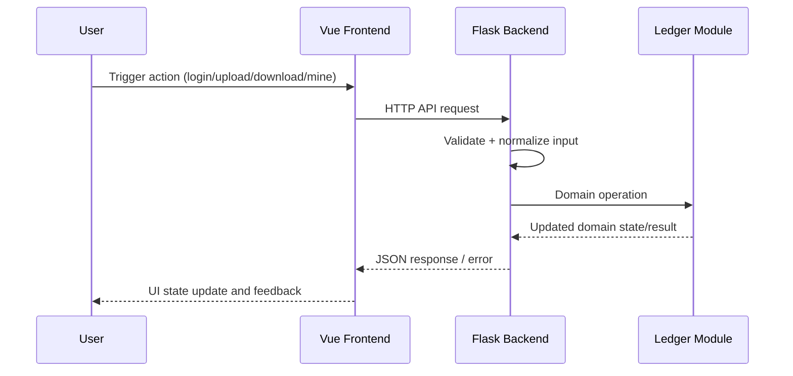

## 3. System Architecture and Technical Approach

### 3.1 Repository-Based Layered Architecture as the Development Baseline

The project architecture will be organized as a three-layer baseline derived from the current repository structure (`frontend/`, `backend/`, `hyperledger/`). During the development phase, this layered structure will be treated as the primary coordination model for implementation, integration testing, and final delivery.

The team plans to maintain the following planned module boundaries:
- **Presentation Layer (`frontend/`)** will be responsible for user interaction, UI state transitions, and standardized API invocation.
- **Service Layer (`backend/`)** will be treated as the backend entry and orchestration boundary for request parsing, validation, business-rule enforcement, and response composition.
- **Ledger Domain Layer (`hyperledger/`)** will continue to encapsulate simulation state and transaction/block logic through `ResourceSharingSystem` and related domain models.
- **Local Storage Boundary (`backend/uploads`)** will be retained for file persistence in the course prototype and will be governed by explicit validation and rollback rules.

During integration testing, each cross-layer interaction (Frontend → Backend → Ledger/Storage) will be verified for correctness, consistency, and traceability. The expected integration output is a stable end-to-end workflow that supports login, upload, download, mining, and block inspection with reproducible behavior.

#### Planning-Oriented Architecture Deliverables
- Layer boundary definition notes.
- Cross-layer interface mapping (UI actions ↔ API endpoints ↔ ledger operations).
- Integration readiness checklist for final delivery.

#### Diagram 1: Planned Overall System Architecture


---

### 3.2 Technology Selection and Usage Plan

The current stack will be preserved as the implementation baseline, and each technology will be used according to a planned engineering purpose.

#### Backend Technology Plan
- **Python + Flask** will be used to organize REST endpoint behavior and to provide explicit request lifecycle control.
- **Flask-CORS** will be maintained to support frontend-backend collaboration during iterative development.
- **Werkzeug utilities** will be used for filename sanitization and safe handling of upload metadata.
- **Python standard libraries** (`hashlib`, `datetime`, `collections`) will be used to implement deterministic hashing, timestamping, and temporary state control.

#### Frontend Technology Plan
- **Vue 3 (Composition API)** will be used to organize reactive states and modular component responsibilities.
- **Vite** will be treated as the rapid development and packaging toolchain to support frequent integration cycles.
- **Axios** will be standardized as the HTTP client for all backend interactions.

#### Ledger Simulation Technology Plan
- The in-memory module in `hyperledger/ledger.py` will be retained for this project phase to reduce infrastructure complexity.
- Domain entities such as `SharedFile` will be treated as structured state containers for deterministic testing.
- Existing lock-based mutation control will be reviewed and refined where needed for consistency.

#### Technology Planning Rationale
This technology strategy is planned to balance three course requirements:
1. **Deliverability**: the system can be developed and demonstrated within course timelines.
2. **Verifiability**: behavior can be validated through deterministic tests and repeatable workflows.
3. **Replaceability**: module boundaries remain clear for future migration (e.g., real Fabric client).

The expected output is a technology usage guideline that aligns implementation decisions with the project schedule and testing plan.

---

### 3.3 Technical Approach Plan for Completion

The team will execute Section 3 through five planned engineering actions.

#### 3.3.1 Contract Stabilization
During the development phase, the backend API surface will be treated as the formal contract boundary. The team will review endpoint semantics, input requirements, response fields, and side effects.

- Planned actions:
  - Build endpoint-by-endpoint matrix (method, path, parameters, success/failure format).
  - Align frontend consumption logic with documented response structure.
  - Track contract deltas in PR reviews.
- Expected output:
  - **API matrix** and change log.

#### 3.3.2 Workflow Closure
The project will be organized around complete user workflows rather than isolated module tasks.

- Planned actions:
  - Treat login → upload → download → mining → block inspection as the baseline chain.
  - Verify that each workflow has deterministic preconditions and postconditions.
  - Bind workflow checks to weekly integration tasks.
- Expected output:
  - **Workflow checklist** with pass/fail evidence.

#### 3.3.3 Rule Centralization
Business constraints will be centralized in backend logic to ensure source-of-truth behavior.

- Planned actions:
  - Confirm that frontend checks are advisory and backend validation remains authoritative.
  - Consolidate constraints for size limits, duplicate detection, role visibility, and download limits.
  - Ensure consistent error signaling for rule violations.
- Expected output:
  - **Validation checklist** and rule ownership notes.

#### 3.3.4 Deterministic Testing
Testing will be planned around deterministic scenarios to improve reproducibility.

- Planned actions:
  - Use seeded accounts and known baseline state.
  - Define endpoint-chain tests with explicit expected mutations.
  - Capture reproducible logs during integration testing.
- Expected output:
  - **Test scripts** and deterministic scenario records.

#### 3.3.5 Replaceability by Design
The architecture will be refined so the current in-memory simulation can be replaced with minimal API disruption.

- Planned actions:
  - Identify where backend routes call `ResourceSharingSystem`.
  - Define adapter boundaries for future ledger replacement.
  - Track assumptions tied to in-memory state.
- Expected output:
  - **Replacement boundary notes** for future Fabric migration.

---

### 3.4 Backend Internal Architecture Refinement Plan

During the development phase, the backend in `backend/app.py` will be reviewed and refined as four logical layers plus lifecycle verification.

#### 3.4.1 Routing Layer Review
Flask routes will be treated as backend entry points. The team will review path definitions, method usage, parameter extraction, and response shaping.

- Planned focus:
  - Ensure route intent is unambiguous.
  - Ensure each route delegates nontrivial logic to helper/service routines.
  - Ensure consistent status code behavior.
- Expected output:
  - **Backend route checklist**.

#### 3.4.2 Service Logic Separation
The team plans to separate orchestration logic from raw route code progressively.

- Planned focus:
  - Group workflow-level behavior (upload pipeline, mining pipeline, block filtering).
  - Reduce duplicated mutation logic.
  - Improve traceability between API actions and state updates.
- Expected output:
  - Service responsibility map and refactoring notes.

#### 3.4.3 Validation Logic Extraction
Validation rules will be organized into explicit, reviewable rule sets.

- Planned focus:
  - Required fields and type checks.
  - Size/category/hash/name/attempt-limit constraints.
  - Role-based visibility checks for sensitive views.
- Expected output:
  - **Validation rule table** and **error response schema**.

#### 3.4.4 File Handling Safety Plan
The file upload module will use `backend/uploads` as the local storage directory for the course prototype.

- Planned focus:
  - Strengthen filename sanitization and path-safety checks.
  - Enforce upload size boundary and integrity hash verification.
  - Define rollback behavior for partial failures.
- Expected output:
  - File handling safety checklist and exception-handling notes.

#### 3.4.5 Request Lifecycle Verification
During integration testing, route parsing, validation, service invocation, ledger mutation, and response construction will be verified as a complete lifecycle.

- Planned focus:
  - Success and error path consistency.
  - Log traceability for debugging and acceptance review.
  - Reproducible lifecycle checks per critical endpoint.
- Expected output:
  - **Backend integration checklist**.

#### Diagram 3: Planned Backend Internal Flow Verification


---

### 3.5 Frontend Architecture Organization Plan

The frontend architecture will be organized around `App.vue` as a controller shell and component modules as functional UI units.

#### 3.5.1 `App.vue` as Controller Shell
During the development phase, `App.vue` will be treated as the orchestration center for:
- Session context.
- Dashboard tab flow.
- Shared loading/error state.
- Cross-component event routing.

The team will verify that global state transitions remain predictable during integration testing.

#### 3.5.2 Components as Functional UI Modules
The following components will be treated as planned functional modules:
- `LoginForm.vue`: identity input and login trigger.
- `FileList.vue`: resource browsing and filtering interactions.
- `FileDetail.vue`: resource detail and download trigger.
- `UploadForm.vue`: upload data input and pre-validation UX.
- `MinedBlocks.vue`: block view, filtering, and role-aware presentation.

Each module will have a bounded responsibility to reduce coupling and simplify review.

#### 3.5.3 API Call Standardization Plan
API calls will be standardized to a consistent request lifecycle pattern:
1. set loading state,
2. send request,
3. map success payload,
4. map error payload,
5. finalize UI state.

During integration testing, the team will verify that identical error conditions are rendered consistently across tabs.

#### 3.5.4 Loading/Error State Handling Plan
Loading indicators and error prompts will be organized as testable UI states rather than ad hoc rendering behavior.

- Planned verification points:
  - per-module loading visibility,
  - recoverability after API failures,
  - consistent reset behavior after success.

#### Frontend Planning Deliverables
- **Component responsibility table**.
- **UI interaction checklist**.
- **Frontend-backend API alignment notes**.

#### Diagram 2: Planned Request Interaction Sequence


---

### 3.6 Ledger Module Development and Refinement Plan

The ledger module will continue to use the in-memory architecture in `hyperledger/ledger.py` as the course baseline, while refinement activities will focus on consistency, verifiability, and replaceability.

#### 3.6.1 Model and State Consistency Plan
The team will maintain and verify core domain model boundaries:
- User identity and address mapping (`users`-based lookup).
- File metadata consistency through `SharedFile` entities.
- Transaction consistency for sender/receiver/type/amount semantics.
- Block consistency for index, previous hash linkage, and mined records.

During testing, the team will verify that lookup, ownership, and reward states remain consistent after each workflow action.

#### 3.6.2 In-Memory Storage Refinement Plan
The current in-memory design will be treated as a controlled test substrate.

- Planned focus:
  - state mutation traceability,
  - deterministic initialization,
  - reset behavior documentation.

#### 3.6.3 Transaction-to-Block Verification Plan
The mining pipeline will be verified as a planned sequence:
1. transaction creation,
2. pending pool accumulation,
3. mining trigger,
4. block construction,
5. block append,
6. balance/resource state update.

The expected output is a set of checks confirming that state transitions are coherent and reproducible.

#### 3.6.4 Mining Workflow Testing Plan
During integration testing, mining behavior will be validated using predefined scenarios and expected outcomes (block growth, pending reduction, wealth update).

#### 3.6.5 Future Replacement Plan
The current `ResourceSharingSystem` boundary will be documented so that a real Fabric client can replace internal storage/consensus behavior in future iterations without breaking frontend/backend contracts.

#### Ledger Planning Deliverables
- **Ledger model notes**.
- **Mining workflow test cases**.
- **State consistency checklist**.

#### Diagram 4: Planned Mining Workflow Verification


---

### 3.7 Planned Integration Data Flows

The following workflows will be treated as integration baselines for development and verification.

#### 3.7.1 Login Workflow Plan
- Involved modules:
  - `LoginForm.vue` / `App.vue`, backend auth routes, `ResourceSharingSystem` identity binding.
- Planned validation points:
  - required credential fields,
  - user-role mapping,
  - response payload completeness.
- Expected integration output:
  - stable session initialization and role-aware dashboard entry.

#### 3.7.2 Upload Workflow Plan
- Involved modules:
  - `UploadForm.vue`, backend upload route, validation helpers, file storage (`backend/uploads`), ledger resource registration.
- Planned validation points:
  - size boundaries,
  - filename sanitization,
  - category normalization,
  - duplicate name/hash protection,
  - partial-failure rollback.
- Expected integration output:
  - uploaded file is persisted, indexed, and visible via list/detail APIs.

#### 3.7.3 Download Workflow Plan
- Involved modules:
  - `FileList.vue` / `FileDetail.vue`, backend download route, attempt-counter logic, ledger reward-queue update.
- Planned validation points:
  - ownership and access checks,
  - per-user attempt limit,
  - response stream validity.
- Expected integration output:
  - valid downloads succeed within policy; limit violations return standardized errors.

#### 3.7.4 Mining Workflow Plan
- Involved modules:
  - mining action in `App.vue`, backend reward route, ledger pending-transaction and block-generation logic, block-view refresh.
- Planned validation points:
  - pending transaction consumption,
  - mined block record consistency,
  - wealth and pending counter synchronization.
- Expected integration output:
  - one complete mining cycle with verifiable block/state changes.

During final delivery rehearsal, all four workflows will be executed as a chained acceptance scenario.

---

### 3.8 API Contract Planning Strategy

The API strategy will be treated as a contract management plan rather than only a coding convention.

#### 3.8.1 Request/Response Standardization Plan
The team will standardize payload structures for success and failure responses and will document required/optional fields per endpoint.

- Planned outputs:
  - endpoint contract sheet,
  - request examples,
  - response examples.

#### 3.8.2 Error Code Consistency Plan
Error handling will be refined toward consistent machine-readable codes in addition to human-readable messages.

Recommended schema for planned adoption:
```json
{
  "message": "Human-readable error summary",
  "code": "DOMAIN_OR_VALIDATION_CODE",
  "details": {"field": "reason"}
}
```

During integration testing, the team will verify that equivalent validation failures return equivalent error codes and status classes.

#### 3.8.3 Endpoint Documentation Plan
All core endpoints (`/api/login`, `/api/register`, `/api/files*`, `/api/ledger/*`, `/api/blocks`) will be documented with method, parameter source, validation rules, and side effects.

#### 3.8.4 Frontend Consumption Consistency Plan
Frontend API consumption will be aligned to the same contract definitions so that UI logic does not depend on undocumented response variations.

The expected output is a stable API contract package suitable for final delivery and TA verification.

---

### 3.9 Constraint Management and Future Evolution Plan

The current constraints will be treated as planned engineering boundaries for the course prototype, and each constraint will be documented with validation strategy and migration notes.

#### 3.9.1 Mock Ledger Constraint Management
- Planned decision context:
  - in-memory simulation will remain for this course phase.
- Planned documentation/testing:
  - explicitly record non-distributed assumptions,
  - verify block/reward behavior through deterministic cases,
  - define replacement notes for real Fabric integration.

#### 3.9.2 Local File Storage Constraint Management
- Planned decision context:
  - `backend/uploads` will remain the prototype storage target.
- Planned documentation/testing:
  - define sanitization and size rules,
  - verify upload/download integrity paths,
  - document cleanup and capacity considerations.

#### 3.9.3 Memory-State Constraint Management
- Planned decision context:
  - process-memory state will be used for speed and simplicity.
- Planned documentation/testing:
  - document restart/reset behavior,
  - verify deterministic scenario setup,
  - include state-reset notes in test scripts.

#### 3.9.4 Security Constraint Management
- Planned decision context:
  - demo-grade token and authorization structure will be retained for course scope.
- Planned documentation/testing:
  - classify this as non-production security,
  - verify role-based visibility behavior,
  - record future hardening path (signed token middleware, stronger policy checks).

#### 3.9.5 Planned Evolution Notes
For future iterations beyond course delivery, the architecture is planned to evolve through:
1. persistent metadata storage,
2. ledger adapter replacement with Fabric client,
3. object-storage migration for binaries,
4. stronger authentication and auditing infrastructure.

The expected output is a constraint-and-evolution register attached to the final technical package.
