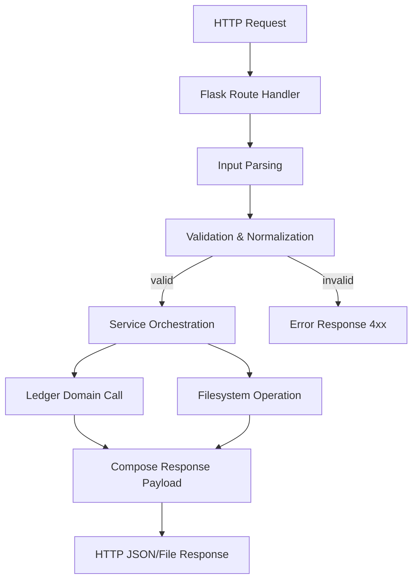
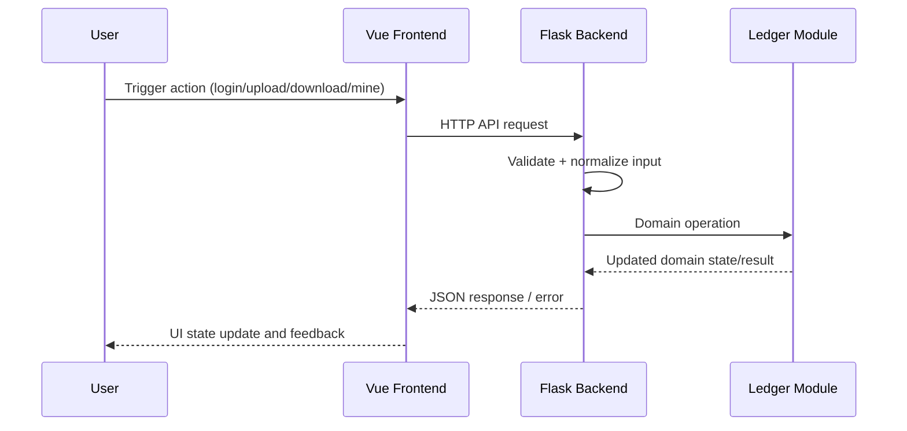
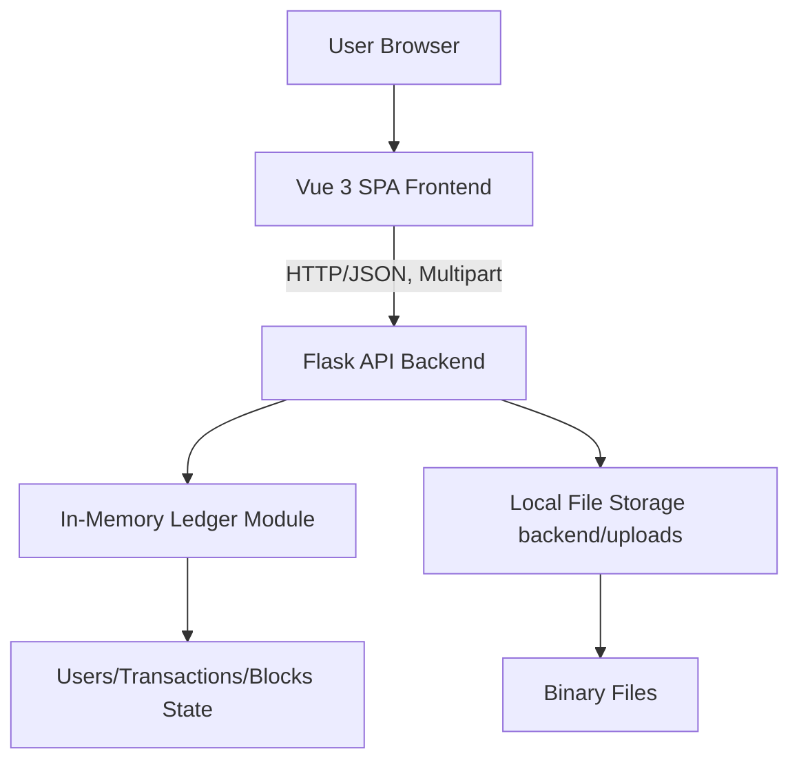

## 3. System Architecture and Technical Approach

### 3.1 Repository-Based Architecture (Refined)

The implemented project follows a **layered prototype architecture** with clear runtime separation among the web presentation tier (`frontend/`), API/service tier (`backend/`), and ledger domain simulation tier (`hyperledger/`). The architecture is intentionally lightweight to satisfy course-level deliverability while preserving realistic software boundaries for future extension.

At runtime, a browser user interacts with a Vue 3 single-page application. The SPA sends HTTP requests (Axios) to Flask endpoints under `/api/*`. Flask handlers perform input parsing, validation, authorization checks (role/identity checks using demo user store), and business orchestration. Ledger-relevant operations are delegated to a long-lived in-memory `ResourceSharingSystem` instance instantiated in `backend/app.py`. File binaries are persisted in `backend/uploads/`, while metadata and reward/block states are maintained in memory by the ledger layer.

This architecture yields a deterministic demo stack that supports:
- Reproducible functional flows without external infrastructure dependencies.
- Fast feedback cycles for testing and classroom demonstration.
- A migration path where ledger internals can later be replaced by real Fabric SDK calls while preserving backend route contracts.

#### Engineering responsibilities by tier

1. **Presentation tier (`frontend/`)**
   - View composition, input collection, and user interaction orchestration.
   - Frontend pre-checks (e.g., upload form constraints) to improve UX.
   - API invocation and response-driven rendering.

2. **API/service tier (`backend/`)**
   - Canonical business rule enforcement (source of truth).
   - Input normalization and defensive validation.
   - Security boundary for role-based view differences.
   - Translation between HTTP payloads and ledger domain operations.

3. **Ledger domain tier (`hyperledger/`)**
   - Domain state management: users, resources, transaction queue, blocks, balances.
   - Mining and wealth accrual semantics.
   - Search/statistical access patterns for files and block history.

4. **Storage concerns**
   - Binary persistence: local filesystem.
   - Stateful simulation data: process memory.

---

### 3.2 Technical Stack Actually Present (Implementation View)

#### Backend stack
- **Python 3.x + Flask** for REST API endpoint exposure and request lifecycle handling.
- **Flask-CORS** for cross-origin requests from Vite frontend during local development.
- **Werkzeug secure utilities** (`secure_filename`) for upload filename sanitization.
- Standard Python libraries (`hashlib`, `datetime`, `collections`, etc.) for hashing, timestamps, and transient state structures.

#### Frontend stack
- **Vue 3** (Composition API) as reactive UI runtime.
- **Vite** for local dev server, bundling, and hot-module reload.
- **Axios** for API communication and asynchronous workflow control.

#### Ledger/simulation stack
- **Pure Python domain module** implementing chain-like mechanics in-memory.
- Thread-safety primitives (lock usage in resource manager areas) to protect local mutations.
- Dataclass usage (`SharedFile`) to define resource domain entities with serializable structure.

#### Persistence characteristics
- File bytes: persisted under `backend/uploads/`.
- Ledger/account/block state: memory-resident inside backend process lifetime.
- Consequence: restart resets ledger simulation state while stored binaries remain on disk unless cleaned.

---

### 3.3 Technical Approach for Course Completion (Execution-Oriented)

The technical delivery strategy is **interface-preserving hardening**: retain the currently functional prototype behavior while improving reliability, testability, and demonstrability.

#### Approach A: Contract stabilization
- Treat `backend/app.py` API surface as system contract.
- Build a strict endpoint matrix (method, path, params, success/failure schema, side effects).
- Align frontend consumption and error rendering to this matrix.

#### Approach B: Workflow-closure development
Focus on one complete value chain rather than isolated screens:
1. Identity establishment (`/api/register`, `/api/login`).
2. Resource declaration/upload and deduplication.
3. Resource discovery/detail/download.
4. Reward settlement through mining.
5. Block visibility inspection by role.

#### Approach C: Rule centralization
- Keep backend as authoritative checker for limits and policy (size limit, duplicate checks, download attempts, role visibility).
- Frontend constraints are advisory; backend validation is mandatory.

#### Approach D: Deterministic test support
- Use seeded demo users and in-memory predictable states for reproducible test scenarios.
- Design test scripts around endpoint chains and explicit post-conditions (wealth/pending/block count changes).

#### Approach E: Replaceability by design
- Encapsulate ledger operations behind service calls so future Fabric integration swaps the implementation, not the route contracts.

---

### 3.4 Backend Internal Architecture

The backend in `backend/app.py` is not split into package submodules yet, but internally it already follows separable concerns. For engineering planning, we model it as four logical layers:

#### 3.4.1 Routing Layer
Responsibilities:
- HTTP method + URL dispatch.
- Query/body extraction from Flask `request`.
- Mapping endpoint intent to service operations.

Representative endpoint groups:
- **Auth/account**: login, register.
- **Ledger view/update**: balance query, reward mining, block listing.
- **Resource lifecycle**: list files, categories, detail, download, upload.

Each route should remain thin: parse → validate → call domain service → shape response.

#### 3.4.2 Service Logic Layer (Logical)
Responsibilities:
- Encodes business workflows crossing multiple checks and mutations.
- Coordinates `ResourceSharingSystem` calls with filesystem operations.
- Applies role policy (admin vs member view scope).

Examples:
- Upload workflow service: category normalization + size enforcement + dedupe checks + binary write + ledger registration.
- Mining service: settle pending transactions and return normalized mined block payload.
- Block query service: apply role-based filters and search normalization.

#### 3.4.3 Validation Layer (Logical)
Responsibilities:
- Input type/required-field checks.
- Domain constraints:
  - upload bytes in `(0, 100MB]`
  - valid/normalized category
  - duplicate name/content protection
  - download-attempt limits per `(downloader, owner, file_id)` tuple
- Error response shaping (HTTP code + message).

Validation helpers in code include parsing/normalization functions (size parsing, category normalization, uploader checks, etc.), and should be incrementally extracted into dedicated utilities for maintainability.

#### 3.4.4 File Handling Logic
Responsibilities:
- Accept multipart or JSON metadata patterns where applicable.
- Sanitize filename to avoid unsafe path composition.
- Persist binaries under upload root directory.
- Hash content (`sha256`) for integrity and duplicate checking.
- Serve download streams with MIME inference.

Engineering note: filesystem write and ledger record insertion should be treated as a pseudo-transaction; failure in one phase should trigger compensating action (e.g., remove written file when ledger registration fails).

#### 3.4.5 Backend request lifecycle
1. Flask route receives request.
2. Request parser extracts JSON/form/query params.
3. Validation executes mandatory checks and normalization.
4. Service logic coordinates ledger + storage mutations/reads.
5. Response serializer returns JSON or file stream.
6. Error path maps exception/validation issues to stable API message.

#### Diagram 3: Backend Internal Flow


---

### 3.5 Frontend Architecture

The frontend is centered on `App.vue` as shell/controller with composable child components that partition functional concerns.

#### 3.5.1 Component structure

**Application shell (`App.vue`)**
- Maintains top-level session and dashboard context.
- Controls tab navigation (`files`, `upload`, `blocks`).
- Manages orchestration state (loading flags, mining overlay, selected file context, error banners).

**Functional components**
- `LoginForm.vue`: credentials input and authentication event emission.
- `FileList.vue`: catalogue display, filtering/search interactions, and file action dispatch.
- `FileDetail.vue`: detailed metadata display and scoped download trigger.
- `UploadForm.vue`: file selection, metadata input, frontend pre-validation, submission.
- `MinedBlocks.vue`: mined block listing, role-aware filters, and export/search interactions.

This is a **container-presentational hybrid**: App.vue behaves as container/controller; child components render and emit events.

#### 3.5.2 API service interaction model
Although an explicit dedicated service directory is not yet created, API calls are centralized in App-level async methods using Axios. A recommended refinement is a `src/services/api.js` abstraction, but the current implementation still follows a consistent call pattern:
1. Set loading state.
2. Call endpoint.
3. Update reactive state on success.
4. Capture and render error state on failure.
5. Clear loading state in `finally`-style handling.

#### 3.5.3 State handling model
- Vue `ref` / `computed` state manages user identity, wealth, file catalogue, block data, and UI flags.
- Derived view state (e.g., masked identity display, role-based display controls) computed from primary state.
- State transitions are event-driven via component emits and button actions.

#### 3.5.4 Interaction lifecycle (UI ↔ API)
1. User action in component (click submit, filter, mine).
2. Component emits event or invokes handler in App shell.
3. App handler calls backend API via Axios.
4. Backend response mapped to reactive state.
5. Child components re-render from updated props.
6. Errors displayed contextually without full app reset.

#### Diagram 2: Request Flow (Sequence)


---

### 3.6 Ledger Module Architecture

The ledger module in `hyperledger/ledger.py` simulates blockchain-adjacent behaviors with explicit domain models and in-memory collections.

#### 3.6.1 Core domain models

1. **User model (logical)**
   - Identity mapping (`username`, blockchain-like address).
   - Associated personal resource manager and wealth-related counters.

2. **SharedFile (`@dataclass`)**
   - Core metadata: `id`, `name`, `size_gb`, `uploader`, `description`.
   - Distribution indicators: `seeds`, `peers`.
   - Ownership and integrity: `owner_address`, `file_hash`, `content_hash`.
   - Classification/storage metadata: `category`, `extension`, `storage_path`.
   - Lifecycle flags: upload timestamp, active status.

3. **Transaction model**
   - Transfer semantics: sender/receiver/amount.
   - Transaction classification (`transaction_type`).
   - Attached resource payload (`resource_data`).
   - Deterministic hash from transaction content + timestamp.

4. **Block model (logical structure)**
   - Block index, previous hash, timestamp, miner information.
   - Embedded transactions snapshot.
   - Current block hash for chain continuity.

#### 3.6.2 In-memory storage design
- `users` dictionary keyed by username for O(1) identity lookup.
- Resource managers maintain file-id keyed maps and category/search-friendly iteration.
- Pending transactions stored in mutable queue/list before mining commit.
- Blockchain stored as append-only list in process memory.

This design privileges speed and test transparency over durability.

#### 3.6.3 Transaction-to-block pipeline
1. User or system actions create transactions (upload declarations, download rewards, etc.).
2. Transactions accumulate in pending pool.
3. Mining operation selects pending transactions.
4. New block assembled with previous hash pointer.
5. Block hash computed and appended to chain.
6. Account/resource states finalized according to transaction semantics.
7. Pending pool cleared/advanced for next cycle.

#### 3.6.4 Blockchain simulation fidelity
The module simulates key blockchain properties but is not consensus-distributed:
- ✅ Immutable-like append sequence (within process lifetime).
- ✅ Hash-linked block progression.
- ✅ Explicit miner/reward accounting.
- ❌ No distributed consensus protocol.
- ❌ No peer network gossip/fork resolution.
- ❌ No cryptographic identity authority (Fabric CA equivalent).

#### Diagram 4: Mining Workflow


---

### 3.7 Data Flow (Detailed)

This section defines end-to-end operational flows with explicit validation and state mutation points.

#### 3.7.1 Login flow
1. User enters credentials in `LoginForm`.
2. Frontend sends `POST /api/login`.
3. Backend checks payload completeness and credential map.
4. Backend ensures ledger user/address binding exists.
5. Backend returns token-like demo value, role, and ledger identity.
6. Frontend stores session context and switches to dashboard.
7. Follow-up reads fetch categories/files/wealth context.

State effects:
- Frontend: `user`, role flags, visibility controls activated.
- Backend/ledger: may lazily initialize account in ledger structures.

#### 3.7.2 Upload flow
1. User chooses file and metadata in `UploadForm`.
2. Frontend performs pre-checks (size, required fields) and submits multipart request.
3. Backend route parses file stream and metadata.
4. Validation layer enforces:
   - size > 0 and ≤100MB
   - sanitized filename
   - category normalization
   - duplicate-name and duplicate-content checks against existing resources
5. File handling layer writes binary to `backend/uploads`.
6. Ledger service registers new resource entry and queues related transaction(s).
7. Backend returns success payload with resource metadata.
8. Frontend refreshes catalogue/detail view and user feedback.

State effects:
- Filesystem: new upload binary persisted.
- Ledger: new file metadata + pending transactional impact.
- Frontend: file list/state increments.

#### 3.7.3 Download flow
1. User clicks download from list or detail view.
2. Frontend requests `/api/files/<owner>/<id>/download` with username context.
3. Backend validates access and per-user attempt limit.
4. If allowed, backend streams file bytes/placeholder.
5. Backend records download attempt count.
6. Ledger queues owner bonus-related transaction for next mining cycle.
7. Frontend handles binary response and triggers browser save.

State effects:
- Backend in-memory attempt counter increments.
- Ledger pending transactions increase.
- Owner wealth unaffected immediately until mining.

#### 3.7.4 Mining flow
1. User triggers mine action from dashboard.
2. Frontend may display simulated delay overlay for UX consistency.
3. Backend processes mining request and delegates to ledger.
4. Ledger consumes pending transactions and creates block.
5. Ledger updates miner reward and affected account wealth.
6. Backend normalizes block payload for UI.
7. Frontend refreshes wealth summary and block list.

State effects:
- Blockchain length increments.
- Pending transaction count decreases/reset.
- Wealth values change and become observable in UI.

---

### 3.8 API Design Strategy

The API design follows pragmatic REST-style conventions tailored to a prototype but intended for later hardening.

#### 3.8.1 Resource-oriented endpoint patterns
- Authentication resources: `/api/login`, `/api/register`.
- File resources: `/api/files`, `/api/files/categories`, `/api/files/<owner>/<file_id>`, `/api/files/<owner>/<file_id>/download`.
- Ledger resources: `/api/ledger/balance`, `/api/ledger/reward`, `/api/blocks`.

#### 3.8.2 Request/response patterns
- JSON payloads for auth, metadata updates, and ledger operations.
- Multipart form for binary upload + metadata.
- Structured JSON responses with explicit key naming suitable for frontend rendering.
- Stream/binary response for downloads.

#### 3.8.3 Error handling format strategy
Recommended consistent schema:
```json
{
  "message": "Human-readable error summary",
  "code": "DOMAIN_OR_VALIDATION_CODE",
  "details": {"field": "reason"}
}
```

Current implementation already returns message-centric errors; course refinement should standardize machine-readable `code` fields for robust frontend branching and automated tests.

#### 3.8.4 REST and semantics
- Use `GET` for retrieval-only operations.
- Use `POST` for state-changing operations (register, login, upload, mine).
- Preserve idempotency expectations where possible (e.g., repeated queries should not mutate state).
- Use explicit query parameters for filtering in block search APIs.

---

### 3.9 System Constraints & Design Decisions

#### 3.9.1 Why mock ledger instead of real blockchain
**Decision**: use in-memory Python simulation rather than Fabric deployment.

**Reasons**:
- Reduces environment complexity for classroom teams.
- Avoids operational burden of peers/orderers/CA setup.
- Enables fast debugging and deterministic demonstrations.

**Trade-off**:
- Lower realism in distributed trust and persistence behavior.
- No real consensus/security guarantees.

#### 3.9.2 Why local file storage
**Decision**: persist uploads to local directory under backend project.

**Reasons**:
- Simple implementation and direct control for prototype stage.
- Easy reproducibility without cloud credentials.
- Allows immediate download demonstration for submitted resources.

**Trade-off**:
- Not horizontally scalable.
- Requires filesystem hygiene and capacity controls.
- Lacks redundancy and object-storage lifecycle policies.

#### 3.9.3 Stateful process-memory constraints
**Decision**: keep users/files/transactions/blocks in backend memory.

**Benefits**:
- Very low-latency reads/writes.
- Predictable setup for lab testing.

**Costs**:
- Process restart resets simulation ledger state.
- No multi-instance consistency.

#### 3.9.4 Security posture constraints
- Demo token strategy is intentionally non-production.
- Role checks exist but should be hardened with signed tokens and middleware.
- Upload security relies on size and filename checks; deep content scanning is absent.

#### 3.9.5 Design implication for future evolution
The chosen prototype decisions are acceptable for course objectives and support incremental migration path:
1. Introduce persistent DB for metadata.
2. Replace in-memory ledger adapter with Fabric client.
3. Move file storage to object service.
4. Add auth middleware and audited access control.

---

### Diagram 1: Overall System Architecture

