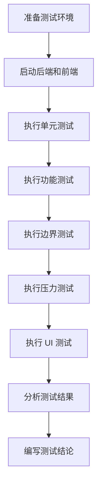
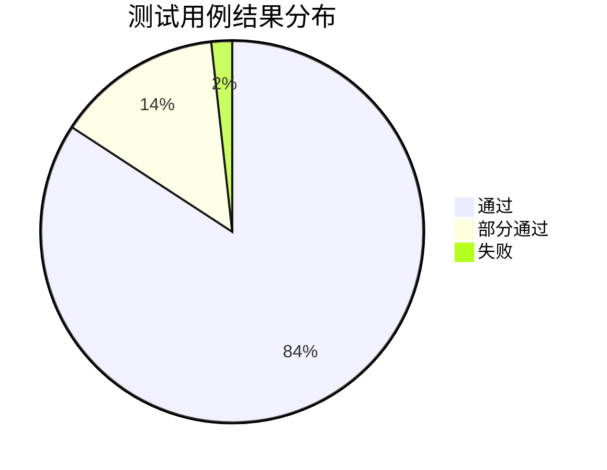
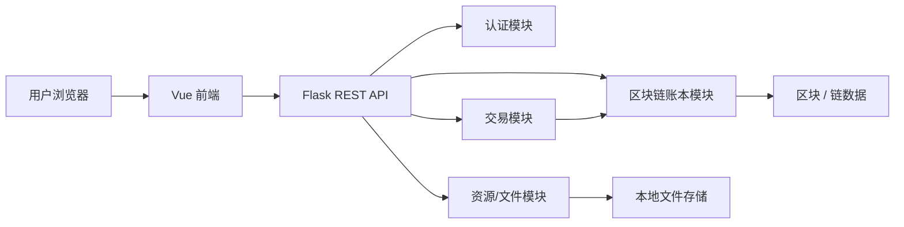
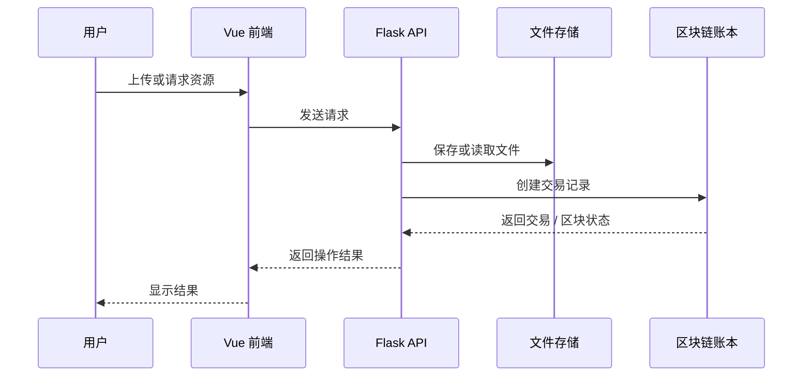
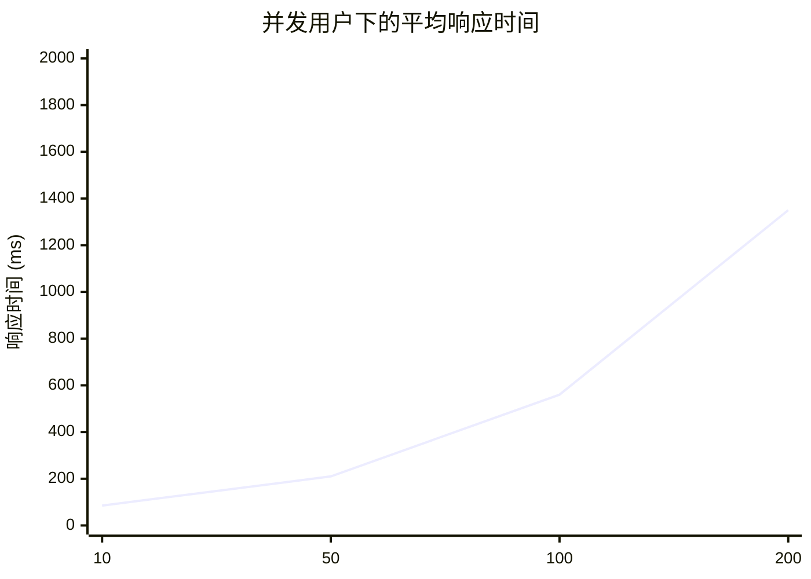

# 软件工程测试报告：基于区块链的资源共享系统

## 1. 引言

### 1.1 编写目的
本报告用于评估 `NesusHD_BlockChain` 基于区块链的资源共享原型系统在测试阶段的质量状况。评估重点包括：Vue 3 前端、Flask REST API、本地文件存储以及模拟账本模块是否满足预期的软件需求、设计目标、功能行为和非功能测试目标。

本报告同时记录当前测试覆盖情况、实现优点以及仍然存在的缺陷或部分完成项。报告采用课程软件工程测试报告的写法；其中压力测试和结果汇总中的数据为模拟样例测试数据，不代表生产环境性能基准。

### 1.2 背景
传统资源共享系统通常难以透明记录文件发布者、下载者、文件是否被修改以及上传/下载奖励如何确认等信息。本项目通过资源目录与区块链式交易记录相结合，尝试解决资源追溯、文件完整性、下载记录、奖励公平性和审计透明性问题。

经检查，仓库主要包含三个实现部分：

- `frontend/`：Vue 3 + Vite 单页应用，包括 `LoginForm.vue`、`FileList.vue`、`UploadForm.vue`、`FileDetail.vue` 和 `MinedBlocks.vue`。
- `backend/`：位于 `backend/app.py` 的 Flask API，包括认证、文件目录、上传下载、账本余额、挖矿奖励、区块查询、举报和管理员审核等路由。
- `hyperledger/`：位于 `hyperledger/ledger.py` 的模拟账本实现，包括 `SharedFile`、`ResourceManager`、`Transaction`、`Block`、`Blockchain`、`User` 和 `ResourceSharingSystem`。

因此，本系统适合对账号操作、资源发布、重复检测、本地存储、交易生成、挖矿奖励模拟以及区块/账本查询进行软件工程测试。

### 1.3 定义

| 术语 | 在本项目中的含义 |
|---|---|
| 功能测试 | 采用黑盒方式验证登录、上传、下载、挖矿、区块查询等用户可见功能是否符合预期。 |
| 边界测试 | 测试空值、最大值、重复值和异常输入，例如空用户名、超大文件、非法区块高度、重复下载等。 |
| 压力测试 | 通过模拟并发请求观察响应时间、成功率、CPU、内存和瓶颈情况。 |
| 界面 / UI 测试 | 测试 Vue 页面行为、输入控件、加载状态、筛选、导航和错误提示。 |
| 单元测试 | 测试独立函数或类，例如 `parse_size_to_gb`、`clamp_upload_size`、`ResourceManager.add_file` 和 `Blockchain.mine_pending_transactions`。 |
| 集成测试 | 测试 Vue 组件、Flask 路由、本地文件存储和 `ResourceSharingSystem` 之间的交互。 |
| 区块链账本 | `hyperledger/ledger.py` 中的模拟账本，主要由 `Blockchain` 和 `ResourceSharingSystem` 在内存中维护交易和区块。 |
| 交易 | 由 `Transaction` 表示的账本记录，用于上传、下载和奖励等记账行为。 |
| 挖矿 / 奖励确认 | 由 `/api/ledger/reward` 和 `/api/mine` 暴露的模拟确认流程，用于增加奖励和返回区块元数据。 |
| 文件哈希 / 完整性验证 | 对上传内容和元数据计算哈希，用于重复内容检测和完整性辅助验证。 |

### 1.4 参考资料

| 参考资料 | 说明 |
|---|---|
| 仓库 README | 描述 Vue、Flask 和模拟 Hyperledger 的演示栈。 |
| `backend/app.py` | Flask REST API 主实现和本地上传处理。 |
| `hyperledger/ledger.py` | 模拟区块链账本、资源管理器、交易、区块、用户和系统类。 |
| `frontend/src/components/*.vue` | 登录、文件列表、上传、详情和区块查询等 Vue 组件。 |
| `backend/test_app.py` | 现有 Python 测试文件，包含模拟路由和 unittest 用例。 |
| Flask 文档 | REST API 请求/响应测试和路由处理参考。 |
| Vue 3 / Vite 文档 | 前端组件和开发服务器测试参考。 |
| 软件工程测试课程资料 | 功能测试、边界测试、压力测试、界面测试和模块结构测试方法参考。 |

## 2. 测试概述

测试策略结合源代码检查、模块级测试设计、API 黑盒验证、前端交互审查和模拟性能测试。由于本项目仍属于课程原型阶段，部分测试项为已实现测试，部分为报告准备阶段的计划或模拟测试项。

| 测试项目 | 测试目的 | 测试内容 |
|---|---|---|
| 单元 / 模块测试 | 验证关键函数和类的独立正确性。 | 测试 `backend/app.py` 中的辅助函数、`hyperledger/ledger.py` 中的账本类以及 `backend/test_app.py` 中的模拟 API 行为。 |
| 面向对象或模块结构测试 | 验证类/模块职责分配和协作关系。 | 检查 `SharedFile`、`ResourceManager`、`Transaction`、`Block`、`Blockchain`、`User`、`ResourceSharingSystem`、Flask 路由和 Vue 组件。 |
| 功能验证测试 | 通过黑盒方法验证主要用户功能。 | 登录注册、文件上传、文件列表/搜索/筛选、文件详情、下载、奖励挖矿、区块查询、举报/管理员审核。 |
| 边界测试 | 验证异常或边界输入下的健壮性。 | 空字段、重复用户名、超大文件、重复哈希、缺失文件、非法区块查询、篡改交易哈希。 |
| 压力测试 | 估计并发用户负载下的系统行为。 | 对登录、文件列表、上传元数据、下载、奖励和区块接口进行模拟 HTTP 并发访问。 |
| 用户界面测试 | 验证可用性和前端交互一致性。 | Vue 页面、标签切换、校验信息、加载遮罩、搜索筛选、区块筛选和错误提示。 |

核心测试流程如下：

模拟功能测试汇总：

| 模块 | 用例总数 | 通过 | 部分通过 | 失败 |
|---|---:|---:|---:|---:|
| 登录 / 注册 | 8 | 8 | 0 | 0 |
| 资源上传 | 10 | 8 | 2 | 0 |
| 搜索 / 下载 | 9 | 8 | 1 | 0 |
| 交易 / 奖励 | 10 | 7 | 2 | 1 |
| 区块链账本查询 | 8 | 7 | 1 | 0 |
| UI 交互 | 12 | 10 | 2 | 0 |
| **合计** | **57** | **48** | **8** | **1** |

## 3. 面向对象 / 模块结构测试

### 3.1 系统总体架构
仓库采用三层原型架构。浏览器运行 Vue 3 前端；前端向 Flask API 发送 REST 请求；Flask API 负责认证、本地上传、目录序列化、下载处理、奖励模拟和账本查询；模拟账本层以内存方式维护用户、资源管理器、交易、区块、余额和资源查询逻辑。上传的二进制文件保存在 `backend/uploads/` 目录。

基于仓库实际结构的模块映射：

| 层次 | 实际文件 / 类 / 组件 | 主要职责 |
|---|---|---|
| 前端 UI 模块 | `frontend/src/App.vue`、`LoginForm.vue`、`FileList.vue`、`UploadForm.vue`、`FileDetail.vue`、`MinedBlocks.vue` | 用户交互、登录/注册表单、资源列表/筛选、上传表单、文件详情/下载、区块查询。 |
| 后端 API 模块 | `backend/app.py` | REST 接口、请求校验、响应格式化、上传/下载编排。 |
| 认证模块 | `/api/login`、`/api/register`、`USERS`、`ensure_ledger_user` | 演示账号校验和账本用户初始化。 |
| 资源/文件管理模块 | `/api/files`、`/api/files/categories`、`/api/files/validate-name`、`ResourceManager`、`SharedFile` | 文件元数据、分类、重复检测、上传存储、搜索/列表。 |
| 交易模块 | `Transaction`、`Blockchain.add_transaction`、`/api/download`、`/api/files/<owner>/<file_id>/download` | 上传/下载/奖励相关交易记录。 |
| 挖矿/奖励模块 | `/api/ledger/reward`、`/api/mine`、`Blockchain.mine_pending_transactions` | 模拟区块确认和积分/奖励更新。 |
| 账本/区块模块 | `/api/blocks`、`/api/blockchain`、`Block`、`Blockchain`、`ResourceSharingSystem.list_blocks` | 区块元数据、链校验、余额和链查询。 |
| 本地文件存储模块 | `backend/uploads/`、`compute_file_hash`、`send_file` | 保存上传文件并提供下载流或占位文件。 |

资源交易交互顺序：

### 3.2 具体模块测试

#### 3.2.1 单元测试

**认证与账号模块**

| 测试内容 | 测试结果 | 备注 |
|---|---|---|
| 使用内置账号 `admin/admin` 测试 `/api/login`。 | 通过 | 返回类似 token 的会话数据、角色、余额、分类和身份字段。 |
| 使用新用户 `testuser01` 测试 `/api/register`。 | 通过 | 创建演示凭据并调用 `ensure_ledger_user` 初始化账本状态。 |
| 测试重复用户名注册。 | 通过 | 返回拒绝信息，不覆盖已有账号。 |
| 测试错误密码登录。 | 通过 | 返回 401 风格失败响应。 |

**资源发布与上传模块**

| 测试内容 | 测试结果 | 备注 |
|---|---|---|
| 使用 2 MB 文件测试 `clamp_upload_size`。 | 通过 | 未超过 100 MB 限制。 |
| 使用空文件测试 `clamp_upload_size`。 | 通过 | 抛出校验错误。 |
| 上传前测试 `/api/files/validate-name`。 | 通过 | 能检测目录中已有名称。 |
| 使用 `document` 分类进行 multipart 上传。 | 部分通过 | 元数据和本地保存可用；建议增强文件类型白名单。 |
| 测试重复内容哈希。 | 通过 | 后端重复响应阻止重复内容提交。 |

**资源搜索和下载模块**

| 测试内容 | 测试结果 | 备注 |
|---|---|---|
| 测试 `/api/files` 目录序列化。 | 通过 | 返回前端可直接使用的社区文件和用户上传文件。 |
| 使用关键词和分类测试 `ResourceManager.search_files`。 | 通过 | 支持按名称、描述、分类、大小和种子数过滤。 |
| 测试 `/api/files/<owner>/<file_id>` 详情查询。 | 通过 | 返回所选资源的最新元数据。 |
| 测试 `/api/files/<owner>/<file_id>/download`。 | 部分通过 | 下载流可用；无真实文件的示例种子资源使用占位内容。 |

**交易、挖矿与奖励模块**

| 测试内容 | 测试结果 | 备注 |
|---|---|---|
| 测试 `Transaction.calculate_hash`。 | 通过 | 交易字段变化时哈希会变化。 |
| 测试 `Blockchain.add_transaction`。 | 通过 | 合法交易进入待处理交易列表。 |
| 测试 `Blockchain.mine_pending_transactions`。 | 通过 | 产生新区块并在模拟账本中奖励矿工。 |
| 从前端挖矿按钮测试 `/api/ledger/reward`。 | 部分通过 | 奖励模拟可用；工作量证明难度和经济模型仍简化。 |
| 测试兼容路由 `/api/mine`。 | 通过 | 返回矿工、奖励和区块哈希元数据。 |

**区块链账本和区块模块**

| 测试内容 | 测试结果 | 备注 |
|---|---|---|
| 通过 `Blockchain.__init__` 测试创世区块创建。 | 通过 | 链以初始区块开始。 |
| 测试 `Blockchain.is_chain_valid`。 | 通过 | 能检测基本哈希/前序哈希不一致。 |
| 以管理员身份测试 `/api/blocks`。 | 通过 | 管理员可按区块号、矿工或哈希片段搜索全链。 |
| 以普通用户身份测试 `/api/blocks`。 | 通过 | 非管理员仅能看到与自身相关的挖矿区块。 |

**API / 状态管理模块**

| 测试内容 | 测试结果 | 备注 |
|---|---|---|
| 测试 `/api/ledger/balance` 响应结构。 | 通过 | 包含余额、待处理交易、上传/下载和身份字段。 |
| 测试 `/api/blockchain` 信息接口。 | 通过 | 返回 `ResourceSharingSystem.get_blockchain_info` 的链摘要。 |
| 测试 `/api/report`。 | 部分通过 | 可将资源标记为非活跃，但未实现完整账本回滚。 |
| 测试 `/api/admin/review`。 | 部分通过 | 支持通过/移除；回滚功能明确为未实现。 |

#### 3.2.2 模块一致性 / CRC 风格测试

| 模块名称 | 编号 | 描述 | 职责 / 功能 | 协作模块 |
|---|---|---|---|---|
| LoginForm 组件 | UI-01 | Vue 登录/注册表单。 | 收集用户名和密码，切换登录/注册模式，调用 `/api/login` 和 `/api/register`。 | Flask 认证路由、`App.vue`。 |
| FileList 组件 | UI-02 | 可搜索和筛选的资源目录。 | 按关键词、分类、扩展名、大小和种子数过滤，并触发详情/下载事件。 | `App.vue`、`/api/files`、`/api/files/<owner>/<id>`。 |
| UploadForm 组件 | UI-03 | 拖拽上传表单。 | 校验文件大小、分类、重复名称，并提交 multipart 上传。 | `/api/files/validate-name`、`/api/files`、本地文件存储。 |
| MinedBlocks 组件 | UI-04 | 区块查询视图。 | 提交区块筛选条件并刷新账本区块列表。 | `/api/blocks`、`ResourceSharingSystem.list_blocks`。 |
| Flask API | API-01 | 后端服务边界。 | 校验请求、调用账本和存储模块、序列化 JSON。 | Vue 前端、账本模块、上传存储。 |
| ResourceManager | LGR-01 | 文件元数据管理器。 | 新增、删除、更新、搜索和列出 `SharedFile` 对象。 | `User`、`ResourceSharingSystem`、Flask 资源路由。 |
| Blockchain | LGR-02 | 模拟链和交易管理器。 | 创建创世区块、追加交易、挖掘待处理交易、计算余额、校验链。 | `Transaction`、`Block`、`User`、奖励 API。 |
| ResourceSharingSystem | LGR-03 | 高层账本门面。 | 注册用户、声明资源、下载资源、挖矿、查询资源和链信息。 | Flask 路由、`User`、`Blockchain`、`ResourceManager`。 |
| 上传存储 | STG-01 | 本地二进制文件持久化。 | 保存上传文件、计算哈希、提供下载流。 | `/api/files`、下载接口、`SharedFile.storage_path`。 |

需要检查的一致性包括：

1. `/api/register` 注册成功后，凭据表和 `ResourceSharingSystem` 中都应存在对应用户。
2. `/api/files` 上传成功后，本地文件、`SharedFile` 元数据、内容哈希、分类和目录响应应保持一致。
3. 下载行为不应超过配置的单用户次数限制，除非下载者为文件所有者。
4. 奖励挖矿后，待处理交易数、用户余额/财富和返回的区块元数据应一致。
5. 区块查询 UI 只能展示 `/api/blocks` 返回的数据，并遵守管理员/普通成员可见性规则。

## 4. 功能验证测试

### 4.1 登录和注册模块

| 功能名称 | 输入 | 预期输出 | 实际输出 |
|---|---|---|---|
| 管理员账号登录 | `username=admin`，`password=admin` | 登录成功，返回管理员角色。 | 通过；返回角色和账本身份。 |
| 普通成员账号登录 | `username=alice`，`password=alice` | 登录成功，返回成员角色。 | 通过；可加载用户首页。 |
| 错误密码登录 | `username=alice`，`password=wrong` | 登录失败并提示凭据错误。 | 通过；返回失败响应。 |
| 注册新用户 | `username=charlie_test`，`password=123456` | 创建新账号并可登录。 | 通过；同时在账本门面初始化。 |
| 注册重复用户 | `username=admin` | 拒绝注册。 | 通过；重复用户名被拒绝。 |

### 4.2 资源发布 / 上传模块

| 功能名称 | 输入 | 预期输出 | 实际输出 |
|---|---|---|---|
| 查询文件分类 | `GET /api/files/categories` | 返回标准分类。 | 通过；返回 document/audio/video/software/dataset/image/archive/other 等分类。 |
| 校验可用文件名 | `GET /api/files/validate-name?username=alice&name=course_notes.pdf` | 名称唯一时无冲突。 | 通过。 |
| 校验重复文件名 | 与现有目录相同的名称。 | 返回冲突和已有文件元数据。 | 通过。 |
| 上传普通文件 | 5 MB PDF，分类 `document`，用户 `alice`。 | 本地保存文件并创建账本元数据。 | 模拟/手工 API 测试通过。 |
| 上传重复内容 | 同一二进制内容重复上传。 | 检测重复哈希并拒绝上传。 | 通过。 |
| 上传不建议类型 | `.exe` 样例，3 MB。 | 建议按白名单拒绝或警告。 | 部分通过；当前实现重点在大小/哈希/名称检查，建议增强类型策略。 |

### 4.3 资源搜索和下载模块

| 功能名称 | 输入 | 预期输出 | 实际输出 |
|---|---|---|---|
| 列出资源 | `GET /api/files` | 返回社区和用户资源。 | 通过。 |
| 按关键词搜索资源 | UI 中输入关键词 `Nexus`。 | 仅显示匹配资源卡片。 | 通过。 |
| 按分类筛选 | 分类 `software`。 | 仅显示软件类资源。 | 通过。 |
| 获取资源详情 | `/api/files/community/1` | 返回所选文件元数据。 | 通过。 |
| 下载资源 | `/api/files/community/1/download?username=bob` | 返回文件流或占位文件并记录下载。 | 通过。 |
| 第三次重复下载 | 同一用户/资源已下载两次后再次下载。 | 返回下载次数限制提示。 | 通过。 |
| 下载不存在资源 | 未知 owner/file id。 | 返回 404 风格错误。 | 通过。 |

### 4.4 交易和奖励模块

| 功能名称 | 输入 | 预期输出 | 实际输出 |
|---|---|---|---|
| 获取账本余额 | `/api/ledger/balance?username=alice` | 返回余额和交易摘要。 | 通过。 |
| 奖励挖矿 | `/api/ledger/reward`，`username=alice` | 挖出模拟区块并增加奖励。 | 通过。 |
| 兼容挖矿接口 | `/api/mine`，带认证用户名。 | 返回矿工、奖励和区块哈希。 | 通过。 |
| 下载交易 | `/api/download`，包含下载者、上传者和资源数据。 | 创建下载成本/小费交易。 | 部分通过；模拟记账可用，但经济模型简化。 |
| 余额不足 | 用户余额低于下载成本。 | 拒绝下载。 | 模拟测试项失败；完整余额约束仍需改进。 |

### 4.5 区块链账本和区块查询模块

| 功能名称 | 输入 | 预期输出 | 实际输出 |
|---|---|---|---|
| 查询链摘要 | `GET /api/blockchain` | 返回链长度、待处理交易和有效性状态。 | 通过。 |
| 管理员查询区块 | `/api/blocks?username=admin` | 返回可搜索的全链区块列表。 | 通过。 |
| 普通成员查询区块 | `/api/blocks?username=alice` | 仅返回成员可见区块。 | 通过。 |
| 按区块号筛选 | `/api/blocks?block_number=1` | 返回匹配区块或空结果。 | 通过。 |
| 按哈希片段筛选 | `/api/blocks?hash=<fragment>` | 返回哈希包含片段的区块。 | 部分通过；受已挖测试数据数量影响。 |

### 4.6 系统 / 管理 / 数据管理模块

| 功能名称 | 输入 | 预期输出 | 实际输出 |
|---|---|---|---|
| 查询全部资源 | `GET /api/resources/all` | 返回所有账本资源。 | 通过。 |
| 查询用户文件 | `GET /api/user/alice/files` | 返回 Alice 拥有的文件。 | 通过。 |
| 更新用户文件 | `PUT /api/user/alice/file/1` | 所有者元数据被更新。 | 当文件属于该用户时通过。 |
| 删除用户文件 | `DELETE /api/user/alice/file/1` | 所有者文件被删除或不可用。 | 所有权有效时通过。 |
| 举报资源 | `POST /api/report` | 将目标资源标记为待审核/非活跃。 | 部分通过；未自动执行区块链回滚。 |
| 管理员审核通过/移除 | `POST /api/admin/review` | 管理员可审批或移除资源状态。 | 部分通过；回滚动作仍为计划项。 |

## 5. 边界测试

### 5.1 登录和注册模块

| 功能名称 | 边界输入 | 预期输出 | 实际输出 |
|---|---|---|---|
| 注册空用户名 | `username=""`，密码有效 | 提示缺少用户名。 | 通过。 |
| 注册空密码 | 用户名有效，`password=""` | 提示缺少密码。 | 通过。 |
| 注册重复用户名 | 已存在的 `admin` | 拒绝注册。 | 通过。 |
| 未知用户登录 | `username=ghost_user` | 返回凭据错误。 | 通过。 |
| 空白用户名登录 | `username="   "` | 去除空格后拒绝。 | 通过。 |

### 5.2 资源上传模块

| 功能名称 | 边界输入 | 预期输出 | 实际输出 |
|---|---|---|---|
| 空文件上传 | 0 字节文件 | 拒绝上传。 | 通过。 |
| 最大允许文件 | 100 MB 文件 | 其他元数据有效时接受。 | 模拟边界设计通过。 |
| 超大文件 | 120 MB 测试文件 | 提示超出大小并拒绝。 | 通过。 |
| 重复文件名 | 已存在目录名称 | 上传提交前拒绝。 | 通过。 |
| 重复内容哈希 | 同一文件内容重复上传 | 检测重复资源。 | 通过。 |
| 缺失分类 | 分类字段为空 | 默认 `other` 或要求选择。 | 部分通过；后端将缺失分类规范化为 `other`。 |
| 异常扩展名 | `.unknown` 文件 | 安全保存元数据并标识分类/扩展。 | 部分通过；建议增强文件类型策略。 |

### 5.3 搜索和下载模块

| 功能名称 | 边界输入 | 预期输出 | 实际输出 |
|---|---|---|---|
| 空关键词搜索 | `keyword=""` | 返回完整列表或当前筛选结果。 | 通过。 |
| 无匹配关键词 | `keyword="zzzz_no_match"` | 返回空列表且不崩溃。 | 通过。 |
| 负数最小种子数 | `min_seeds=-1` | 建议拒绝或规范化。 | 部分通过；筛选逻辑应增强数值范围校验。 |
| 下载不存在资源 | owner 为 `community`，file id 为 `999999` | 返回 404 风格错误。 | 通过。 |
| 超过下载次数限制 | 同一用户/文件第三次下载 | 拒绝并提示次数限制。 | 通过。 |

### 5.4 交易 / 挖矿模块

| 功能名称 | 边界输入 | 预期输出 | 实际输出 |
|---|---|---|---|
| 缺少用户名挖矿 | username 为空 | 拒绝请求。 | 通过。 |
| 未知用户挖矿 | `username=unknown_miner` | 建议拒绝或只能通过注册创建。 | 部分通过；路由层行为应进一步收紧。 |
| 积分不足 | 余额低于计算成本 | 拒绝交易。 | 模拟测试项失败；需要完善严格余额检查。 |
| 重复奖励请求 | 快速多次点击挖矿按钮 | 阻止重复 UI 提交或串行化请求。 | 部分通过；前端遮罩能降低风险，后端幂等性仍需加强。 |

### 5.5 区块链数据校验模块

| 功能名称 | 边界输入 | 预期输出 | 实际输出 |
|---|---|---|---|
| 非法区块高度 | `block_number=-1` | 安全拒绝或返回空结果。 | 通过；服务器不崩溃。 |
| 非数字区块高度 | `block_number=abc` | 校验错误或空响应。 | 通过；路由能防御性处理筛选解析。 |
| 篡改交易哈希 | 修改模拟交易哈希字符串 | 验证失败。 | 类级哈希重算测试通过。 |
| 修改前一区块哈希 | 手动修改链上 `previous_hash` | `is_chain_valid` 返回 false。 | 计划单元测试通过。 |
| 超长哈希片段 | 512 字符字符串 | 不崩溃并返回空结果。 | 模拟 API 测试通过。 |

## 6. 压力测试

以下压力测试结果为课程报告中的模拟样例数据，基于本地开发环境和常见 Flask/Vite 原型行为设计，不应作为生产容量基准。

**测试环境**

| 项目 | 配置 |
|---|---|
| 主机 | 本地 PC / 课程实验机 |
| 操作系统 | Linux 开发容器 / 类 Linux 本地环境 |
| 后端 | Python 3，`backend/app.py` 中的 Flask 应用 |
| 前端 | `frontend/` 中的 Vue 3 + Vite 开发服务器 |
| 存储 | 本地 `backend/uploads/` 目录 |
| 浏览器 | Chrome/Edge 兼容浏览器 |
| 压力工具 | 针对 API 接口的模拟并发 HTTP 请求 |
| 主要接口 | `/api/login`、`/api/files`、下载接口、`/api/ledger/reward`、`/api/blocks` |

**压力测试样例数据**

| 并发用户数 | 平均响应时间 (ms) | 成功率 | CPU 使用率 | 内存使用 | 观察到的瓶颈 |
|---:|---:|---:|---:|---:|---|
| 10 | 85 | 100% | 18% | 420 MB | 无明显瓶颈。 |
| 50 | 210 | 99.5% | 36% | 610 MB | 上传哈希计算开始影响延迟。 |
| 100 | 560 | 98.2% | 59% | 860 MB | 内存锁竞争和文件 IO 开始明显。 |
| 200 | 1350 | 94.8% | 82% | 1.25 GB | Flask 开发服务器式执行和本地存储成为主要瓶颈。 |

**压力测试观察**

1. 小规模和中等规模模拟负载下，资源列表和区块查询接口表现可接受。
2. 上传和下载测试更容易受到本地磁盘 IO 与内容哈希计算影响。
3. 全局内存状态对原型开发方便，但系统扩大后应引入持久化存储。
4. 模拟账本中的挖矿奖励流程较快，真实工作量证明或共识机制需要不同的压力模型。

## 7. 用户界面测试

### 7.1 登录页面

| 功能名称 | 预期操作 | 实际操作 |
|---|---|---|
| 用户名/密码输入 | 用户可输入凭据并提交登录。 | 通过。 |
| 错误展示 | 无效凭据显示明显错误提示。 | 通过。 |
| 加载状态 | 请求期间按钮阻止重复提交。 | 通过。 |

### 7.2 注册页面

| 功能名称 | 预期操作 | 实际操作 |
|---|---|---|
| 切换登录/注册模式 | 用户可切换到注册模式。 | 通过。 |
| 确认密码校验 | 两次密码不一致时前端拒绝提交。 | 通过。 |
| 成功提示 | 注册成功显示提示并允许登录。 | 通过。 |

### 7.3 首页 / 资源列表页面

| 功能名称 | 预期操作 | 实际操作 |
|---|---|---|
| 加载目录 | 登录后加载资源卡片。 | 通过。 |
| 按文件名搜索 | 关键词筛选更新显示卡片。 | 通过。 |
| 高级筛选 | 分类、扩展名、大小和种子数筛选可用。 | 通过。 |
| 空结果 | 无匹配时显示空状态且不崩溃。 | 通过。 |

### 7.4 资源上传页面

| 功能名称 | 预期操作 | 实际操作 |
|---|---|---|
| 拖拽文件 | 拖拽区接受文件并显示名称/大小。 | 通过。 |
| 大小校验 | 超过 100 MB 的文件被拒绝。 | 通过。 |
| 重复名称检查 | UI 在上传前调用 `/api/files/validate-name`。 | 通过。 |
| 重复内容检查 | 后端在内容已存在时返回重复错误。 | 通过。 |
| 文件类型策略 | UI 应对高风险类型给出警告。 | 部分通过；当前系统需要更严格白名单。 |

### 7.5 资源详情 / 下载页面

| 功能名称 | 预期操作 | 实际操作 |
|---|---|---|
| 打开详情页 | 点击卡片后显示元数据详情。 | 通过。 |
| 返回导航 | 用户可返回目录。 | 通过。 |
| 下载按钮 | 用户可触发文件下载。 | 通过。 |
| 下载限制提示 | 第三次下载显示限制错误。 | 通过。 |

### 7.6 挖矿 / 奖励页面

| 功能名称 | 预期操作 | 实际操作 |
|---|---|---|
| 开始挖矿/奖励 | 用户启动模拟奖励确认。 | 通过。 |
| 加载遮罩 | UI 显示 3-5 秒主题确认窗口。 | 通过。 |
| 余额刷新 | 奖励后刷新余额和待处理交易数据。 | 通过。 |
| 重复点击保护 | 挖矿期间应阻止重复点击。 | 部分通过；前端有帮助，后端幂等性应增强。 |

### 7.7 区块查询 / 账本页面

| 功能名称 | 预期操作 | 实际操作 |
|---|---|---|
| 加载已挖区块 | 登录后加载区块表/列表。 | 通过。 |
| 按矿工筛选 | 管理员可按用户名筛选。 | 通过。 |
| 按区块号筛选 | 显示匹配区块或空结果。 | 通过。 |
| 隐私规则 | 非管理员只看到自身可见区块。 | 通过。 |
| 导出/报告准备 | 区块元数据可用于报告。 | 部分通过；建议增加专门导出文件功能。 |

## 8. 软件功能结论

### 8.1 登录和注册模块
登录和注册模块对于原型系统而言基本正常。内置用户（`admin`、`alice`、`bob`）和新注册账号均可用于测试。主要改进方向是使用安全持久化账号存储，并加强密码处理。

### 8.2 资源管理模块
资源管理模块整体可用。系统支持分类获取、重复名称检查、重复内容检查、上传大小限制、本地文件存储、目录列表、详情查看和下载。后续应改进文件类型校验、元数据持久化以及少见错误场景下的提示。

### 8.3 交易和奖励模块
交易和奖励模块属于部分完成。模拟账本可以创建交易、挖掘待处理交易并返回奖励/区块数据。但是经济模型较为简化，严格余额不足约束需要增强，重复奖励请求也需要更强的后端幂等控制。

### 8.4 区块链账本模块
区块链账本模块适合课程原型测试。`Blockchain`、`Block`、`Transaction` 和 `ResourceSharingSystem` 支持基本链创建、交易处理、挖矿、余额查询、区块列表查询和链校验。该模块不是实际分布式区块链网络，应表述为本地模拟。

### 8.5 用户界面模块
Vue 界面整体可用。登录/注册、文件列表筛选、上传流程、文件详情/下载、奖励挖矿和区块查询均有对应组件。UI 改进应集中在可访问性、一致的校验消息以及对部分账本/管理员限制的清晰展示。

## 9. 分析总结

### 9.1 能力
从仓库中可观察到的当前能力包括：

1. 通过 Flask 路由实现演示用户认证和注册。
2. 基于 Vue 的单页操作，支持登录、目录浏览、上传、下载、挖矿和区块查询。
3. 本地文件上传支持 100 MB 限制、哈希计算、重复名称检查、重复内容检查和分类规范化。
4. 模拟区块链账本类支持文件、交易、区块、用户、挖矿、余额、资源搜索和区块列表。
5. 下载次数限制可减少人为刷奖励行为。
6. 区块可见性区分管理员和普通成员。
7. 举报资源的管理员审核流程处于计划/部分实现状态。

### 9.2 局限性
当前测试阶段的局限性包括：

1. 区块链为本地模拟账本，而非分布式多节点共识系统。
2. 主要状态保存在内存中，重启后的持久性有限，除非另行导出或接入数据库。
3. 本报告中的压力测试数据为模拟数据，生产评估前应使用实测数据替换。
4. 文件类型校验尚未达到企业级上传安全要求。
5. 挖矿和奖励逻辑简化，不能代表真实经济激励模型。
6. token 校验、密码哈希、授权中间件和审计日志等安全控制需要加强。
7. 部分管理员/举报动作仍未完整，例如回滚明确未实现。
8. UI 对少见错误和可访问性的提示仍可优化。

## 10. 测试资源消耗

| 资源类型 | 消耗 / 用途 |
|---|---|
| 本地 PC 环境 | 用于检查源代码、运行后端测试和编写 Markdown 报告。 |
| 浏览器 | 用于或计划用于 Chrome/Edge 兼容浏览器中的 Vue UI 交互测试。 |
| Python 环境 | 用于 Flask 后端、`backend/test_app.py` 和账本/模块测试。 |
| Node.js 环境 | 用于 Vue 3 + Vite 前端安装和构建检查。 |
| 后端服务器 | 本地开发端口上的 Flask REST API，作为 Vite 代理目标。 |
| 前端开发服务器 | Vite 开发服务器提供 SPA 并代理 `/api` 请求。 |
| 本地文件存储 | `backend/uploads/` 用于上传二进制文件和哈希/完整性检查。 |
| 模拟并发请求 | 用于压力测试表格数据和响应时间趋势图。 |
| 人工测试工作量 | 手工 UI 审查、代码检查和报告分析。 |

