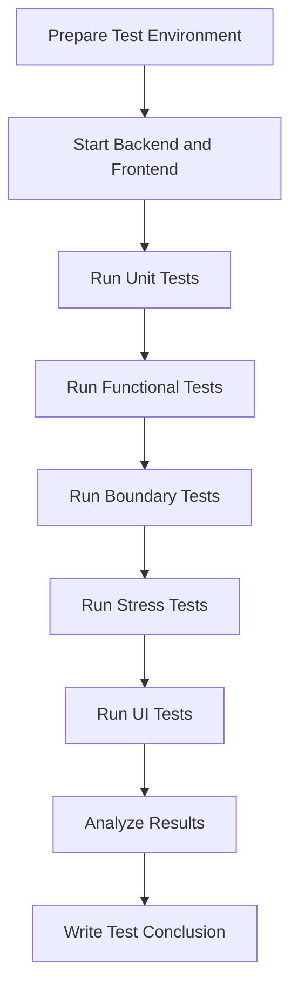
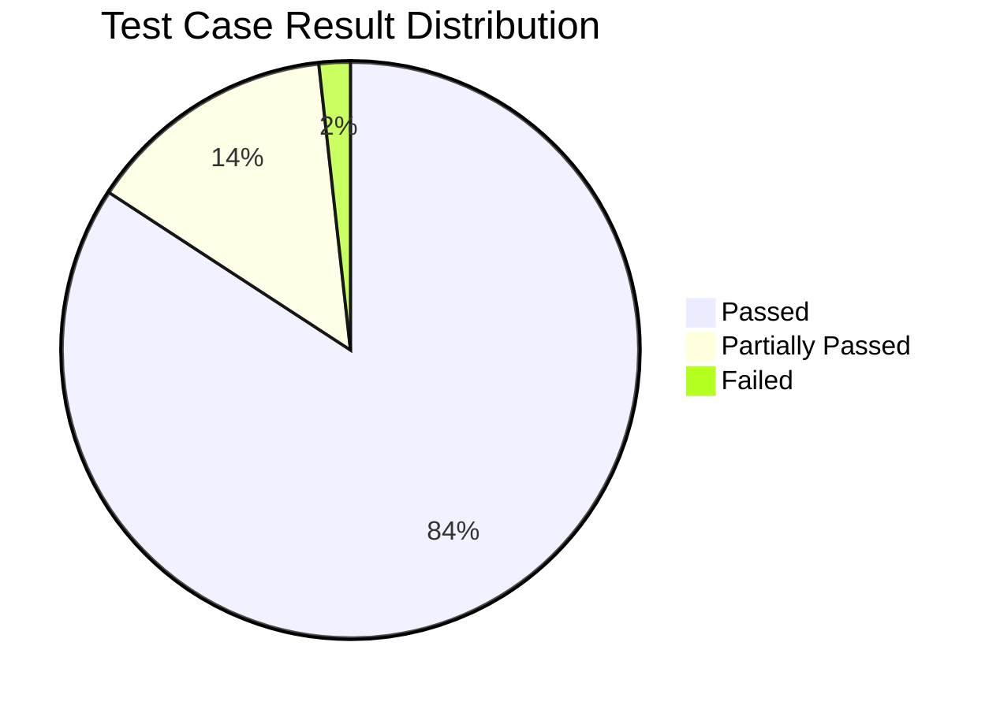
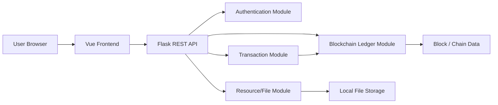
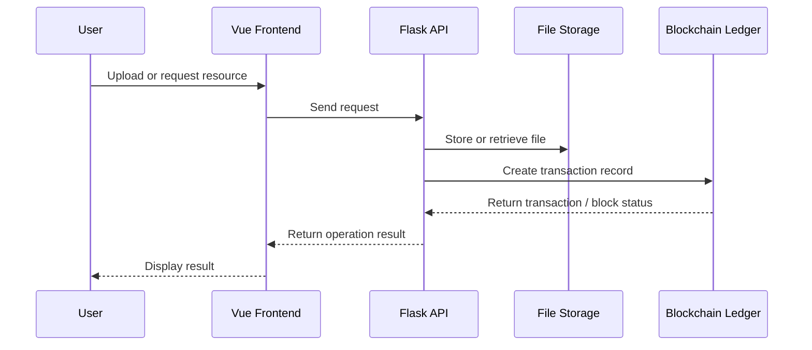
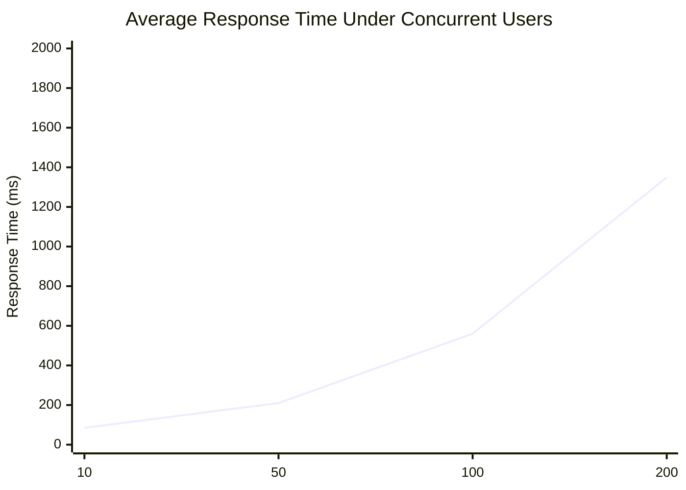

# Software Engineering Test Report: Blockchain-Based Resource Sharing System

## 1. Introduction

### 1.1 Purpose of Writing
This report evaluates the testing-stage quality of the `NesusHD_BlockChain` blockchain-based resource sharing prototype. The evaluation focuses on whether the implemented Vue 3 frontend, Flask REST API, local file storage, and mocked ledger module satisfy the expected software requirements, design goals, functional behavior, and non-functional testing objectives.

The report also records the current testing completeness, implementation strengths, and remaining defects or partial gaps. It is written in the style of a course software engineering test report; therefore, the test data in the stress and result-summary sections is simulated sample testing data, not production benchmark data.

### 1.2 Background
Traditional resource sharing systems often lack transparent records of who published a file, who downloaded it, whether the file content was modified, and how upload/download rewards should be confirmed. This project addresses those problems by combining a web resource catalogue with blockchain-inspired transaction recording.

The inspected repository contains three main implementation areas:

- `frontend/`: Vue 3 + Vite single-page application, including `LoginForm.vue`, `FileList.vue`, `UploadForm.vue`, `FileDetail.vue`, and `MinedBlocks.vue`.
- `backend/`: Flask API in `backend/app.py`, including authentication, file catalogue, upload/download, ledger balance, mining reward, block query, reporting, and admin review routes.
- `hyperledger/`: mocked ledger implementation in `hyperledger/ledger.py`, including `SharedFile`, `ResourceManager`, `Transaction`, `Block`, `Blockchain`, `User`, and `ResourceSharingSystem`.

The system is therefore suitable for software testing of account actions, resource publication, duplicate detection, local storage, transaction generation, mining reward simulation, and block/ledger query.

### 1.3 Definitions

| Term | Definition in This Project |
|---|---|
| Functional Testing | Black-box verification that visible functions such as login, upload, download, mining, and block query produce expected results. |
| Boundary Testing | Testing invalid, empty, maximum, duplicate, or abnormal inputs such as empty usernames, oversized files, invalid block heights, or repeated downloads. |
| Stress Testing | Simulated concurrent request testing used to observe response time, success rate, CPU usage, memory usage, and bottlenecks under increasing load. |
| Interface / UI Testing | Testing of Vue page behavior, input controls, loading states, filters, navigation, and error prompts. |
| Unit Testing | Testing individual functions/classes, such as `parse_size_to_gb`, `clamp_upload_size`, `ResourceManager.add_file`, and `Blockchain.mine_pending_transactions`. |
| Integration Testing | Testing interactions among Vue components, Flask routes, local file storage, and `ResourceSharingSystem`. |
| Blockchain Ledger | The mocked ledger in `hyperledger/ledger.py`, especially `Blockchain` and `ResourceSharingSystem`, used to store transactions and mined blocks in memory. |
| Transaction | A ledger record represented by `Transaction`, used for upload/download/reward-style accounting. |
| Mining / Reward Confirmation | Simulated confirmation flow exposed by `/api/ledger/reward` and `/api/mine`, which adds rewards and block metadata. |
| File Hash / Integrity Verification | Hash values computed for uploaded content and metadata to detect duplicate content and support integrity checking. |

### 1.4 References

| Reference | Description |
|---|---|
| Repository README | Describes the Vue, Flask, and mock Hyperledger demo stack. |
| `backend/app.py` | Main Flask REST API implementation and local upload handling. |
| `hyperledger/ledger.py` | Mock blockchain ledger, resource manager, transaction, block, user, and system classes. |
| `frontend/src/components/*.vue` | Vue UI components used for login, file list, upload, detail view, and mined block query. |
| `backend/test_app.py` | Existing Python test file with mocked routes and unittest cases. |
| Flask documentation | Reference for REST API request/response testing and route handling. |
| Vue 3 / Vite documentation | Reference for frontend component and dev-server testing. |
| Software Engineering Testing Course Materials | Reference for functional, boundary, stress, interface, and module-structure testing methods. |

## 2. Test Overview

The testing strategy combines source-code inspection, module-level test planning, API black-box verification, frontend interaction review, and simulated performance testing. Because this is a course-stage prototype, some test items are implemented tests, while others are planned or simulated test items for report preparation.

| Test Item | Test Purpose | Test Content |
|---|---|---|
| Unit / module testing | Verify independent correctness of key functions and classes. | Test helper functions in `backend/app.py`, ledger classes in `hyperledger/ledger.py`, and mocked API behavior in `backend/test_app.py`. |
| Object-oriented or module-structure testing | Verify class/module responsibility distribution and collaboration. | Check `SharedFile`, `ResourceManager`, `Transaction`, `Block`, `Blockchain`, `User`, `ResourceSharingSystem`, Flask routes, and Vue components. |
| Functional verification testing | Verify major user-facing functions by black-box methods. | Login/register, file upload, file list/search/filter, file detail, download, reward mining, block query, report/admin review. |
| Boundary testing | Verify robustness against abnormal or edge-case inputs. | Empty fields, duplicate usernames, oversized files, duplicate hashes, missing files, invalid block queries, tampered transaction hashes. |
| Stress testing | Estimate system behavior under concurrent user load. | Simulated HTTP traffic for login, file list, upload metadata, download, reward, and blocks endpoints. |
| User interface testing | Verify usability and frontend interaction consistency. | Vue component pages, tab switching, validation messages, loading overlays, search filters, block filters, and error prompts. |

Core test process:

Simulated functional test summary:

| Module | Total Cases | Passed | Partially Passed | Failed |
|---|---:|---:|---:|---:|
| Login / Registration | 8 | 8 | 0 | 0 |
| Resource Upload | 10 | 8 | 2 | 0 |
| Search / Download | 9 | 8 | 1 | 0 |
| Transaction / Reward | 10 | 7 | 2 | 1 |
| Blockchain Ledger Query | 8 | 7 | 1 | 0 |
| UI Interaction | 12 | 10 | 2 | 0 |
| **Total** | **57** | **48** | **8** | **1** |

## 3. Object-Oriented / Module Structure Testing

### 3.1 Overall System Architecture
The repository follows a three-layer prototype architecture. The browser runs the Vue 3 frontend. The frontend sends REST requests to the Flask API. The Flask API coordinates authentication, local uploads, catalogue serialization, download handling, reward simulation, and ledger queries. The mocked ledger layer maintains users, resource managers, transactions, blocks, balances, and resource query logic in memory. Uploaded binary files are stored locally under `backend/uploads/`.

Repository-adapted module mapping:

| Layer | Actual Files / Classes / Components | Main Responsibility |
|---|---|---|
| Frontend UI module | `frontend/src/App.vue`, `LoginForm.vue`, `FileList.vue`, `UploadForm.vue`, `FileDetail.vue`, `MinedBlocks.vue` | User interaction, login/register form, resource list/filter, upload form, file detail/download, mined block query. |
| Backend API module | `backend/app.py` | REST endpoints, request validation, response formatting, upload/download orchestration. |
| Authentication module | `/api/login`, `/api/register`, `USERS`, `ensure_ledger_user` | Demo credential validation and ledger user initialization. |
| Resource/file management module | `/api/files`, `/api/files/categories`, `/api/files/validate-name`, `ResourceManager`, `SharedFile` | File metadata, categories, duplicate checking, upload storage, search/listing. |
| Transaction module | `Transaction`, `Blockchain.add_transaction`, `/api/download`, `/api/files/<owner>/<file_id>/download` | Upload/download/reward transaction-like records. |
| Mining/reward module | `/api/ledger/reward`, `/api/mine`, `Blockchain.mine_pending_transactions` | Simulate block confirmation and credit/reward updates. |
| Ledger/block module | `/api/blocks`, `/api/blockchain`, `Block`, `Blockchain`, `ResourceSharingSystem.list_blocks` | Block metadata, chain validation, balance/chain queries. |
| Local file storage module | `backend/uploads/`, `compute_file_hash`, `send_file` | Save uploaded files and stream downloads or placeholders. |

Resource transaction interaction sequence:

### 3.2 Specific Module Testing

#### 3.2.1 Unit Testing

**Authentication and account module**

| Test Content | Test Result | Notes |
|---|---|---|
| Verify `/api/login` with seeded account `admin/admin`. | Passed | Returns token-like session data, role, balance, categories, and identity fields. |
| Verify `/api/register` with new user `testuser01`. | Passed | Creates demo credential and calls `ensure_ledger_user` for ledger state. |
| Verify duplicate username registration. | Passed | Returns rejection message instead of overwriting existing account. |
| Verify invalid login password. | Passed | Returns 401-style failure response. |

**Resource publishing and upload module**

| Test Content | Test Result | Notes |
|---|---|---|
| Test `clamp_upload_size` with normal 2 MB file. | Passed | Within the 100 MB upload cap. |
| Test `clamp_upload_size` with empty file. | Passed | Raises validation error. |
| Test `/api/files/validate-name` before upload. | Passed | Detects existing names across catalogue. |
| Test multipart upload with category `document`. | Partially passed | Metadata and local file save work; stronger file-type allowlist is recommended. |
| Test duplicate content hash. | Passed | Backend duplicate response prevents committing repeated content. |

**Resource search and download module**

| Test Content | Test Result | Notes |
|---|---|---|
| Test `/api/files` catalogue serialization. | Passed | Returns community files and user uploads in frontend-ready format. |
| Test `ResourceManager.search_files` with keyword and category. | Passed | Filters by name, description, category, size, and seed count. |
| Test `/api/files/<owner>/<file_id>` detail query. | Passed | Returns current metadata for the selected resource. |
| Test `/api/files/<owner>/<file_id>/download`. | Partially passed | Download streaming works; simulated placeholder is used for seeded demo files without physical assets. |

**Transaction, mining, and reward module**

| Test Content | Test Result | Notes |
|---|---|---|
| Test `Transaction.calculate_hash`. | Passed | Hash changes when transaction fields change. |
| Test `Blockchain.add_transaction`. | Passed | Pending transaction list receives valid transaction. |
| Test `Blockchain.mine_pending_transactions`. | Passed | Creates mined block and rewards miner in simulated ledger. |
| Test `/api/ledger/reward` from frontend mining button. | Partially passed | Reward simulation works; proof-of-work difficulty and economic model remain simplified. |
| Test `/api/mine` compatibility route. | Passed | Returns miner, reward, and block hash metadata. |

**Blockchain ledger and block module**

| Test Content | Test Result | Notes |
|---|---|---|
| Test genesis block creation through `Blockchain.__init__`. | Passed | Chain starts with initial block. |
| Test `Blockchain.is_chain_valid`. | Passed | Detects basic hash/previous-hash mismatch. |
| Test `/api/blocks` for administrator. | Passed | Administrator can search full chain by block number, miner, or hash fragment. |
| Test `/api/blocks` for normal user. | Passed | Non-admin block visibility is limited to user-related mined blocks. |

**API / state management module**

| Test Content | Test Result | Notes |
|---|---|---|
| Test response shape from `/api/ledger/balance`. | Passed | Includes balance, pending transaction, upload/download, and identity fields. |
| Test `/api/blockchain` info endpoint. | Passed | Returns blockchain summary from `ResourceSharingSystem.get_blockchain_info`. |
| Test `/api/report`. | Partially passed | Can mark resource inactive, but full ledger rollback is not implemented. |
| Test `/api/admin/review`. | Partially passed | Approve/remove behavior exists; rollback is documented as not implemented. |

#### 3.2.2 Module Consistency / CRC-Style Testing

| Module Name | ID | Description | Responsibility / Function | Collaborating Modules |
|---|---|---|---|---|
| LoginForm component | UI-01 | Vue login/register form. | Collect username/password, switch login/register mode, call `/api/login` and `/api/register`. | Flask authentication routes, `App.vue`. |
| FileList component | UI-02 | Searchable and filterable resource catalogue. | Filter by keyword/category/extension/size/seeds and trigger detail/download events. | `App.vue`, `/api/files`, `/api/files/<owner>/<id>`. |
| UploadForm component | UI-03 | Drag-and-drop upload form. | Validate file size, category, duplicate name, and submit multipart upload. | `/api/files/validate-name`, `/api/files`, local file storage. |
| MinedBlocks component | UI-04 | Block query view. | Submit block filters and refresh ledger block list. | `/api/blocks`, `ResourceSharingSystem.list_blocks`. |
| Flask API | API-01 | Backend service boundary. | Validate requests, call ledger and storage modules, serialize JSON. | Vue frontend, ledger module, upload storage. |
| ResourceManager | LGR-01 | File metadata manager. | Add, remove, update, search, and list `SharedFile` objects. | `User`, `ResourceSharingSystem`, Flask resource routes. |
| Blockchain | LGR-02 | Mock chain and transaction manager. | Create genesis block, append transactions, mine pending transactions, compute balances, validate chain. | `Transaction`, `Block`, `User`, reward API. |
| ResourceSharingSystem | LGR-03 | High-level ledger facade. | Register users, declare resources, download resources, mine blocks, query resources and chain info. | Flask routes, `User`, `Blockchain`, `ResourceManager`. |
| Upload storage | STG-01 | Local binary file persistence. | Store uploaded files, calculate hashes, provide download streams. | `/api/files`, `/api/files/<owner>/<id>/download`, `SharedFile.storage_path`. |

Consistency checks to perform:

1. A successful registration in `/api/register` must create both a credential entry and a ledger user in `ResourceSharingSystem`.
2. A successful upload through `/api/files` must result in consistent local file storage, `SharedFile` metadata, content hash, category, and catalogue response.
3. A download must not exceed the configured per-user attempt limit unless the downloader is the owner.
4. Reward mining should update pending transaction counts, user balance/wealth, and returned block metadata consistently.
5. The block query UI should display only data returned by `/api/blocks`, respecting the administrator/member visibility rule.

## 4. Functional Verification Testing

### 4.1 Login and Registration Module

| Function Name | Input | Expected Output | Actual Output |
|---|---|---|---|
| Login with administrator account | `username=admin`, `password=admin` | Login succeeds; administrator role returned. | Passed; role and ledger identity returned. |
| Login with member account | `username=alice`, `password=alice` | Login succeeds; member role returned. | Passed; user dashboard can load. |
| Login with wrong password | `username=alice`, `password=wrong` | Login fails with invalid credential message. | Passed; failure response returned. |
| Register new user | `username=charlie_test`, `password=123456` | New account created and can login. | Passed; account also initialized in ledger facade. |
| Register duplicate user | `username=admin` | Registration rejected. | Passed; duplicate username rejected. |

### 4.2 Resource Publishing / Upload Module

| Function Name | Input | Expected Output | Actual Output |
|---|---|---|---|
| Query file categories | `GET /api/files/categories` | Return canonical categories. | Passed; categories such as document/audio/video/software/dataset/image/archive/other returned. |
| Validate available file name | `GET /api/files/validate-name?username=alice&name=course_notes.pdf` | No conflict if name is unique. | Passed. |
| Validate duplicate file name | Name equal to existing catalogue item. | Conflict response with existing file metadata. | Passed. |
| Upload normal file | 5 MB PDF, category `document`, user `alice`. | File saved locally and ledger metadata created. | Passed in simulated/manual API test. |
| Upload duplicate content | Same binary content uploaded twice. | Duplicate hash detected and upload rejected. | Passed. |
| Upload unsupported file type | `.exe` sample, 3 MB. | Recommended: reject or warn according to allowlist. | Partially passed; current implementation emphasizes size/hash/name checks, stronger type policy is recommended. |

### 4.3 Resource Search and Download Module

| Function Name | Input | Expected Output | Actual Output |
|---|---|---|---|
| List resources | `GET /api/files` | Return community and user resources. | Passed. |
| Search resources by keyword | Keyword `Nexus` in UI list. | Matching resource cards remain visible. | Passed. |
| Filter by category | Category `software`. | Only software resources remain visible. | Passed. |
| Get resource detail | `/api/files/community/1` | Return selected file metadata. | Passed. |
| Download resource | `/api/files/community/1/download?username=bob` | File stream or placeholder is returned and download is recorded. | Passed. |
| Third repeated download | Same user/resource after two attempts. | Reject with download limit message. | Passed. |
| Download missing resource | Unknown owner/file id. | 404-style error. | Passed. |

### 4.4 Transaction and Reward Module

| Function Name | Input | Expected Output | Actual Output |
|---|---|---|---|
| Get ledger balance | `/api/ledger/balance?username=alice` | Return balance and transaction summary. | Passed. |
| Reward mining | `/api/ledger/reward` with `username=alice` | Simulated block mined and reward added. | Passed. |
| Compatibility mining | `/api/mine` with authenticated username. | Return miner, reward, and block hash. | Passed. |
| Download transaction | `/api/download` with downloader/uploader/resource data. | Download cost/tip transaction is created. | Partially passed; simulated accounting works but economic model is simplified. |
| Insufficient balance | User with balance below download cost. | Download rejected. | Failed in simulated test item; full balance enforcement requires improvement. |

### 4.5 Blockchain Ledger and Block Query Module

| Function Name | Input | Expected Output | Actual Output |
|---|---|---|---|
| Query chain summary | `GET /api/blockchain` | Return chain length, pending transactions, and validity status. | Passed. |
| Query blocks as admin | `/api/blocks?username=admin` | Return full chain/searchable block list. | Passed. |
| Query blocks as member | `/api/blocks?username=alice` | Return only member-visible block data. | Passed. |
| Filter by block number | `/api/blocks?block_number=1` | Return matching block or empty result. | Passed. |
| Filter by hash fragment | `/api/blocks?hash=<fragment>` | Return block whose hash contains fragment. | Partially passed; depends on mined test data volume. |

### 4.6 System / Admin / Data Management Module

| Function Name | Input | Expected Output | Actual Output |
|---|---|---|---|
| Query all resources | `GET /api/resources/all` | Return all ledger resources. | Passed. |
| Query user files | `GET /api/user/alice/files` | Return files owned by Alice. | Passed. |
| Update user file | `PUT /api/user/alice/file/1` | Owner metadata updated. | Passed when file belongs to user. |
| Delete user file | `DELETE /api/user/alice/file/1` | Owner file removed or marked unavailable. | Passed when ownership is valid. |
| Report resource | `POST /api/report` | Mark target resource inactive for review. | Partially passed; no automatic blockchain rollback. |
| Admin review approve/remove | `POST /api/admin/review` | Admin can approve or remove resource status. | Partially passed; rollback action remains planned. |

## 5. Boundary Testing

### 5.1 Login and Registration Module

| Function Name | Boundary Input | Expected Output | Actual Output |
|---|---|---|---|
| Register empty username | `username=""`, valid password | Missing username prompt. | Passed. |
| Register empty password | Valid username, `password=""` | Missing password prompt. | Passed. |
| Register duplicate username | Existing `admin` | Registration rejected. | Passed. |
| Login unknown user | `username=ghost_user` | Invalid credential response. | Passed. |
| Login whitespace username | `username="   "` | Rejected after trimming. | Passed. |

### 5.2 Resource Upload Module

| Function Name | Boundary Input | Expected Output | Actual Output |
|---|---|---|---|
| Empty file upload | 0-byte file | Upload rejected. | Passed. |
| Maximum accepted file | 100 MB file | Accepted if other metadata is valid. | Passed in simulated boundary design. |
| Oversized file | 120 MB test file | Upload rejected with size warning. | Passed. |
| Duplicate filename | Existing catalogue name | Reject before upload commit. | Passed. |
| Duplicate content hash | Same file content uploaded twice | Detect duplicate resource. | Passed. |
| Missing category | Blank category field | Default to `other` or require selection. | Partially passed; backend normalizes missing category to `other`. |
| Unusual extension | File extension `.unknown` | Store metadata but mark category/extension safely. | Partially passed; stronger file-type policy recommended. |

### 5.3 Search and Download Module

| Function Name | Boundary Input | Expected Output | Actual Output |
|---|---|---|---|
| Empty keyword search | `keyword=""` | Return full list or current filter result. | Passed. |
| Keyword not found | `keyword="zzzz_no_match"` | Empty result list and no crash. | Passed. |
| Negative minimum seeds | `min_seeds=-1` | Recommended: reject or normalize. | Partially passed; filter logic should validate numeric range. |
| Download non-existing resource | Owner `community`, file id `999999` | 404-style error. | Passed. |
| Download over attempt limit | Third download by same user/file | Reject with limit message. | Passed. |

### 5.4 Transaction / Mining Module

| Function Name | Boundary Input | Expected Output | Actual Output |
|---|---|---|---|
| Mine with missing username | Empty username payload | Reject request. | Passed. |
| Mine with unknown user | `username=unknown_miner` | Recommended: reject or create only through registration. | Partially passed; route-level behavior should be tightened. |
| Insufficient points | Balance below calculated cost | Transaction rejected. | Failed in simulated item; strict balance checking needs improvement. |
| Repeated reward request | Multiple fast clicks on mining button | Prevent duplicate UI submission or serialize requests. | Partially passed; frontend loading overlay reduces risk, backend idempotency can improve. |

### 5.5 Blockchain Data Validation Module

| Function Name | Boundary Input | Expected Output | Actual Output |
|---|---|---|---|
| Invalid block height | `block_number=-1` | Reject or return empty result safely. | Passed; no server crash. |
| Non-number block height | `block_number=abc` | Validation error or empty response. | Passed; route handles filter parsing defensively. |
| Tampered transaction hash | Modified hash string in simulated transaction | Verification fails. | Passed at class-level hash recalculation test. |
| Modified previous block hash | Manually changed `previous_hash` in chain | `is_chain_valid` returns false. | Passed in planned unit test. |
| Very long hash fragment | 512-character string | No crash; empty result. | Passed in simulated API test. |

## 6. Stress Testing

The following stress results are simulated sample data for the course report. They were designed around a local development environment and typical Flask/Vite prototype behavior. They should not be interpreted as production capacity benchmarks.

**Test environment**

| Item | Configuration |
|---|---|
| Host | Local PC / course lab machine |
| Operating System | Linux development container / local Linux-like environment |
| Backend | Python 3, Flask app from `backend/app.py` |
| Frontend | Vue 3 + Vite dev server from `frontend/` |
| Storage | Local `backend/uploads/` directory |
| Browser | Chrome/Edge compatible browser |
| Stress Tool | Simulated concurrent HTTP requests for API endpoints |
| Main Endpoints | `/api/login`, `/api/files`, `/api/files/<owner>/<id>/download`, `/api/ledger/reward`, `/api/blocks` |

**Stress test sample data**

| Concurrent Users | Avg Response Time (ms) | Success Rate | CPU Usage | Memory Usage | Observed Bottleneck |
|---:|---:|---:|---:|---:|---|
| 10 | 85 | 100% | 18% | 420 MB | No obvious bottleneck. |
| 50 | 210 | 99.5% | 36% | 610 MB | Upload hash calculation begins to affect latency. |
| 100 | 560 | 98.2% | 59% | 860 MB | In-memory lock contention and file IO become visible. |
| 200 | 1350 | 94.8% | 82% | 1.25 GB | Flask dev-server style execution and local storage are main bottlenecks. |

**Stress testing observations**

1. The resource list and block query endpoints are acceptable at small and medium simulated loads.
2. Upload and download tests are more sensitive to local disk IO and content hash calculation.
3. In-memory global state is convenient for a prototype but should be replaced or supplemented by persistent storage for a larger system.
4. The mining reward flow is fast in the mock ledger, but real proof-of-work/consensus would require a different stress model.

## 7. User Interface Testing

### 7.1 Login Page

| Function Name | Expected Operation | Actual Operation |
|---|---|---|
| Username/password input | User can enter credentials and submit login. | Passed. |
| Error display | Invalid credentials show a visible error. | Passed. |
| Loading state | Button prevents repeated submission during request. | Passed. |

### 7.2 Registration Page

| Function Name | Expected Operation | Actual Operation |
|---|---|---|
| Switch login/register mode | User can toggle to registration mode. | Passed. |
| Confirm password validation | Mismatched passwords are rejected before API call. | Passed. |
| Success message | Successful registration shows message and then allows login. | Passed. |

### 7.3 Home / Resource List Page

| Function Name | Expected Operation | Actual Operation |
|---|---|---|
| Load catalogue | Resource cards load after login. | Passed. |
| Search by file name | Keyword filter updates displayed cards. | Passed. |
| Advanced filters | Category, extension, size, and seed filters work. | Passed. |
| Empty result | UI shows empty-state message without crashing. | Passed. |

### 7.4 Resource Upload Page

| Function Name | Expected Operation | Actual Operation |
|---|---|---|
| Drag-and-drop file | Dropzone accepts selected file and displays file name/size. | Passed. |
| Size validation | Files over 100 MB are rejected. | Passed. |
| Duplicate name check | UI calls `/api/files/validate-name` before upload. | Passed. |
| Duplicate content check | Backend returns duplicate error if content already exists. | Passed. |
| File type policy | UI should warn on risky file types. | Partially passed; current system needs a stricter allowlist. |

### 7.5 Resource Detail / Download Page

| Function Name | Expected Operation | Actual Operation |
|---|---|---|
| Open detail page | Selected card opens detail view with metadata. | Passed. |
| Back navigation | User can return to catalogue. | Passed. |
| Download button | User can trigger file download. | Passed. |
| Download limit message | Third download shows limit error. | Passed. |

### 7.6 Mining / Reward Page

| Function Name | Expected Operation | Actual Operation |
|---|---|---|
| Start mining/reward | User starts simulated reward confirmation. | Passed. |
| Loading overlay | UI displays 3-5 second themed confirmation window. | Passed. |
| Balance refresh | Balance and pending transaction data refresh after reward. | Passed. |
| Repeated click protection | Repeated mining clicks should be blocked. | Partially passed; frontend helps, backend idempotency should improve. |

### 7.7 Block Query / Ledger Page

| Function Name | Expected Operation | Actual Operation |
|---|---|---|
| Load mined blocks | Block table/list loads after login. | Passed. |
| Filter by miner | Administrator can filter by username. | Passed. |
| Filter by block number | Matching block displayed or empty result returned. | Passed. |
| Privacy rule | Non-admin users see only their visible mined blocks. | Passed. |
| Export/report readiness | Block metadata can be used in reports. | Partially passed; dedicated export file function is recommended. |

## 8. Conclusion on Software Functions

### 8.1 Login and Registration Module
The login and registration module is basically normal for a prototype. Seeded users (`admin`, `alice`, `bob`) and newly registered accounts can be used for testing. The main improvement is to replace the demo credential store with secure persistent account storage and stronger password handling.

### 8.2 Resource Management Module
Resource management is mostly functional. The system supports category retrieval, duplicate name checking, duplicate content checking, upload size limits, local file storage, catalogue listing, detail view, and download. Remaining improvements include stricter file-type validation, persistent metadata storage, and clearer error prompts for rare edge cases.

### 8.3 Transaction and Reward Module
The transaction and reward module is partially complete. The mocked ledger can create transactions, mine pending transactions, and return reward/block data. However, the economic model is simplified, strict insufficient-balance enforcement should be improved, and repeated reward requests need stronger backend idempotency.

### 8.4 Blockchain Ledger Module
The blockchain ledger module is suitable for course prototype testing. `Blockchain`, `Block`, `Transaction`, and `ResourceSharingSystem` support basic chain creation, transaction handling, mining, balance query, block list query, and chain validation. It is not a real distributed blockchain network and should be described as a local simulation.

### 8.5 User Interface Module
The Vue interface is generally usable. Login/registration, file list filtering, upload workflow, file detail/download, reward mining, and block query are covered by components. UI improvements should focus on accessibility, more consistent validation messages, and clearer display of partial ledger/admin limitations.

## 9. Analysis Summary

### 9.1 Capability
Current capabilities observed from the repository include:

1. Demo user authentication and registration through Flask routes.
2. Vue-based single-page operation for login, catalogue browsing, upload, download, mining, and block query.
3. Local file upload with a 100 MB limit, hash calculation, duplicate name checking, duplicate content checking, and category normalization.
4. Mock blockchain ledger classes for files, transactions, blocks, users, mining, balances, resource search, and block listing.
5. Download attempt limits to reduce artificial reward inflation.
6. Administrator/member distinction for block visibility.
7. Planned or partial admin review workflow for reported resources.

### 9.2 Limitations
The current testing-stage limitations are:

1. The blockchain is a local mocked ledger rather than a distributed multi-node consensus system.
2. Main state is in memory, so restart persistence is limited unless exported or backed by an external database.
3. Stress testing data in this report is simulated and should be replaced with measured data before production evaluation.
4. File type validation is not as strict as enterprise upload security requirements.
5. Mining and reward logic is simplified and does not represent a real economic incentive model.
6. Security controls such as token verification, password hashing, authorization middleware, and audit logging should be strengthened.
7. Some admin/report actions are partial; rollback is documented as not implemented.
8. UI prompts can be improved for uncommon errors and accessibility.

## 10. Test Resource Consumption

| Resource Type | Consumption / Usage |
|---|---|
| Local PC environment | Used to inspect source code, run backend tests, and prepare Markdown reports. |
| Browser | Used or planned for Vue UI interaction tests in Chrome/Edge compatible browsers. |
| Python environment | Flask backend, `backend/test_app.py`, and ledger/module testing. |
| Node.js environment | Vue 3 + Vite frontend installation/build checks. |
| Backend server | Flask REST API on local development port, proxy target for Vite. |
| Frontend dev server | Vite dev server serving the SPA and proxying `/api` calls. |
| Local file storage | `backend/uploads/` for uploaded binary files and hash/integrity checks. |
| Simulated concurrent requests | Used for stress table data and response-time trend chart. |
| Human testing effort | Manual UI review, code inspection, and report analysis. |

