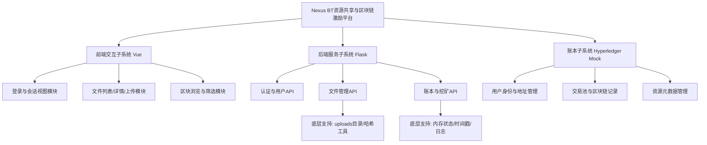
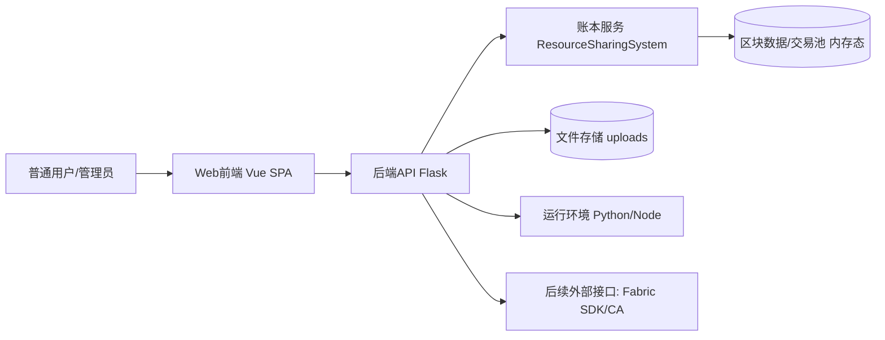
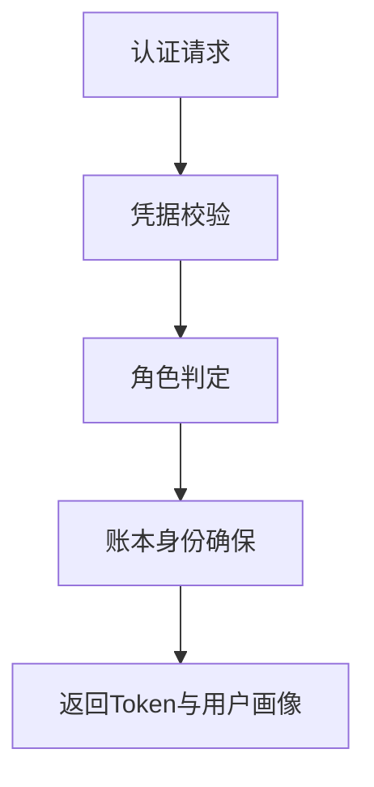
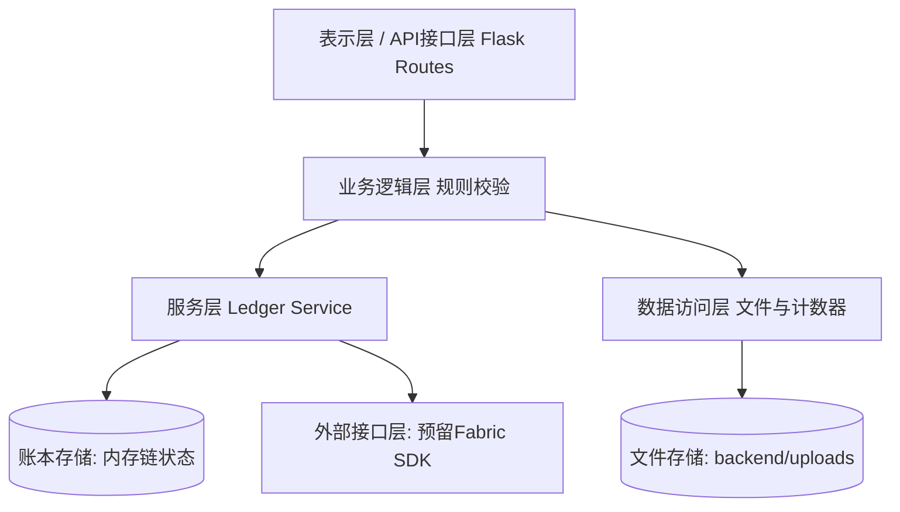
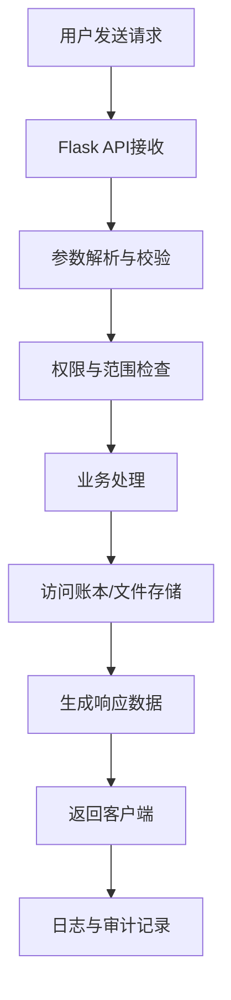
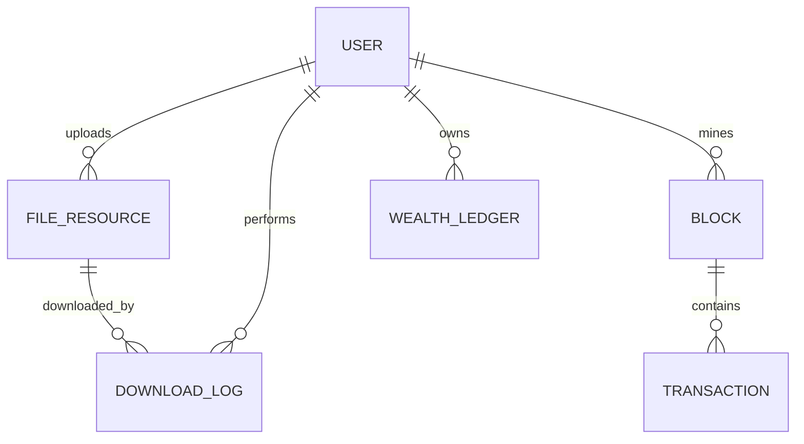
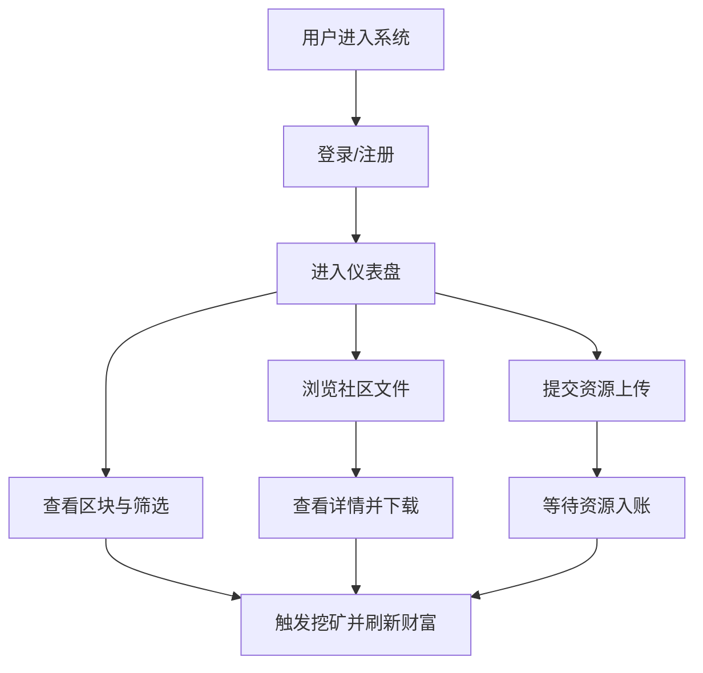

# 总体设计报告

Project Name: Nexus BT资源共享与区块链激励平台（规划版）

## 1 体系结构设计

### 1.1 目的
本总体设计将用于指导“Nexus BT资源共享与区块链激励平台”的后续工程化建设过程。项目将以“资源共享 + 区块链激励 + 可追溯记录”为核心目标，形成可扩展、可维护、可演进的系统架构。体系结构设计将会在后续阶段支撑模块边界划分、接口协议约束、数据模型标准化以及运行维护策略制定。

具体而言，本设计将计划实现以下作用：
- 为前后端与账本子系统定义清晰职责边界，降低耦合度；
- 为REST API、文件处理接口、挖矿/记账流程提供统一设计基线；
- 为后续接入真实Hyperledger Fabric网络预留替换层；
- 为权限控制、日志追踪与运行监控提供结构性支持。

### 1.2 体系结构风格
本系统拟采用“分层体系结构 + 前后端分离架构 + RESTful架构 + 数据中心型（账本中心）”的组合风格。

1. 分层体系结构：后端将分为API接口层、业务逻辑层、账本服务层、数据/文件访问层，以增强可维护性与可测试性。  
2. 前后端分离架构：Vue客户端将通过HTTP接口调用Flask服务，后续将便于独立部署、版本迭代与跨端扩展。  
3. RESTful架构：系统接口将围绕用户、文件、区块、奖励等资源建模，预计提升接口一致性。  
4. 数据中心型（账本中心）：资源声明、下载奖励、区块记录将围绕统一账本状态组织，便于追溯与审计。

该组合将适配当前项目的“交互展示 + 业务编排 + 账本模拟”特征，并为后续真实区块链替换提供连续演进路径。

### 1.3 层级结构
系统计划采用如下层级：
- 顶层：Nexus平台整体系统；
- 次顶层：前端交互子系统、后端服务子系统、账本子系统；
- 中间层：认证与用户、资源文件管理、区块挖矿与奖励、分类与检索、下载控制与审计；
- 底层：本地文件存储、内存账本结构、Flask/Vue运行环境、第三方依赖（axios、flask-cors等）。

### 1.4 体系结构环境图和原型
系统将处于“用户—Web客户端—后端服务—账本/存储”环境中运行。外部参与者主要包括普通成员与管理员；系统内部将由前端展示、后端API和账本服务协同组成；底层将依赖Python运行时、Node运行时、文件系统以及后续可替换的区块链网络接口。

#### 1.4.1 顶层 - 系统整体设计
- 模块职责：系统整体将提供资源共享、信用激励、区块追踪的一体化服务。  
- 主要输入：用户登录信息、资源文件、检索条件、挖矿请求。  
- 主要输出：认证结果、文件目录、下载流、账户财富与区块记录。  
- 依赖关系：依赖前端交互、后端API编排、账本服务状态一致性。  
- 后续实现计划：后续将把“模拟账本”逐步替换为“真实Fabric网络调用层”。

#### 1.4.2 次顶层 - 前端交互子系统设计
- 模块职责：负责登录、仪表盘、文件浏览、上传交互、区块筛选展示。  
- 主要输入：用户操作事件、API返回JSON。  
- 主要输出：页面状态、可视化列表、交互反馈与错误提示。  
- 依赖关系：依赖后端 `/api/login`、`/api/files`、`/api/blocks` 等接口。  
- 后续实现计划：将计划完善状态管理、表单校验一致性与多角色可视化策略。

#### 1.4.3 次顶层 - 后端服务子系统设计
- 模块职责：负责请求接入、参数验证、业务规则执行、文件读写、账本调用。  
- 主要输入：HTTP请求（JSON/Multipart）。  
- 主要输出：标准化JSON响应与文件流响应。  
- 依赖关系：依赖账本服务对象、哈希计算、下载限制计数器、本地存储目录。  
- 后续实现计划：后续将引入更完善的令牌认证、异常分层与可观测日志。

#### 1.4.4 中间层 - 认证与用户模块设计
- 模块职责：处理登录、注册、角色识别与账本身份映射。  
- 主要输入：用户名、密码、登录会话信息。  
- 主要输出：令牌、角色、账本身份标识。  
- 依赖关系：依赖用户凭据存储结构与账本用户注册接口。  
- 后续实现计划：预计实现持久化用户库、密码加密与令牌过期机制。

#### 1.4.5 中间层 - 资源文件管理模块设计
- 模块职责：处理文件分类、上传、查重、详情查询、下载控制。  
- 主要输入：上传文件流、文件元数据、筛选条件、下载请求。  
- 主要输出：文件目录、详情对象、下载二进制流、校验错误。  
- 依赖关系：依赖哈希计算、上传目录、账本资源管理器。  
- 后续实现计划：后续将扩展对象存储适配器、异步扫描与更精细的限流策略。

#### 1.4.6 中间层 - 区块挖矿与奖励模块设计
- 模块职责：处理待确认交易、挖矿奖励、区块检索与导出支持。  
- 主要输入：挖矿请求、区块筛选参数、下载触发奖励事件。  
- 主要输出：区块元数据、财富变更结果、待处理交易统计。  
- 依赖关系：依赖账本链结构、时间戳格式化、管理员权限控制。  
- 后续实现计划：将计划对接真实链码调用，并补充链上事件订阅机制。

## 2 服务器端设计

### 2.1 服务器架构
服务器端将采用分层架构，预计包含：
- 表示层/API接口层：提供登录、文件、区块、奖励等REST端点；
- 业务逻辑层：执行权限判定、查重规则、下载次数限制、奖励分配；
- 服务层：封装账本操作（用户注册、交易记录、区块查询）；
- 数据访问层：负责上传文件目录访问、哈希读写、内存结构读写；
- 存储层：本地文件系统 + 账本内存态（后续可替换Fabric）；
- 外部接口层：后续将接入Fabric SDK、CA服务与链码接口。

### 2.2 服务器处理流程
系统后续将采用统一请求处理流程：
1. 用户或前端提交HTTP请求；
2. API层接收并路由至目标控制器；
3. 进行参数校验与格式规范化；
4. 执行权限与作用域检查（如管理员可见范围）；
5. 执行业务逻辑（查重、下载限次、奖励计算等）；
6. 调用账本服务与文件存储；
7. 生成结果并映射为统一响应结构；
8. 返回前端并触发界面刷新；
9. 记录日志与必要的审计信息。

### 2.3 数据库设计 / 数据存储设计
鉴于当前项目特征，系统后续将采用“关系化数据模型设计 + 文件存储”的混合方案。即使原型阶段以内存结构实现，设计阶段仍将先给出标准实体模型，以支持后续迁移到MySQL/PostgreSQL或链上状态数据库。

系统后续将设计如下核心表（或等价模型）：

| 表名/模型名 | 字段名 | 数据类型 | 字段说明 | 主键 | 必填 |
|---|---|---|---|---|---|
| user_account | id | BIGINT | 用户唯一标识 | 是 | 是 |
| user_account | username | VARCHAR(64) | 登录名，将用于身份识别 | 否 | 是 |
| user_account | password_hash | VARCHAR(255) | 密码摘要，将用于认证校验 | 否 | 是 |
| user_account | role | VARCHAR(32) | 角色（administrator/member） | 否 | 是 |
| user_account | ledger_address | VARCHAR(128) | 账本地址映射 | 否 | 否 |
| file_resource | id | BIGINT | 资源ID | 是 | 是 |
| file_resource | owner_id | BIGINT | 所属用户ID | 否 | 是 |
| file_resource | file_name | VARCHAR(255) | 文件名称 | 否 | 是 |
| file_resource | file_hash | CHAR(64) | 文件哈希，将用于查重 | 否 | 是 |
| file_resource | category | VARCHAR(32) | 分类标签 | 否 | 是 |
| file_resource | size_bytes | BIGINT | 文件大小（字节） | 否 | 是 |
| file_resource | storage_path | VARCHAR(512) | 存储路径 | 否 | 是 |
| download_log | id | BIGINT | 下载日志ID | 是 | 是 |
| download_log | file_id | BIGINT | 被下载资源ID | 否 | 是 |
| download_log | downloader_id | BIGINT | 下载者ID | 否 | 是 |
| download_log | attempt_no | INT | 当前用户对资源的下载次数 | 否 | 是 |
| download_log | downloaded_at | DATETIME | 下载时间戳 | 否 | 是 |
| block_record | id | BIGINT | 区块记录ID | 是 | 是 |
| block_record | block_index | INT | 区块高度 | 否 | 是 |
| block_record | block_hash | CHAR(64) | 区块哈希 | 否 | 是 |
| block_record | previous_hash | CHAR(64) | 前序哈希 | 否 | 否 |
| block_record | miner_user_id | BIGINT | 记账者用户ID | 否 | 否 |
| block_record | tx_count | INT | 交易数量 | 否 | 是 |
| wealth_ledger | id | BIGINT | 财富台账ID | 是 | 是 |
| wealth_ledger | user_id | BIGINT | 用户ID | 否 | 是 |
| wealth_ledger | wealth_value | DECIMAL(18,2) | 当前积分/财富值 | 否 | 是 |
| wealth_ledger | pending_tx | INT | 待确认交易数 | 否 | 是 |
| wealth_ledger | updated_at | DATETIME | 更新时间 | 否 | 是 |

## 3 UI 设计

### 3.1 设计原则
本系统UI（含Web交互与API交互）将遵循以下原则：
- 简洁明了：页面层级将控制在最少必要深度，降低学习成本；
- 一致性：按钮、状态标签、错误提示与术语将统一；
- 易用性：关键流程（登录、上传、下载、挖矿）将减少操作步骤；
- 可维护性：组件化结构将支持后续独立迭代；
- 安全性：将采用输入校验、权限提示、敏感信息遮蔽；
- 信息反馈清晰：加载中、成功、失败、限制条件将实时反馈；
- 操作流程清楚：通过导航分区呈现“文件—上传—区块”主流程。

### 3.2 UI 原型设计 / 交互原型设计
系统将规划Web前端原型，并辅以API交互原型。

**页面/交互原型规划**

1. 登录与注册页  
   - 页面功能：用户身份接入与基础账户创建。  
   - 主要输入：用户名、密码。  
   - 主要输出：登录令牌、角色、账本身份。  
   - 用户操作流程：填写凭据 → 提交校验 → 成功后进入仪表盘。

2. 仪表盘总览区  
   - 页面功能：展示个人财富、待确认交易、角色信息、身份可见性切换。  
   - 主要输入：刷新操作、挖矿触发操作。  
   - 主要输出：财富数值变化、挖矿过程状态反馈。  
   - 用户操作流程：查看状态 → 执行挖矿 → 接收结果反馈。

3. 社区文件页（列表+详情）  
   - 页面功能：资源检索、筛选、详情查看与下载。  
   - 主要输入：分类筛选条件、详情查看动作、下载动作。  
   - 主要输出：文件列表、详情信息、下载结果。  
   - 用户操作流程：筛选列表 → 查看详情 → 发起下载。

4. 上传页  
   - 页面功能：提交本地文件与元数据并请求入账。  
   - 主要输入：文件、类别、描述等元信息。  
   - 主要输出：上传成功/失败信息、查重与大小限制反馈。  
   - 用户操作流程：选择文件 → 填写元数据 → 提交并等待响应。

5. 区块浏览页  
   - 页面功能：展示区块记录并提供搜索筛选（管理员全量，成员个人）。  
   - 主要输入：关键字、区块号、矿工筛选条件。  
   - 主要输出：区块列表、元数据、可导出结果（后续）。  
   - 用户操作流程：设置筛选 → 查询区块 → 查看记录/导出。

6. API交互原型（配套）  
   - 交互功能：前端将通过 `/api/login`、`/api/files`、`/api/files/{owner}/{id}`、`/api/files/{owner}/{id}/download`、`/api/ledger/reward`、`/api/blocks` 等接口完成业务闭环。  
   - 输入输出：JSON请求/响应 + 文件流下载。  
   - 流程说明：客户端发起请求 → 服务端校验处理 → 返回结构化结果并驱动UI状态更新。
